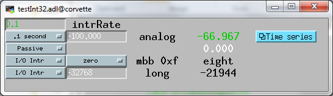

asynDriver
==========
 
:author: Mark Rivers, Eric Norum, and Marty Kraimer
:date: December 1, 2024
:version: R4-45

License Agreement
-----------------
This product is available via the open source license
described at the end of this document.

.. contents:: Contents

Purpose
-------
**asynDriver** is a general purpose facility for interfacing device specific
code to low level drivers. asynDriver allows non-blocking device support that works
with both blocking and non-blocking drivers.
  
A primary target for asynDriver is EPICS IOC device support but, other than using
libCom, much of it is independent of EPICS.
  
asynDriver has the following key concepts:

- Device support communicates with drivers via interfaces

  - Drivers take care of the details of how to communicate with a device and implement
    interfaces for use by device support. Interfaces are defined for both message and
    register based devices. In the past when support was written for a new type of device,
    device support for standard EPICS records had to be written in addition to the driver
    support. Now a driver just implements one or more of the standard interfaces.
- A port provides access to device instances

  - A port, which has a portName, identifies a communication path to one or more device
    instances. For example a GPIB port can have up to 15 devices connected to it. An
    RS232 port communicates with a single device. Drivers register a port. Device support
    connects to a port.
- asynManager controls access to a port

  - asynManager, a component of asynDriver, provides exclusive access to a driver via
    calls to queueRequest, lockPort/unlockPort, and queueLockPort/queueUnlockPort. Once
    device support has access, it can make an arbitrary number of calls to the driver
    knowing that no other support can call the driver. Device and driver support do
    not need to implement queues or semaphores since asynManager does this for them.
- asynTrace provides a general purpose diagnostic facility

  - Rules are defined for providing diagnostic messages. Provided device and driver
    support follow the rules, a user can obtain several levels of diagnostic information
    that can be displayed on the console, written to a file, or sent to the EPICS errlog
    facility.
- asynRecord - Generic access to an device/port

  - asynRecord is an EPICS record and set of associated MEDM displays that provide access

    - A port or a device connected to a port

      - The port or port,addr can be changed dynamically. Thus with one asynRecord in an
        IOC, it is possible to talk to any device that has an asyn compatible driver.
    - asynTrace - All asynTrace options can be controlled with the asynRecord.
    - Connection Management
      - Display and change connection, enable, and autoConnect state
    - Standard interfaces

      - These can be used to communicate with devices. For example if a new instrument arrives
        that has a serial, GPIB, or ethernet port, then it is often possible to communicate
        with it just by attaching an asynRecord to it.
- Extensive Serial Support

  - asynDriver provides many facilities for communicating with RS232, RS485, GPIB, and
    ethernet.
 
Status
------
This version provides:

- asynManager: the software layer between device support and drivers.
- asynRecord: EPICS record support that provides a generic interface to asynManager,
  asynCommon, asynOctet, asynGpib, and other interfaces.
- asynPortDriver: a C++ base class that makes it easy to write asyn drivers, with
  much of the boilerplate asyn code handled in the base class methods.
- asynPortClient: C++ classes that makes it easy to write C++ asyn clients that
  communicate directly with asyn port drivers without running an EPICS IOC.
- standard interfaces: Standard message and register based interfaces are defined.
  Low Level Drivers implement standard interfaces. Device support communicates with
  low level drivers via standard interfaces.
- devEpics: Generic device support for EPICS records.
- devGpib: EPICS device support that replaces the device support layer of the Winans/Franksen
  gpibCore support.
- asynGpib: a replacement for the drvGpibCommon layer of the Franksen gpibCore support.
- drvAsynSerialPort: Support for devices connected to serial ports.
- drvAsynIPPort: Support for TCP/IP and UDP/IP socket communication, including serial
  devices accessed via Ethernet/Serial converter boxes.
- drvAsynIPServerPort: Support for asyn socket servers that are accessed from remote
  clients. TCP/IP sockets and UDP are supported.
- VXI-11: A replacement for the VXI-11 support of the Franksen gpibCore support.
- drvPrologixGPIB: Support for GPIB devices over Ethernet using the Prologix GPIB-Ethernet
  controller.
- Linux-gpib: Support for the Linux GPIB Package library.
- gsIP488: A low level driver for the Greensprings IP488 Industry Pack module.
- ni1014: A low level driver for the National Instruments VME 1014D.
- Serial Bus Support: The asynLockPortNotify interface was added to make it easier
  to support serial bus drivers that use the standard serial support.

The following are some of the existing EPICS general purpose device support systems
that have been converted to use asynDriver:

- StreamDevice. This is the protocol file-based support for serial/GPIB/CAN from
  Dirk Zimoch.
- gpibCore. This is the operating-system-independent version of the Winans/Franksen
  GPIB support.
- synApps (The APS BCDA synchrotron applications). The mca, dxp, motor, Ip330, IpUnidig,
  DAC128V and quadEM applications in this package have all been converted to asyn.
  The serial and GPIB modules in this package are no longer needed, because the asyn
  record replaces them. The areaDetector module was written to use asyn, and was the
  original motivation for the development of asynPortDriver.

Acknowledgments
---------------  
The idea of creating asynDriver resulted from many years of experience with writing
device support for serial and GPIB devices. The following individuals have been
most influential.

- **John Winans**

  - John provided the original EPICS GPIB support. Databases using John's support can
    be used without modification with devGpib. With small modifications, device support
    modules written for John's support can be used.
- **Benjamin Franksen**

  - John's support only worked on vxWorks. In addition, the driver support was implemented
    as a single source file. Benjamin defined an interface between drvCommon and low
    level controllers and split the code into drvGpib and the low level drivers. He
    also created the support for drvVxi11.
- **Eric Norum**

   - Eric started with Benjamin's code and converted it to use the Operating System Independent
     features of EPICS 3.14.
- **Marty Kraimer**
    
   - Marty started with Eric's version and made changes to support secondary addressing;
     and to replace ioctl with code to support general bus management, universal commands,
     and addressed commands.
- **Pete Owens**
    
  - Pete, for the Diamond Light Source, did a survey of several types of device/driver
    support packages for serial devices. Diamond decided to use the StreamDevice support
    developed by Dirk Zimoch.
- **Dirk Zimoch**
    
  - Dirk developed StreamDevice, which has a single device support model, but supports
    arbitrary low level message based drivers, i.e. GPIB, serial, etc.
- **Jun-ichi Odagiri**
    
  - Jun-ichi developed NetDev, a system that provides EPICS device support for network
    based devices. It has a single device support model, but provides a general framework
    for communicating with network based devices.
- **Mark Rivers**
   
  - Mark became an active developer of asynDriver soon after he started converting SynApps
    to use asynDriver. He soon pushed to have asynDriver support synchronous drivers,
    support register based drivers, and support interrupts. With these additions asynDriver
    is a framework for interfacing to a large class of devices instead of just message
    based asynchronous devices.
- **Yevgeny A. Gusev**
    
  - Yevgeny has found bugs and suggested improvements in the way asynManager handles
    queue timeouts and cancels. He provides an expert and welcome set of eyes to look
    at difficult code!!!

Overview of asynDriver
----------------------

Definitions
~~~~~~~~~~~  
asynDriver is a software layer between device specific code and drivers that communicate
with devices. It supports both blocking and non-blocking communication and can be
used with both register and message based devices. asynDriver uses the following
terminology:

- interface

  - All communication between software layers is done via interfaces. An interface definition
    is a C language structure consisting entirely of function pointers. An asynDriver
    interface is analogous to a C++ or Java pure virtual interface. Although the implementation
    is in C, the spirit is object oriented. Thus this document uses the term "method"
    rather than "function pointer".
- port

  - A physical or logical entity which provides access to a device. A port provides
    access to one or more devices.
- portDriver
      
  - Code that communicates with a port.
- portThread
      
  - If a portDriver can block, a thread is created for each port, and all I/O to the
    portDriver is done via this thread.
- device
      
  - A device (instrument) connected to a port. For example a GPIB interface can have
    up to 15 devices connected to it. Other ports, e.g. RS-232 serial ports, only support
    a single device. Whenever this document uses the word device without a qualifier,
    it means something that is connected to a port.
    
- device support
      
  - Code that interacts with a device.
- synchronous
      
  - Support that does not voluntarily give up control of the CPU.
- asynchronous
      
  - Support that is not synchronous. Some examples of asynchronous operations are epicsThreadSleep,
    epicsEventWait, and stdio operations. Calls to epicsMutexTake are considered to
    be synchronous operations, i.e. they are permitted in synchronous support.
- asynDriver
  
  - The name for the support described in this manual. It is also the name of the header
    file that describes the core interfaces.
- asynManager
  
  - An interface and the code which implements the methods for interfaces asynManager
    and asynTrace.
- asynchronous Driver
  
  - A driver that blocks while communicating with a device. Typical examples are serial,
    gpib, and network based drivers.
- synchronous Driver
  
  - A driver that does not block while communicating with a device. Typical examples
    are VME register based devices.
- Message Based Interfaces

  - Interfaces that use octet arrays for read/write operations.
- Register Based Interfaces
  
  - Interfaces that use integers or floats for read/write operations.
- interrupt
  
  - As implemented by asynManager, interrupt just means "I have a new value for port,
    address".

Synchronous/asynchronous and message/register are orthogonal concepts. For example
a register based driver can be either synchronous or asynchronous. The terminology
register vs message is adapted from VXI.

Standard interfaces are defined so that device specific code can communicate with
multiple port drivers. For example if device support does all its communication
via reads and writes consisting of 8 bit bytes (octets), then it should work with
all port drivers that support octet messages. If device support requires more complicated
support, then the types of ports will be more limited. Standard interfaces are also
defined for drivers that accept 32 bit integers or 64 bit floats. Additional interfaces
can be defined, and it is expected that additional standard interfaces will be defined.

One or more devices can be attached to a port. For example, only one device can
be attached to an RS-232 port, but up to 15 devices can be attached to a GPIB port.

Multiple layers can exist between device specific code and a port driver. A software
layer calls interposeInterface in order to be placed between device specific code
and drivers. For more complicated protocols, additional layers can be created. For
example, GPIB support is implemented as an asynGpib interface which is called by
user code, and an asynGpibPort interface which is called by asynGpib.

A driver normally implements multiple interfaces. For example asynGpib implements
asynCommon, asynOctet, and asynGpib.

asynManager uses the Operating System Independent features of EPICS base. It is,
however, independent of record/device support. Thus, it can be used by other code,
e.g. a sequence program.

Standard Interfaces
~~~~~~~~~~~~~~~~~~~
These are interfaces provided by asynManager or interfaces implemented by all or
most port drivers.

The interfaces are:

**asynManager** provides services for communicating with a device connected to a port.

**asynCommon** is an interface that must be implemented by all low level drivers. The methods are:

- report - Report status of port.
- connect - Connect to the port or device.
- disconnect - Disconnect from the port or device.

**asynTrace** is an interface for generating diagnostic messages.
 
**asynLockPortNotify** is an interface that is implemented by a driver which is an asynUser of another driver. 
An example is a serial bus driver that uses standard serial support. asynManager calls asynLockPortNotify
whenever it locks or unlocks the port.

**asynDrvUser** is an interface for communicating information from device support to a driver without the device support knowing any
details about what is passed.

Generic Interfaces
~~~~~~~~~~~~~~~~~~

In addition to **asynCommon** and optionally **asynDrvUser**, port drivers can implement one
or more of the following message and/or register based interfaces.

**asynOctet** methods for message based devices

**asynFloat64** methods for devices that read/write IEEE float values

**asynFloat32Array** methods for devices that read/write arrays of IEEE 32-bit float values

**asynFloat64Array** methods for devices that read/write arrays of IEEE 64-bit float values

**asynInt32** methods for devices that read/write integer values. Many analog I/O drivers can use this interface.

**asynInt64** methods for devices that read/write 64-bit integer values.

**asynInt8Array** methods for devices that read/write arrays of 8-bit integer values

**asynInt16Array** methods for devices that read/write arrays of 16-bit integer values

**asynInt32Array** methods for devices that read/write arrays of 32-bit integer values

**asynInt64Array** methods for devices that read/write arrays of 64-bit integer values

**asynUInt32Digital** methods for devices that read/write arrays of digital values.
This interface provides a mask to address individual bits within registers.

**asynGenericPointer** methods for devices that read/write arbitrary structures, passed via a void* pointer.
The client and the server of course need to agree on the structure type being pointed to.

**asynEnum** methods for devices to define enum strings, values, and severities.

**asynOption** methods for device configuration using key/value pairs.

asynManager
~~~~~~~~~~~
asynManager is an interface and associated code. It is the "heart" of asynDriver
since it manages the interactions between device support code and drivers. It provides
the following services:

reporting
.........
  
  Method: report

asynUser creation
.................
  
  Methods: createAsynUser, duplicateAsynUser, freeAsynUser
  
  An asynUser is a "handle" for accessing asynManager services and for calling interfaces
  implemented by drivers. An asynUser must only be created via a call to createAsynUser
  or duplicateAsynUser since asynManager keeps private information for each asynUser.
  freeAsynUser puts the asynUser on a free list rather than calling free. Clients
  can continually create and free asynUsers quickly and without fragmenting memory.

  The call to createAsynUser specifies a processCallback and a timeoutCallback. These
  are the callbacks that will be called as a result of a queueRequest.
  An asynUser should not be shared between parts of code that can simultaneously access
  a driver. For example device support for standard EPICS records should create an
  asynUser for each record instance.

Basic asynUser services
.......................
  
  Methods: connectDevice, disconnect, findInterface
  
  These methods should only be called by the code that created the asynUser.

  After an asynUser is created the user calls connectDevice. The user is connected
  to a port driver that can communicate with a device. findInterface is called for
  each interface the user requires. disconnect is called when the user is done with
  the device.

Queuing services
................
  
  Methods: queueRequest, cancelRequest, lockPort, unlockPort, queueLockPort, queueUnlockPort,
  blockProcessCallback, unblockProcessCallback

  queueRequest is a request to call the processCallback specified in the call to createAsynUser.
  Most interface methods must only be called from processCallback via a call to queueRequest
  or between calls to lockPort/unlockPort.. Exceptions to this rule must be clearly
  documented (a common exception are methods registerInterruptUser/cancelInterruptUser).
  
  queueRequest semantics differ for ports that can block and ports that do not block
  
  When registerPort is called by a driver that can block, a thread is created for
  the port. A set of queues, based on priority, is created for the thread. queueRequest
  puts the request on one of the queues. The port thread takes the requests from the
  queues and calls the associated callback. Only one callback is active at a time.

  When registerPort is called by a driver that does not block, a mutex is created
  for the port. queueRequest takes the mutex, calls the callback, and releases the
  mutex. The mutex guarantees that two callbacks to a port are not active at the same
  time.
 
  lockPort is a request to lock all access to low level drivers until unlockPort is
  called. If the port blocks then lockPort and all calls to the port driver may block.
  lockPort/unlockPort are provided for use by code that is willing to block or for
  communication with synchronous ports. A call to lockPort locks all addresses associated
  with a multi-address port. Prior to asyn R4-14 pasynManager->lockPort() immediately
  took the port mutex when it was available, rather than queueing a request to take
  the mutex. From asyn R4-14 to R4-20 lockPort queues a request to access the port
  and then blocks until the queue request callback runs in the portThread. When the
  queue request runs, the thread that called pasynManager->lockPort() executes,
  and the portThread blocks, until pasynManager->unlockPort() is called. In R4-21
  the queued lockPort and unlockPort functions were renamed to queueLockPort and queueUnlockPort,
  and the original lightweight lockPort and unlockPort functions were restored. Up
  to R4-32 when queueLockPort called queueRequest it did not specify a timeout. This
  could lead to code being hung if the port disconnected after the call to queueRequest
  but before the callback was called. The code would remain hung until the port reconnected.
  In R4-32 the queueRequest is done with a timeout. The default timeout value is 2.0
  seconds but this can be change with the shell command asynSetQueueLockPortTimeout(portName,
  double timeout). If the pasynUser->timeout passed to queueLockPort is greater
  than the current port timeout value this larger timeout from the pasynUser is used
  instead.

  blockProcessCallback is a request to prevent access to a device or port by other
  asynUsers between queueRequests. blockProcessCallback can be called from a processCallback
  or when the asynUser has no request queued. When called from processCallback blocking
  starts immediately, otherwise blocking starts the next time processCallback is called.
  Blocking means that no other asynUser's processCallback will be called until unblockProcessCallback
  is called. blockProcessCallback only works with drivers that can block and an error
  is returned if it is called for non-blocking drivers.

Basic Driver services
.....................
  
  Methods: registerPort, registerInterface, shutdownPort

  registerPort is called by a portDriver. registerInterface is called by a portDriver
  or an interposeInterface.

  Each port driver provides a configuration command that is executed for each port
  instance. The configuration command performs port specific initializations, calls
  registerPort, and registerInterface for each interface it implements.

  When calling registerPort, the driver can declare that it is destructible. For
  such a port, asynManager will allow the shutdown function to be called on the
  port. Moreover, it will call this function itself on process exit. This allows
  the driver to react and perform any cleanup necessary, such as stopping
  internal threads and releasing device resources.

Attribute Retrieval
...................

  Methods: isMultiDevice, canBlock, getAddr, getPortName, isConnected, isEnabled,
  isAutoConnect

  These methods can be called by any code that has access to the asynUser

Connection services
...................
  
  Methods: enable,autoConnect,setAutoConnectTimeout

  These methods can be called by any code that has access to the asynUser.

  These methods can be called to set the enable and autoConnect settings for a port
  and/or device. If autoConnect is true then asynManager does the following:

    When the port registers its asynCommon interface, asynManager queues a connection
    request. It then waits for a short time for the connection callback to complete.
    The default time is 0.5 seconds, but this time can be changed with a call to the
    function pasynManager->setAutoConnectTimeout(double timeout). This function can
    be accessed from the iocsh shell with the asynSetAutoConnectTimeout(double timeout)
    command. This short timeout is designed to allow devices time to connect if they
    are available, but not to excessively slow down booting of the IOC by waiting, for
    example, for the system timeout on TCP connections. Note that this means that it
    is very likely that the pasynCommon->connect() call will occur as soon as the
    asynCommon interface is registered, which means that the driver must have already
    done all initialization required for the asynCommon->connect() callback before
    it registers the asynCommon interface. If the port does not connect initially, or
    if it subsequently disconnects, then asynManager will queue a connection request
    every 20 seconds. If autoConnect is true and port/device is enabled but the device
    is not connected, then queueManager calls calling asynCommon:connect just before
    it calls processCallback.

Exception services
....................
  
  Methods: exceptionCallbackAdd, exceptionCallbackRemove, exceptionConnect, exceptionDisconnect

  Device support code calls exceptionCallbackAdd and exceptionCallbackRemove. The
  complete list of exceptions is defined in asynDriver.h as "enum asynException".

  Whenever a port driver connects or disconnects, normally as a result of a call to
  asynCommon:connect or asynCommon:disconnect, it must also call exceptionConnect
  or exceptionDisconnect.

Interrupt services
..................
  
  Methods: registerInterruptSource, getInterruptPvt, createInterruptNode, freeInterruptNode,
  addInterruptUser, removeInterruptUser, interruptStart, interruptEnd

  Interrupt just means: "I have a new value." Many asyn interfaces, e.g. asynInt32,
  provide interrupt support. These interfaces provide methods addInterruptUser and
  removeInterruptUser. Device support calls addInterruptUser if it wants to be called
  whenever an interrupt occurs. Drivers or other code that implements the interface
  calls the registered users when it has new data. asynManager provides services that
  help drivers implement thread-safe support for interrupts.
  
  A driver that supports interrupts calls registerInterruptSource for each interface
  that has associated interrupts. It calls interruptStart to obtain a list of all
  registered users and interruptEnd after it calls the registered users. The driver
  is also responsible for calling addInterruptUser and removeInterruptUser.
  
  If any calls are made to addInterruptUser or removeInterruptUser between the calls
  to interruptStart and interruptEnd, asynManager puts the request on a list and processes
  the request after interruptEnd is called.
  
  Many standard interfaces, e.g. asynInt32, provide methods registerInterruptUser,
  cancelInterruptUser. These interfaces also provide an auxiliary interface, e.g.
  asynInt32Base, and code which implements registerInterruptUser and cancelInterruptUser.
  
  On operating systems like vxWorks or RTEMS interruptStart,interruptEnd MUST NOT
  be called from interrupt level.

Timestamp services
..................
  
  Methods: updateTimeStamp, getTimeStamp, setTimeStamp, registerTimeStampSource, unregisterTimeStampSource.

  These methods provide support for setting a timestamp for a port. This timestamp
  is typically used to set the pasynUser->timestamp field that is passed to device
  support on read or callback operations. Device support uses the pasynUser->timestamp
  field to set the record TIME field. This will then be the record timestamp if the
  record TSE field is -2. asynManager provides a default timestamp source function
  which just calls epicsTimeGetCurrent(). However, registerTimeStampSource can be
  used to supply a different user-provided timestamp source function, for example
  one that calls epicsTimeGetEvent(), or some other site-specific timestamp source.
  unregisterTimeStampSource reverts to the default timestamp source in pasynManager.

General purpose freelist service
................................
  
  Methods: memMalloc, memFree

  These methods do not require an asynUser. They are provided for code that must continually
  allocate and free memory. Since memFree puts the memory on a free list instead of
  calling free, they are more efficient that calloc/free and also help prevent memory
  fragmentation.

Interpose service
.................
  
  Method: interposeInterface

  Code that calls interposeInterface implements an interface which is either not supported
  by a port driver or that is "interposed" between the caller and the port driver.
  For example asynInterposeEos interposes asynOctet. It performs end of string processing
  for port drivers that do not support it.

  interposeInterface is recursive, i.e. an arbitrary number of interpose layers can
  exist above a single port,addr.

Multiple Device vs Single Device Port Drivers
~~~~~~~~~~~~~~~~~~~~~~~~~~~~~~~~~~~~~~~~~~~~~
  
When a low level driver calls registerPort, it declares if it handles multiple devices.
This determines how the addr argument to connectDevice is handled and what getAddr
returns.

  **multiDevice false**
  
    The addr argument to connectDevice is ignored and getAddr always returns -1

  **multiDevice true**
  
    If connectDevice is called with addr<0, the connection is to the port and getAddr
    always returns -1. If addr>=0, then the caller is connected to the device at
    the specified address. getAddr will return this address. An asynUser connected to
    the port can issue requests that affect all address on the port. For example disabling
    access to the port prevents access to all addresses on the port.
    
Connection Management
~~~~~~~~~~~~~~~~~~~~~
  
asynManager keeps track of the following states:

  **connection**
      
    Is the port or device connected? This state is initialized to disconnected.
    
  **enabled**      

    Is the port or device enabled? This state is initialized to enabled.
    
  **autoConnect**
      
    Does asynManager automatically attempt to connect if it finds the port or device
    disconnected? This is initialized to the state specified in the call to registerPort.

If the port does not support multiple devices, then port and device status are the
same. If the port does support multiple devices, then asynManager keeps track of
the states for the port and for every device connected to the port.

Whenever any of the states change for a port or device, then all users that previously
called exceptionCallbackAdd for that port or device are called.

Low level drivers must call pasynManager:exceptionConnect whenever they connect
to a port or port,addr and exceptionDisconnect whenever they disconnect.

Protecting a Thread from Blocking
~~~~~~~~~~~~~~~~~~~~~~~~~~~~~~~~~
  
The methods asynManager:report and asynCommon:report can be called by any thread,
but the caller is blocked until the report finishes. lockPort, unlockPort, queueLockPort,
queueUnlockPort, and most port methods may block. The other asynManager methods
can be called by any thread including portThread. None of these methods block.

Unless stated otherwise the methods for other interfaces must only be called by
processCallback or by calls between lockPort/unlockPort, or queueLockPort/queueUnlockPort.

Interface methods registerInterruptUser and cancelInterruptUser must never block.
The registerInterruptUser callback must not block because it could be called by
a non blocking driver.

portThread
~~~~~~~~~~
  
If a driver calls asynManager:registerPort with the ASYN_CANBLOCK attributes bit
set, then asynManager creates a thread for the port. Each portThread has its own
set of queues for the calls to queueRequest. Four queues are maintained. One queue
is used only for asynCommon:connect and asynCommon:disconnect requests. The other
queues provide different priorities: low, medium, and high. queueRequests to any
queue other then the connection queue will be rejected if the port is not connected.
portThread runs forever implementing the following algorithm:

#. Wait for work by calling epicsEventMustWait. Other code such as queueRequest call
   epicsEventSignal.
#. If the port is disabled, go back to 1.
#. For every element in queue, asynQueuePriorityConnect:

    - Removes the element from the queue.
    - Calls the user's callback
#. For each element of the queues asynQueuePriorityHigh, ...,asynQueuePriorityLow.

    - If disabled, skip this element.
    - If not connected and autoConnect is true for the device, then attempt to connect
      to the device.
    - If not connected, skip this element.
    - If blocked by another thread, skip this element.
    - If not blocked and user has requested blocking, then blocked.
    - Remove from queue and:
  
       * lock port
       * call user callback
       *  unlock port

The actual code is more complicated because it unlocks before it calls code outside
asynManager. This means that the queues can be modified and exceptions may occur.

Overview of Queuing
~~~~~~~~~~~~~~~~~~~
  
When discussing queuing it is useful to think of 3 components of asyn:

#. asynManager. This is the core part of asyn. It knows nothing about EPICS records.
   In fact it is completely independent of EPICS except that it uses libCom for OS-independent
   things like mutexes, message queues, events, etc. The queuing it provides is for
   callback requests to communicate with asynchronous drivers (ASYN_CANBLOCK) via pasynManager->queueRequest().
#. Standard asyn device support (devEpics directory). This is the only part of asyn
   that knows about EPICS records and depends on EPICS components other than libCom.
   It supports callbacks from the driver under 3 conditions:

      - Input records with SCAN=I/O Intr
      - Input records with periodic scanning (asynInt32Average and asynFloat64Average only)
      - Output records with asyn:READBACK=1.

   The callback values can be placed in a ring buffer so that values are not lost if
   the callbacks happen faster than the record can process. The size of the ring buffer
   can be controlled with the asyn:FIFO info tag. The default is 10 for scalar records.
   The default is 0 for devAsynOctet, waveform, stringin, stringout, lsi, lso, printf
   and scalcout records. If the ring buffer is in use then each driver callback results
   in pushing a new value into the buffer and a request to process the record in a
   separate callback thread. If the ring buffer is full then the oldest value in the
   queue is discarded and the new value is added. This guarantees that the record will
   eventually have the value of the most recent callback, but it may skip some before
   this. If ASYN_TRACE_WARNING is set then a warning message is printed. The driver
   callbacks do not block waiting for the record to process.
#. asynPortDriver. asynPortDriver does not support queueing. It does have a parameter
   library that stores the most recent value of scalar parameters. It does not store
   values for array parameters.

Theory of Operation
-------------------

Initialization
~~~~~~~~~~~~~~  
During initialization, port drivers register each communication port as well as
all supported interfaces.

User code creates an asynUser, which is a "handle" for accessing asynDriver facilities,
by calling
::

    pasynManager->createAsynUser(processCallback, timeoutCallback);
  
An asynUser has the following features:

- An asynUser is the means by which asynManager manages multiple requests for accessing
  a port.
- processCallback,which is used by queueRequest described below, is the address
  of a user supplied callback routine.
- timeoutCallback is the address of caller supplied callback that will be called
  if a queueRequest remains on the queue too long.
- Device support code should create an asynUser for each "atomic" access to low
  level drivers, i.e. a set of calls that must not be interlaced with other calls
  to the low level drivers. For example device support for EPICS record support should
  create an asynUser for each record instance.
- Device support code should NOT try to share an asynUser between multiple sources
  of requests for access to a port. If this is done then device support must itself
  handle contention issues that are already handled by asynManager.
  
User code connects to a low level driver via a call to
::

    status = pasynManager->connectDevice(pasynUser, portName, addr);

This call must specify the name of the port and the address of the device. It then
calls findInterface to locate the interfaces with which it calls the driver. For example
::

    pasynInterface = pasynManager->findInterface(pasynUser, asynOctetType, 1);

Requesting access to a port
~~~~~~~~~~~~~~~~~~~~~~~~~~~
  
- queueRequest
      
    The processCallback passed to createAsynUser makes calls to the port interfaces.
    
- lockPort/unlockPort, queueLockPort/queueUnlockPort
      
    The caller can make calls to the port interfaces while the lock is held. These calls
    and calls to the port may block and thus should NOT be used by code that should
    not block, e.g. synchronous device support for EPICS records.
    
queueRequest - Flow of Control
~~~~~~~~~~~~~~~~~~~~~~~~~~~~~~
  
User code requests access to a port by calling
::

    status = pasynManager->queueRequest(pasynUser, priority, timeout);
  
This results in either processCallback or timeoutCallback being called. Most requests
to a port must be made from processCallback. queueRequest does not block. If queueRequest
is called for a port that can block the request is queued to a thread dedicated
to the port. If queueRequest is called for a port does not block it just calls processCallback.
guarantee is valid only if low level drivers are only accessed by calling queueRequest,
lockPort/unlockPort, and/or queueLockPort/queueUnlockPort

The following examples are based on EPICS IOC record/device support.

The first example shows access to a port that can block.
  
.. figure:: AsynFlow.jpg
    :align: center

    **Figure 1: Asynchronous Control Flow**

The sequence of record device support events that occurs starting with an application
thread is pictured above in Figure 1, and explained below in the following steps:

#. Record processing calls device support with PACT 0 (Processing is not active).
#. Device support calls queueRequest.
#. queueRequest places the request on the driver work queue. The application thread
   is now able to go on and perform other operations. Subsequent operations for this
   I/O request are handled in the port driver thread.
#. The portThread removes the I/O request from the work queue.
#. The portThread calls the processCallback located in Record device support.
#. processCallback calls the low-level driver. The low-level driver read or write
   routine blocks until the I/O completes or until a timeout occurs. The low-level
   driver routine returns the results of the I/O operation to processCallback.
#. processCallback requests that the record be processed. NOTE: The process request
   will be made by one of the standard callback requests rather than the port thread.
#. Record support calls device support again, this time with PACT 1(processing is
   active). Device support updates fields in the record and returns to record support
   which completes record processing.
  
The second example shows access to a port that cannot block.
  
.. figure:: AsynSynFlow.jpg
    :align: center

    **Figure 2: Synchronous Control Flow**

The sequence of record device support events that occurs starting with an application
thread is pictured above in Figure 2, and explained below in the following steps:

#. Record processing calls device support.
#. Device support calls queueRequest.
#. Since the port is synchronous, i.e. can not block, queueRequest locks the port
   and then calls the processCallback.
#. processCallback calls the low-level driver read or write routine. The low-level
   driver routine returns the results of the I/O operation to processCallback.
#. processCallback returns to queueRequest, which unlocks the port and returns to
   device support, which returns to record support, which completes record processing.

Shutdown
~~~~~~~~

asyn provides the low-level driver the opportunity to clean up when the port
goes out of use, which happens when the shutdown function is called, or on
process exit. A driver that wants to support this needs to:

- pass the ASYN_DESTRUCTIBLE flag to registerPort;
- call exceptionCallbackAdd to register a handler for asynExceptionShutdown;
- perform any cleanup necessary in the exception handler.

The above steps are implemented by the asynPortDriver C++ base class; see the
`asynPortDriver <asynPortDriver.html>`__ documentation for more information on
how to use its API. Its exception handler runs the destructors of the low-level
driver.

When a port is registered with ASYN_DESTRUCTIBLE, a destructor function is
registered to run on process exit. This destructor is equivalent to the shutdown
function of asynManager. It disables the port and marks it as defunct so it
cannot be re-enabled. After removing all references to the low-level driver,
asynExceptionShutdown is emitted.

asynDriver Structures and Interfaces
------------------------------------

asynDriver.h describes the following:

- asynStatus - An enum that describes the status returned by many methods.
- asynException - An enum that describes exceptions.
- asynQueuePriority - An enum that describes the queue priorities.
- asynUser - A structure that contains generic information and is the "handle" for calling most methods.
- asynInterface - a structure that describes an interface.
- userCallback - a typedef for the user process callback function described above.
- exceptionCallback - a typedef for a user callback to be called when exceptions occur.
- timeStampCallback - a typedef for a user callback function that will be called by updateTimeStamp.
- asynManager - An interface for communicating with asynDriver.
- asynCommon - An interface providing methods that must be implemented by all low level drivers.
- asynTrace - An interface plus associated functions and definitions that implement the trace facility.

asynStatus
~~~~~~~~~~

Defines the status returned by most methods. If a method returns a status other
than asynSuccess, and one of the arguments to the method is pasynUser, then the
method is expected to write a message into pasynUser->errorMessage.
::

  typedef enum {
    asynSuccess,asynTimeout,asynOverflow,asynError,asynDisconnected,asynDisabled
  } asynStatus
  

.. list-table::  asynStatus
  :widths: 20 80
  
  * - asynSuccess
    - The request was successful.
  * - asynTimeout 
    - The request failed with a timeout. 
  * - asynOverflow 
    - The driver has lost input data. This can happen if an internal buffer or the user
      supplied buffer is too small. Whenever possible, low level drivers should be written
      so that the user can read input in small pieces. 
  * - asynError 
    - Some other error occurred. 
  * - asynDisconnected 
    - The request failed because the port is not connected. 
  * - asynDisabled 
    - The request failed because the port or device is disabled. 
 
asynException
~~~~~~~~~~~~~  
Defines the exceptions for method exceptionOccurred
::

  typedef enum {
    asynExceptionConnect,asynExceptionEnable,asynExceptionAutoConnect,
    asynExceptionTraceMask,asynExceptionTraceIOMask,asynExceptionTraceInfoMask,
    asynExceptionTraceFile,asynExceptionTraceIOTruncateSize,asynExceptionShutdown
  } asynException;

.. list-table::  asynException
  :widths: 20 80
  
  * - asynExceptionConnect 
    - The connection state of the port or device has changed.
  * - asynExceptionEnable 
    - The enable state of the port or device has changed. 
  * - asynExceptionAutoConnect  
    - The autoConnect state of the port or device has changed. 
  * - asynExceptionTraceMask 
    - The traceMask for the port or device has changed.
  * - asynExceptionTraceIOMask 
    - The traceIOMask for the port or device has changed. 
  * - asynExceptionTraceInfoMask 
    - The traceInfoMask for the port or device has changed. 
  * - asynExceptionTraceFile 
    - The trace file for the port or device has changed.  
  * - asynExceptionTraceIOTruncateSize 
    - The traceIOTruncateSize for the port or device has changed.
  * - asynExceptionShutdown
    - The port has been shut down and the driver may clean up.

asynQueuePriority
~~~~~~~~~~~~~~~~~  
This defines the priority passed to queueRequest.
::

  typedef enum {
    asynQueuePriorityLow,asynQueuePriorityMedium,asynQueuePriorityHigh,
    asynQueuePriorityConnect
  } asynQueuePriority;

.. list-table::  asynQueuePriority
  :widths: 20 80
  
  * - asynQueuePriorityLow 
    - Lowest queue priority. 
  * - asynQueuePriorityMedium 
    - Medium queue priority. 
  * - asynQueuePriorityHigh  
    - High queue priority. 
  * - asynQueuePriorityConnect  
    - Queue a connect or disconnect request. This priority must be used for and only for
      connect/disconnect requests. 

asynUser
~~~~~~~~  
Describes a structure that user code passes to most asynManager and driver methods.
Code must allocate and free an asynUser by calling asynManager:createAsynUser (or
asynManager:duplicateAsynUser) and asynManager:freeAsynUser.
::

  typedef struct asynUser {
    char          *errorMessage;
    int            errorMessageSize;
    /* timeout must be set by the user */
    double         timeout;  /* Timeout for I/O operations*/
    void          *userPvt; 
    void          *userData; 
    /* The following is for use by driver */
    void          *drvUser;
    /* The following is normally set by driver via asynDrvUser->create() */
    int            reason;
    epicsTimeStamp timestamp;
    /* The following are for additional information from method calls */
    int            auxStatus;     /* For auxillary status*/
    int            alarmStatus;   /* Typically for EPICS record alarm status */
    int            alarmSeverity; /* Typically for EPICS record alarm severity */
  } asynUser;

.. list-table::  asynUser
  :widths: 20 80
  
  * - errorMessage 
    - When a method returns asynError it should put an error message into errorMessage
      via a call to
      ::

          epicsSnprintf(pasynUser->errorMessage,pasynUser->errorMessageSize, "<format>",...)

      The error message should *not* end with (nor contain) a newline character
      sequence (e.g. ``\n``). It is up to user code to decide whether and how to
      display the error message. Keeping newlines out of the error message make it easy
      for user code to embed the error message in another message or output format. 
  * - errorMessageSize  
    - The size of errorMessage. The user can not change this value.
  * - timeout 
    - The number of seconds before timeout for I/O requests. This is set by the user and
      can be changed between calls to a driver. If a call to a low level driver results
      in the driver making many I/O requests this is the time for each I/O request. 
      The meaning is as follows:
    
      > 0.0 Wait for up to timeout seconds for the I/O to complete
    
      = 0.0 Perform any I/O that can be done without blocking. Return timeout error if
      no I/O can be done without blocking.
    
      < 0.0 Infinite timeout. Wait forever for I/O to complete.
  * - userPvt 
    - For use by the user. The user should set this immediately after the call to pasynManager->createAsynUser.
          
      If this is changed while asynUser is queued, the results are undefined, e.g. it
      could cause a crash. 
  * - userData 
    - Also for use by the user. 
  * - drvUser  
    - A driver can use this to hold asynUser specific data. The asynDrvUser interface
      is used for communication between asynUser and the driver. 
  * - reason   
    - Drivers and asynUsers can use this as a general purpose field. By convention it
      is used to determine what "command" is being sent over a particular interface. For
      example an A/D driver implementing the asynInt32 interface might define reason=0
      to mean "return the A/D conversion", while reason=1 might mean "return the amplifier
      gain". Typically drivers implement the asynDrvUser interface, and use this to convert
      from descriptive strings for commands (e.g. "DATA" or "GAIN" in this example) to
      the enum "reason". A driver that is calling an interrupt users often uses reason
      to decide if the users callback should be called. Values of reason less than 0 are
      reserved for standard meanings. For example ASYN_REASON_SIGNAL is used to mean "out
      of band" request. The devGpib support uses this to report SRQs. 
  * - timestamp  
    - Devices which provide their own time stamps use this field to provide the time value
      for records whose TSE field is set to "-2". 
  * - auxStatus 
    - Any method can provide additional return information in auxStatus. The meaning is
      determined by the method. Callbacks can use auxStatus to set record alarm status
      in device support callback functions.
  * - alarmStatus  
    - Any method can provide additional return information in alarmStatus. The meaning
      is determined by the method. Callbacks can use alarmStatus to set record alarm status
      in device support callback functions. 
  * - alarmSeverity  
    - Any method can provide additional return information in alarmStatus. The meaning
      is determined by the method. Callbacks can use alarmSeverity to set record alarm
      severity in device support callback functions. 

asynInterface
~~~~~~~~~~~~~
This defines an interface registered with asynPortManager:registerPort or asynManager:interposeInterface.
::

  typedef struct asynInterface{
    const char *interfaceType; /*For example, asynCommonType */
    void *pinterface;          /*For example, pasynCommon */
    void *drvPvt;
  } asynInterface;

.. list-table::  asynInterface
  :widths: 20 80
  
  * - interfaceType
    - A character string describing the interface. 
  * - pinterface 
    - A pointer to the interface. The user must cast this to the correct type.
  * - drvPvt  
    - For the exclusive use of the code that called registerPort or interposeInterface.

asynManager
~~~~~~~~~~~
This is the main interface for communicating with asynDriver.
::

  /*registerPort attributes*/
  #define ASYN_MULTIDEVICE  0x0001
  #define ASYN_CANBLOCK     0x0002
  #define ASYN_DESTRUCTIBLE 0x0004
  
  /*standard values for asynUser.reason*/
  #define ASYN_REASON_SIGNAL -1
  
  #define ASYN_REASON_RESERVED_LOW 0x70000000
  #define ASYN_REASON_RESERVED_HIGH 0x7FFFFFFF
  
  #define ASYN_REASON_QUEUE_EVEN_IF_NOT_CONNECTED ASYN_REASON_RESERVED_LOW
  
  typedef void (*userCallback)(asynUser *pasynUser);
  typedef void (*exceptionCallback)(asynUser *pasynUser,asynException exception);
  typedef void (*timeStampCallback)(void *userPvt, epicsTimeStamp *pTimeStamp);
  
  typedef struct interruptNode{
      ELLNODE node;
      void    *drvPvt;
  }interruptNode;
  typedef struct asynManager {
      void      (*report)(FILE *fp,int details,const char*portName);
      asynUser  *(*createAsynUser)(userCallback process,userCallback timeout);
      asynUser  *(*duplicateAsynUser)(asynUser *pasynUser,
                                   userCallback queue,userCallback timeout);
      asynStatus (*freeAsynUser)(asynUser *pasynUser);
      void       *(*memMalloc)(size_t size);
      void       (*memFree)(void *pmem,size_t size);
      asynStatus (*isMultiDevice)(asynUser *pasynUser,
                                  const char *portName,int *yesNo);
      /* addr = (-1,>=0) => connect to (port,device) */
      asynStatus (*connectDevice)(asynUser *pasynUser,
                                  const char *portName,int addr);
      asynStatus (*disconnect)(asynUser *pasynUser);
      asynStatus (*exceptionCallbackAdd)(asynUser *pasynUser,
                                         exceptionCallback callback);
      asynStatus (*exceptionCallbackRemove)(asynUser *pasynUser);
      asynInterface *(*findInterface)(asynUser *pasynUser,
                              const char *interfaceType,int interposeInterfaceOK);
      asynStatus (*queueRequest)(asynUser *pasynUser,
                                asynQueuePriority priority,double timeout);
      asynStatus (*cancelRequest)(asynUser *pasynUser,int *wasQueued);
      asynStatus (*blockProcessCallback)(asynUser *pasynUser, int allDevices);
      asynStatus (*unblockProcessCallback)(asynUser *pasynUser, int allDevices);
      asynStatus (*lockPort)(asynUser *pasynUser);
      asynStatus (*unlockPort)(asynUser *pasynUser);
      asynStatus (*queueLockPort)(asynUser *pasynUser);
      asynStatus (*queueUnlockPort)(asynUser *pasynUser);
      asynStatus (*setQueueLockPortTimeout)(asynUser *pasynUser, double timeout);
      asynStatus (*canBlock)(asynUser *pasynUser,int *yesNo);
      asynStatus (*getAddr)(asynUser *pasynUser,int *addr);
      asynStatus (*getPortName)(asynUser *pasynUser,const char **pportName);
      /* drivers call the following*/
      asynStatus (*registerPort)(const char *portName,
                                int attributes,int autoConnect,
                                unsigned int priority,unsigned int stackSize);
      asynStatus (*registerInterface)(const char *portName,
                                asynInterface *pasynInterface);
      asynStatus (*exceptionConnect)(asynUser *pasynUser);
      asynStatus (*exceptionDisconnect)(asynUser *pasynUser);
      /*any code can call the following*/
      asynStatus (*interposeInterface)(const char *portName, int addr,
                                asynInterface *pasynInterface,
                                asynInterface **ppPrev);
      asynStatus (*enable)(asynUser *pasynUser,int yesNo);
      asynStatus (*shutdownPort)(asynUser *pasynUser);
      asynStatus (*autoConnect)(asynUser *pasynUser,int yesNo);
      asynStatus (*isConnected)(asynUser *pasynUser,int *yesNo);
      asynStatus (*isEnabled)(asynUser *pasynUser,int *yesNo);
      asynStatus (*isAutoConnect)(asynUser *pasynUser,int *yesNo);
      asynStatus (*setAutoConnectTimeout)(double timeout);
      asynStatus (*waitConnect)(asynUser *pasynUser, double timeout);
      /*The following are methods for interrupts*/
      asynStatus (*registerInterruptSource)(const char *portName,
                                 asynInterface *pasynInterface, void **pasynPvt);
      asynStatus (*getInterruptPvt)(asynUser *pasynUser,
                                 const char *interfaceType, void **pasynPvt);
      interruptNode *(*createInterruptNode)(void *pasynPvt);
      asynStatus (*freeInterruptNode)(asynUser *pasynUser,interruptNode *pnode);
      asynStatus (*addInterruptUser)(asynUser *pasynUser,
                                    interruptNode*pinterruptNode);
      asynStatus (*removeInterruptUser)(asynUser *pasynUser,
                                    interruptNode*pinterruptNode);
      asynStatus (*interruptStart)(void *pasynPvt,ELLLIST **plist);
      asynStatus (*interruptEnd)(void *pasynPvt);
      /* Time stamp functions */
      asynStatus (*registerTimeStampSource)(asynUser *pasynUser, void *userPvt, timeStampCallback callback);
      asynStatus (*unregisterTimeStampSource)(asynUser *pasynUser);
      asynStatus (*updateTimeStamp)(asynUser *pasynUser);
      asynStatus (*getTimeStamp)(asynUser *pasynUser, epicsTimeStamp *pTimeStamp);
      asynStatus (*setTimeStamp)(asynUser *pasynUser, const epicsTimeStamp *pTimeStamp);
  
      const char *(*strStatus)(asynStatus status);
  } asynManager;
  epicsShareExtern asynManager *pasynManager;

.. list-table::  asynManager
  :widths: 20 80
  
  * - report 
    - Reports status about the asynPortManager. If portName is non-NULL it reports for
      a specific port. If portName is NULL then it reports for each registered port. It
      also calls asynCommon:report for each port being reported. 
  * - createAsynUser 
    - Creates an asynUser. The caller specifies two callbacks, process and timeout. These
      callback are only called as a result of a queueRequest. The timeout callback is
      optional. errorMessageSize characters are allocated for errorMessage. The amount
      of storage can not be changed. This method doesn't return if it is unable to allocate
      the storage. 
  * - duplicateAsynUser 
    - Creates an asynUser by calling createAsynUser. It then initializes the new asynUser
      as follows: The fields timeout, userPvt, userData, and drvUser are initialized with
      values taken from pasynUser. Its connectDevice state is the same as that for pasynUser.
  * - freeAsynUser 
    - Free an asynUser. The user must free an asynUser only via this call. If the asynUser
      is connected to a port, asynManager:disconnect is called. If the disconnect fails,
      this call will also fail. The storage for the asynUser is saved on a free list and
      will be reused in later calls to createAsynUser or duplicateAsynUser. Thus continually
      calling createAsynUser (or duplicateAsynUser) and freeAsynUser is efficient. 
  * - memMalloc / memFree
    - Allocate/Free memory. memMalloc/memFree maintain a set of freelists of different
      sizes. Thus any application that needs storage for a short time can use memMalloc/memFree
      to allocate and free the storage without causing memory fragmentation. The size
      passed to memFree MUST be the same as the value specified in the call to memMalloc.
  * - isMultiDevice 
    - Answers the question "Does the port support multiple devices?" This method can be
      called before calling connectDevice. 
  * - connectDevice 
    - Connect the asynUser structure to a device specified by portName, addr. The port
      Name is the same as that specified in a call to registerPort. The call will fail
      if the asynUser is already connected to a device. If the port does not support multiple
      devices, than addr is ignored. connectDevice only connects the asynUser to the port
      driver for the portName,addr. The port driver may or may not be connected to the
      actual device. Thus, connectDevice and asynCommon:connect are completely different.
      
      See the Theory of Operation section for a description of the difference between
      single and multi-device port drivers.
  * - disconnect 
    - Disconnect the asynUser from the port,addr to which it is connected via a previous
      call to connectDevice. The call will fail if the asynUser is queued or locked, or
      has a callback registered via exceptionCallbackAdd. Note that asynManager:disconnect
      and asynCommon:disconnect are completely different. 
  * - exceptionCallbackAdd 
    - Callback will be called whenever one of the exceptions defined by asynException
      occurs. The callback can call isConnected, isEnabled, or isAutoConnect to find the
      connection state. asynTrace provides methods to find out the current trace settings.
  * - exceptionCallbackRemove 
    - Callback is removed. This must be called before disconnect. 
  * - findInterface 
    - Find a driver interface. If interposeInterfaceOK is true, then findInterface returns
      the last interface registered or interposed. Otherwise, the interface registered
      by registerPort is returned. It returns 0 if the interfaceType is not supported.
      
      The user needs the address of the driver's interface and of pdrvPvt so that calls
      can be made to the driver. For example
      ::

        asynInterface *pasynInterface;
        asynOctet *pasynOctet;
        void *pasynOctetPvt;
        ...
        pasynInterface = pasynManager->findInterface(
            pasynUser,asynOctetType,1);
        if(!pasynInterface) { /*error do something*/}
        pasynOctet = (asynOctet *)pasynInterface->pinterface;
        pasynOctetPvt = pasynInterface->pdrvPvt;
        ...
        /* The following call must be made from a callback */
        pasynOctet->read(pasynOctetPvt,pasynUser,...

  * - queueRequest 
    - When registerPort is called, the caller must specify if it can block, i.e. attribute
      bit ASYN_CANBLOCK is set or cleared. If the port has been registered with ASYN_CANBLOCK
      true then the request is put on a queue for the thread associated with the queue.
      If the port has been registered with ASYN_CANBLOCK false then queueRequest locks
      the port and calls the process callback. In either case the process callback specified
      in the call to createAsynUser is called.
      
      If the asynUser is already on a queue, asynError is returned. The timeout starts
      when the request is queued. A value less than or equal to 0.0 means no timeout.
      The request is removed from the queue before the callback is called. Callbacks are
      allowed to make requests to asynManager such as queueRequest, blockProcessCallback,
      etc. It is even permissible to call freeAsynUser from a callback but the request
      will be delayed until after the callback completes.
      
      The priority asynQueuePriorityConnect must be used for asynCommon:connect and asynCommon:disconnect
      calls, and must NOT be used for any other calls.
     
      If a timeout callback was not passed to createAsynUser and a queueRequest with a
      non-zero timeout is requested, the request fails.
     
      Attempts to queue a request other than a connection request to a disconnected port
      will fail unless the reason is ASYN_REASON_QUEUE_EVEN_IF_NOT_CONNECTED.
  * - cancelRequest 
    - If a asynUser is queued, remove it from the queue. If either the process or timeout
      callback is active when cancelRequest is called than cancelRequest will not return
      until the callback completes. 
  * - blockProcessCallback / unblockProcessCallback    
    - blockProcessCallback is a request to prevent access to a device or port by other
      asynUsers between queueRequests. blockProcessCallback can be called from a processCallback
      or when the asynUser has no request queued. When called from processCallback blocking
      starts immediately, otherwise blocking starts the next time processCallback is called.
      Blocking means that no other asynUser's processCallback will be called until unblockProcessCallback
      is called. Note the following restrictions for blockProcessCallback:
      
      - blockProcessCallback only works with drivers that can block and an error is returned
        if it is called for non-blocking drivers.
      - queueRequests that specify a priority of asynQueuePriorityConnect are not blocked.
      
      It is permissible to simultaneously block allDevices and also the device to which
      the asynUser is connected. 
  * - lockPort / unlockPort 
    - Lock access to a port driver. This is used by code that is willing to block while
      making calls to a port driver. The code can call lockPort, make an arbitrary number
      of calls to the port driver, and than call unlockPort. Other code that calls queueRequest
      and/or lockPort will be delayed between the calls to lockPort and unlockPort.
  * - queueLockPort / queueUnlockPort 
    - Lock access to a port driver. This is used by code that is willing to block while
      making calls to a port driver. The code can call queueLockPort, make an arbitrary
      number of calls to the port driver, and than call queueUnlockPort. Other code that
      calls queueRequest and/or lockPort will be delayed between the calls to queueLockPort
      and queueUnlockPort. The difference between lockPort and queueLockPort is that queueLockPort
      queues a request to lock the port, using the same queues as queueRequest. This means
      that a thread that repeatedly calls queueLockPort without sleeping between calls
      will still allow other threads to access the port. This is not true with lockPort,
      which will take a mutex as soon as the port is free, and can prevent other threads
      from accessing the port at all. 
  * - setQueueLockPortTimeout 
    - Sets the timeout passed to queueRequest() in queueLockPort(). The default value
      of 2.0 seconds is set when the port is created. This function can be used to change
      that value. Note that if the pasynUser->timeout value passed to queueLockPort
      is larger than the current value then this larger timeout value is used. 
  * - canBlock 
    - yesNo is set to (0,1), i.e. (false,true) if calls to the low level driver can block.
      The value is determined by the attributes passed to registerPort. 
  * - getAddr 
    - \*addr is set equal to the address which the user specified in the call to connectDevice
      or -1 if the port does not support multiple devices.
      
      See the Theory of Operation section for a description of the difference between
      single and multi-device port drivers.
  * - getPortName 
    - \*pportName is set equal to the name of the port to which the user is connected.
  * - registerPort 
    - This method is called by drivers. A call is made for each port instance.
      Attributes is a set of bits. Currently three bits are defined:
      ASYN_MULTIDEVICE, ASYN_CANBLOCK, and ASYN_DESTRUCTIBLE. The driver must
      specify these properly; see the Theory of Operation section. autoConnect,
      which is (0,1) for (no,yes), provides the initial value for the port and
      all devices connected to the port. priority and stacksize are only
      relevant if ASYN_CANBLOCK=1, in which case asynManager uses these values
      when it creates the port thread with epicsThreadCreate(). If priority is
      0, then the default value epicsThreadPriorityMedium will be assigned. If
      stackSize is 0, the default value of
      epicsThreadGetStackSize(epicsThreadStackMedium) will be assigned. The
      portName argument specifies the name by which the upper levels of the asyn
      code will refer to this communication interface instance. The registerPort
      method makes an internal copy of the string to which the name argument
      points.
  * - registerInterface 
    - This is called by port drivers for each supported interface. This method *does
      not* make a copy of the asynInterface to which the pasynInterface argument
      points. Callers must store the asynInteface in a location which is retained for
      the lifetime of the port. This is commonly done by placing the asynInterface structure
      in the 'driver private' structure. 
  * - exceptionConnect 
    - This method must be called by the driver when and only when it connects to a port
      or device. 
  * - exceptionDisconnect 
    - This method must be called by the driver when and only when it disconnects from
      a port or device. 
  * - interposeInterface 
    - This is called by a software layer between client code and the port driver. For
      example, if a device echos writes then a software module that issues a read after
      each write could be created and call interposeInterface for interface asynOctet.
      
      Multiple interposeInterface calls for a port/addr/interface can be issued. \*ppPrev
      is set to the address of the previous asynInterface. Thus the software module that
      last called interposeInterface is called by user code. It in turn can call the software
      module that was the second to last to call interposeInterface. This continues until
      the actual port driver is called.
    
      interposeInterface can also be called with an asynInterface that has not been previously
      registered or replaced. In this case \*ppPrev will be null. Thus, new interfaces
      that are unknown to the low level driver can be implemented.
  * - enable 
    - If enable is set yes, then queueRequests are not dequeued unless their queue timeout
      occurs.
  * - shutdownPort
    - The port is marked as defunct, preventing its use. It cannot be re-enabled.
      The underlying driver is notified and may be destroyed.
  * - autoConnect 
    - If autoConnect is true and the port or device is not connected when a user callback
      is scheduled to be called, asynManager calls pasynCommon->connect. See the discussion
      of Flow of Control below for details. 
  * - isConnected 
    - \*yesNo is set to (0,1) if the port or device (is not, is) connected. 
  * - isEnabled 
    - \*yesNo is set to (0,1) if the port or device (is not, is) enabled. 
  * - isAutoConnect 
    - \*yesNo is set to (0,1) if the portThread (will not, will) autoConnect for the port
      or device. 
  * - setAutoConnectTimeout 
    - Changes the timeout when waiting for the initial connection callback from port drivers.
      This callback occurs in response to asynManager queueing a connection request, which
      happens when the port driver registers its asynCommon interface. The default timeout
      is 0.5 seconds. 
  * - waitConnect 
    - Wait for up to timeout seconds for the port/device to connect. 
  * - registerInterruptSource 
    - If a low level driver supports interrupts it must call this for each interface that
      supports interrupts. pasynPvt must be the address of a void * that will be given
      a value by registerInterruptSource. This argument is passed interruptStart and interruptEnd.
  * - getInterruptPvt 
    - Any code that wants to call createInterruptNode but does not know the address of
      pasynPvt can find it via this method. The caller must be connected to a device,
      i.e. must have called connectDevice. If the caller is not connected, getInterruptPvt
      returns asynError. 
  * - createInterruptNode / freeInterruptNode
    - These methods are the only way a user can allocate and free an interruptNode. pasynPvt
      is the value obtained from getInterruptPvt. createInterruptNode/freeInterruptNode
      are separate methods rather than being done automatically by addInterruptUser/removeInterruptUser
      so that addInterruptUser/removeInterruptUser can be efficient. 
  * - addInterruptUser / removeInterruptUser
    - Code that implements registerInterruptUser/cancelInterruptUser must call addInterruptUser/removeInterruptUser
      to add and remove users from the list or else calls to interruptStart/interruptEnd
      will not work. This is an efficient operation so that a user can repeatedly call
      registerInterruptUser / cancelInterruptUser. If either of these is called while a
      interrupt is being processed, i.e. between calls to interruptStart/interruptEnd,
      the call will block until interruptEnd is called. The process callback for the asynUser
      specified in the call to addInterruptUser must not call removeInterruptUser or it
      will block forever. 
  * - interruptStart / interruptEnd
    - The code that implements interrupts is interface dependent. The only service asynManager
      provides is a thread-safe implementation of the user list. When the code wants to
      call the callback specified in the calls to registerInterruptUser, it calls interruptStart
      to obtain the list of callbacks. When it is done it calls interruptEnd. If any requests
      are made to addInterruptUser/removeInterruptUser between the calls to interruptStart
      and interruptEnd, asynManager delays the requests until interruptEnd is called.
  * - registerTimeStampSource 
    - Registers a user-defined time stamp callback function. 
  * - unregisterTimeStampSource 
    - Unregisters any user-defined timestamp callback function and reverts to the default
      timestamp source function in asynManager, which simply calls epicsTimeGetCurrent().
  * - updateTimeStamp 
    - Set the current time stamp for this port by calling either the default timestamp
      source, or a user-defined timestamp source that was registered with registerTimeStampSource.
  * - getTimeStamp 
    - Get the current time stamp for this port that was returned by the most recent call
      to updateTimeStamp. 
  * - setTimeStamp 
    - Set the current time stamp for this port directly from the timestamp value passed
      to this function. 
  * - strStatus 
    - Returns a descriptive string corresponding to the asynStatus value. 

asynCommon
~~~~~~~~~~
asynCommon describes the methods that must be implemented by drivers.
::

  /* Device Interface supported by ALL asyn drivers*/
  #define asynCommonType "asynCommon"
  typedef struct  asynCommon {
      void       (*report)(void *drvPvt,FILE *fp,int details);
      /*following are to connect/disconnect to/from hardware*/
      asynStatus (*connect)(void *drvPvt,asynUser *pasynUser);
      asynStatus (*disconnect)(void *drvPvt,asynUser *pasynUser);
  }asynCommon;

.. list-table::  asynCommon
  :widths: 20 80
  
  * - report 
    - Generates a report about the hardware device. This is the only asynCommon method
      that does not have to be called by the queueRequest callback or between calls to
      lockPort/unlockPort. 
  * - connect 
    - Connect to the hardware device or communication path. The queueRequest must specify
      priority asynQueuePriorityConnect. 
  * - disconnect 
    - Disconnect from the hardware device or communication path. The queueRequest must
      specify priority asynQueuePriorityConnect. 

asynCommonSyncIO
~~~~~~~~~~~~~~~~
asynCommonSyncIO provides a convenient interface for software that needs to perform
"synchronous" operations to an asyn device, i.e. that blocks while waiting for the
port to be available and for the operation to complete. The code does not need to
handle callbacks or understand the details of the asynManager and asynCommon interfaces.
::

  typedef struct asynCommonSyncIO {
      asynStatus (*connect)(const char *port, int addr, 
                            asynUser **ppasynUser, const char *drvInfo);
      asynStatus (*disconnect)(asynUser *pasynUser);
      asynStatus (*connectDevice)(asynUser *pasynUser);
      asynStatus (*disconnectDevice)(asynUser *pasynUser);
      asynStatus (*report)(asynUser *pasynUser, FILE *fd, int details);
  } asynCommonSyncIO;
  epicsShareExtern asynCommonSyncIO *pasynCommonSyncIO;
  
Note that there is a potential for confusion in the connect* and disconnect* function
names of this interface. For consistency with the other SyncIO interfaces, connect
calls pasynManager->connectDevice, disconnect calls pasynManager->disconnect,
connectDevice calls asynCommon->connect, and disconnectDevice calls asynCommon->disconnect.

asynDrvUser
~~~~~~~~~~~
asynDrvUser provides methods that allow an asynUser to communicate user specific
information to/from a port driver
::

  #define asynDrvUserType "asynDrvUser"
  typedef struct  asynDrvUser {
      /*The following do not have to be called via queueRequest callback*/
      asynStatus (*create)(void *drvPvt,asynUser *pasynUser,
          const char *drvInfo, const char **pptypeName,size_t *psize);
      asynStatus (*getType)(void *drvPvt,asynUser *pasynUser,
          const char **pptypeName,size_t *psize);
      asynStatus (*destroy)(void *drvPvt,asynUser *pasynUser);
  }asynDrvUser;

.. list-table:: asynDrvUser
  :widths: 20 80

  * - create
    - The user, i.e. device support calls create. The driver can create any resources
      it needs. It can use pasynUser->drvUser to provide access to the resources. If
      the asynUser and the driver both know how to access the resources they must agree
      about the name for the resource and a size. If pptypeName is not null the driver
      can give a value to \*pptypeName. If psize is not null the driver can give a value
      to \*psize. Unless asynUser receives a typeName and size that it recognizes it must
      not access asynUser.drvUser. 
  * - getType 
    - If other code, e.g. an interposeInterface wants to access asynUser.drvUser it must
      call this and verify that typeName and size are what it expects. 
  * - destroy 
    - Destroy the resources created by create and set asynUser.drvUser null. 

asynLockPortNotify
~~~~~~~~~~~~~~~~~~
This is provided for port drivers that are an asynUser of another port driver. For
example a serial bus driver can be implemented by connecting to a standard serial
port to perform the actual I/O. When the serial bus port is locked, either by the
requester calling lockPort or because a queueRequest was dequeued, then the serial
bus driver needs to lock the associated serial port.

The serial bus driver registers interface asynLockPortNotify. Whenever the serial
bus port is locked, asynManager calls pasynLockPortNotify.lock. The serial bus driver
calls asynManager.lockPort for the serial port to which it is connected. Similarly
for unlockPort. Thus while the serial bus port is locked, the serial bus is also
locked.

asynLockPortNotify is used only by asynManager itself. It is not put in the list
of interfaces for the port.
  
asynLockPortNotify is
::

  #define asynLockPortNotifyType "asynLockPortNotify"
  typedef struct  asynLockPortNotify {
      asynStatus (*lock)(void *drvPvt,asynUser *pasynUser);
      asynStatus (*unlock)(void *drvPvt,asynUser *pasynUser);
  } asynLockPortNotify;

.. list-table:: asynLockPortNotify
  :widths: 20 80
  
  * - lock 
    - Called when asynManager.lockPort is called. The driver normally calls asynManager.lockPort
      for the port to which it is connected. 
  * - unlock 
    - Called when asynManager.unlockPort is called. The driver normally calls asynManager.unlockPort
      for the port to which it is connected. 

asynOption
~~~~~~~~~~  
asynOption provides a generic way of setting driver specific options. For example
the serial port driver uses this to specify baud rate, stop bits, etc.
::

  #define asynOptionType "asynOption"
  /*The following are generic methods to set/get device options*/
  typedef struct asynOption {
      asynStatus (*setOption)(void *drvPvt, asynUser *pasynUser,
                                  const char *key, const char *val);
      asynStatus (*getOption)(void *drvPvt, asynUser *pasynUser,
                                  const char *key, char *val, int sizeval);
  }asynOption;

.. list-table:: asynOption
  :widths: 20 80

  * - setOption 
    - Set value associated with key.
  * - getOption
    - Get value associated with key.

asynTrace
~~~~~~~~~
asynDriver provides a trace facility with the following attributes:

- Tracing is turned on/off for individual devices, i.e. a portName, addr.
- Trace has a global trace mask for asynUsers not connected to a port or port, addr.
- The output is sent to a file or to stdout or to errlog.
- A mask determines the type of information that can be displayed. The various choices
  can be ORed together. The default value of this mask when a port is created is ASYN_TRACE_ERROR.

    - ASYN_TRACE_ERROR Run time errors are reported, e.g. timeouts.
    - ASYN_TRACEIO_DEVICE Device support reports I/O activity.
    - ASYN_TRACEIO_FILTER Any layer between device support and the low level driver
      reports any filtering it does on I/O.
    - ASYN_TRACEIO_DRIVER Low level driver reports I/O activity.
    - ASYN_TRACE_FLOW Report logic flow. Device support should report all queue requests,
      callbacks entered, and all calls to drivers. Layers between device support and low
      level drivers should report all calls they make to lower level drivers. Low level
      drivers report calls they make to other support.
    - ASYN_TRACE_WARNING Report warnings, i.e. conditions that are between ASYN_TRACE_ERROR
      and ASYN_TRACE_FLOW.
- Another mask determines how message buffers are printed. The various choices can
  be ORed together. The default value of this mask when a port is created is ASYN_TRACEIO_NODATA.

    - ASYN_TRACEIO_NODATA Don't print any data from the message buffers.
    - ASYN_TRACEIO_ASCII Print with a "%s" style format.
    - ASYN_TRACEIO_ESCAPE Call epicsStrPrintEscaped.
    - ASYN_TRACEIO_HEX Print each byte with " %2.2x".
- Another mask determines what information is printed at the beginning of each message.
  The various choices can be ORed together. The default value of this mask when a
  port is created is ASYN_TRACEINFO_TIME.

    - ASYN_TRACEINFO_TIME prints the date and time of the message.
    - ASYN_TRACEINFO_PORT prints [port,addr,reason], where port is the port name, addr
      is the asyn address, and reason is pasynUser->reason. These are the 3 pieces
      of "addressing" information in asyn.
    - ASYN_TRACEINFO_SOURCE prints the file name and line number, i.e. [__FILE__,__LINE__]
      where the asynPrint or asynPrintIO statement occurs.
    - ASYN_TRACEINFO_THREAD prints the thread name, thread ID and thread priority, i.e.
      [epicsThreadGetNameSelf(), epicsThreadGetIdSelf(), epicsThreadGetPrioritySelf()].

  
In order for the trace facility to perform properly; device support and all drivers
must use the trace facility. Device and driver support can directly call the asynTrace
methods. The asynPrint and asynPrintIO macros are provided so that it is easier
for device/driver support. Support can have calls like
::

  asynPrint(pasynUser,ASYN_TRACE_FLOW,"%s Calling queueRequest\n", someName);
  
The asynPrintIO call is designed for device support or drivers that issue read or
write requests. They make calls like
::

  asynPrintIO(pasynUser,ASYN_TRACEIO_DRIVER,data,nchars,"%s nchars %d",someName,nchars);
  
The asynTrace methods are implemented by asynManager. These methods can be used
by any code that has created an asynUser and is connected to a device. All methods
can be called by any thread. That is, an application thread and/or a portThread.
If a thread performs all I/O via calls to print or printIO, then it does not have
to call lock or unlock. If it does want to do its own I/O, it must lock before any
I/O and unlock after. For example:
::

    pasynTrace->lock(pasynUser);
    fd = pasynTrace->getTraceFile(pasynUser);
    /*perform I/O to fd */
    pasynTrace->unlock(pasynUser);
  
If the asynUser is not connected to a port, i.e. pasynManager->connectDevice
has not been called, then a "global" device is assumed. This is useful when asynPrint
is called before connectDevice.  

This is the asynTrace interface:
::

  /*asynTrace is implemented by asynManager*/
  /*All asynTrace methods can be called from any thread*/
  /* traceMask definitions*/
  #define ASYN_TRACE_ERROR     0x0001
  #define ASYN_TRACEIO_DEVICE  0x0002
  #define ASYN_TRACEIO_FILTER  0x0004
  #define ASYN_TRACEIO_DRIVER  0x0008
  #define ASYN_TRACE_FLOW      0x0010
  #define ASYN_TRACE_WARNING   0x0020
  
  /* traceIO mask definitions*/
  #define ASYN_TRACEIO_NODATA 0x0000
  #define ASYN_TRACEIO_ASCII  0x0001
  #define ASYN_TRACEIO_ESCAPE 0x0002
  #define ASYN_TRACEIO_HEX    0x0004
  
  /* traceInfo mask definitions*/
  #define ASYN_TRACEINFO_TIME 0x0001
  #define ASYN_TRACEINFO_PORT 0x0002
  #define ASYN_TRACEINFO_SOURCE 0x0004
  #define ASYN_TRACEINFO_THREAD 0x0008
  
  /* asynPrint and asynPrintIO are macros that act like
     int asynPrintSource(asynUser *pasynUser,int reason, __FILE__, __LINE__, const char *format, ... );
     int asynPrintIOSource(asynUser *pasynUser,int reason,
          const char *buffer, size_t len, __FILE__, __LINE__, const char *format, ... );
  */
  typedef struct asynTrace {
      /* lock/unlock are only necessary if caller performs I/O other than */
      /* by calling asynTrace methods                                     */
      asynStatus (*lock)(asynUser *pasynUser);
      asynStatus (*unlock)(asynUser *pasynUser);
      asynStatus (*setTraceMask)(asynUser *pasynUser,int mask);
      int        (*getTraceMask)(asynUser *pasynUser);
      asynStatus (*setTraceIOMask)(asynUser *pasynUser,int mask);
      int        (*getTraceIOMask)(asynUser *pasynUser);
      asynStatus (*setTraceInfoMask)(asynUser *pasynUser,int mask);
      int        (*getTraceInfoMask)(asynUser *pasynUser);
      asynStatus (*setTraceFile)(asynUser *pasynUser,FILE *fp);
      FILE       *(*getTraceFile)(asynUser *pasynUser);
      asynStatus (*setTraceIOTruncateSize)(asynUser *pasynUser,size_t size);
      size_t     (*getTraceIOTruncateSize)(asynUser *pasynUser);
  #if defined(__GNUC__) && (__GNUC__ < 3)
      /* GCC 2.95 does not allow EPICS_PRINTF_STYLE on function pointers */
      int        (*print)(asynUser *pasynUser,int reason, const char *pformat, ...);
      int        (*printSource)(asynUser *pasynUser,int reason, const char *fileName, int line, const char *pformat, ...);
      int        (*vprint)(asynUser *pasynUser,int reason, const char *pformat, va_list pvar);
      int        (*vprintSource)(asynUser *pasynUser,int reason, const char *file, int line, const char *pformat, va_list pvar);
      int        (*printIO)(asynUser *pasynUser,int reason,
                      const char *buffer, size_t len,const char *pformat, ...);
      int        (*printIOSource)(asynUser *pasynUser,int reason,
                      const char *buffer, size_t len,const char *file, int line, const char *pformat, ...);
      int        (*vprintIO)(asynUser *pasynUser,int reason,
                      const char *buffer, size_t len,const char *pformat, va_list pvar);
      int        (*vprintIOSource)(asynUser *pasynUser,int reason,
                      const char *buffer, size_t len,const char *file, int line, const char *pformat, va_list pvar);
  #else
      int        (*print)(asynUser *pasynUser,int reason, const char *pformat, ...) EPICS_PRINTF_STYLE(3,4);
      int        (*printSource)(asynUser *pasynUser,int reason, const char *fileName, int line, const char *pformat, ...) EPICS_PRINTF_STYLE(5,6);
      int        (*vprint)(asynUser *pasynUser,int reason, const char *pformat, va_list pvar) EPICS_PRINTF_STYLE(3,0);
      int        (*vprintSource)(asynUser *pasynUser,int reason, const char *file, int line, const char *pformat, va_list pvar) EPICS_PRINTF_STYLE(5,0);
      int        (*printIO)(asynUser *pasynUser,int reason,
                      const char *buffer, size_t len,const char *pformat, ...) EPICS_PRINTF_STYLE(5,6);
      int        (*printIOSource)(asynUser *pasynUser,int reason,
                      const char *buffer, size_t len,const char *file, int line, const char *pformat, ...) EPICS_PRINTF_STYLE(7,8);
      int        (*vprintIO)(asynUser *pasynUser,int reason,
                      const char *buffer, size_t len,const char *pformat, va_list pvar) EPICS_PRINTF_STYLE(5,0);
      int        (*vprintIOSource)(asynUser *pasynUser,int reason,
                      const char *buffer, size_t len,const char *file, int line, const char *pformat, va_list pvar) EPICS_PRINTF_STYLE(7,0);
  #endif
  }asynTrace;
  epicsShareExtern asynTrace *pasynTrace;

.. list-table:: asynTrace
  :widths: 20 80
  
  * - lock/unlock 
    - These are only needed for code that call asynTrace.print or asynTrace.printIO instead
      of asynPrint and asynPrintIO.
      
      print, and printIO both lock while performing their operations. The get methods
      do not lock (except for getTraceFile) and they are safe. Except for setTraceFile
      the set methods do not block, since worst that can happen is that the user gets
      a little more or a little less output.
  * - setTraceMask 
    - Set the trace mask. Normally set by the user requesting it via a shell command or
      the devTrace device support. Setting the trace mask for a port also sets the trace
      mask for all devices connected to that port 
  * - getTraceMask 
    - Get the trace mask. Device support that wants to issue trace messages calls this
      to see what trace options have been requested. 
  * - setTraceIOMask 
    - Set the traceIO mask. Normally set by the user requesting it via a shell command
      or the devTrace device support. Setting the traceIO mask for a port also sets the
      traceIO mask for all devices connected to that port 
  * - getTraceIOMask 
    - Get the traceIO mask. Support that wants to issue its own IO messages instead of
      calling asynPrintIO should call this and honor the mask settings. Most code will
      not need it. 
  * - setTraceInfoMask 
    - Set the traceInfo mask. Normally set by the user requesting it via a shell command
      or the devTrace device support. Setting the traceInfo mask for a port also sets
      the traceInfo mask for all devices connected to that port 
  * - getTraceInfoMask 
    - Get the traceInfo mask. Support that wants to issue its own IO messages instead
      of calling asynPrint should call this and honor the mask settings. Most code will
      not need it. 
  * - setTraceFile 
    - Set the stream to use for output. A NULL argument means use errlog. Normally set
      by the user requesting it via a shell command or by the devTrace device support.
      If the current output stream is none of (NULL, stdout, stderr) then the current
      output stream is closed before the new stream is used. 
  * - getTraceFile 
    - Get the file descriptor to use for output. Device support that wants to issue its
      own IO messages instead of calling asynPrintIO should call this and honor the mask
      settings. In this case, lock must have been called first. Most code will not need
      it. If the return value is 0, then ouput should be directed to errlog. 
  * - setTraceIOTruncateSize 
    - Determines how much data is printed by printIO. In all cases it determines how many
      bytes of the buffer are displayed. The actual number of characters printed depends
      on the traceIO mask. For example ASYN_TRACEIO_HEX results in 3 characters being
      printed for each byte. Normally set by the user requesting it via a shell command
      or the devTrace device support. 
  * - getTraceIOTruncateSize 
    - Get the current truncate size. Called by asynPrintIO. Code that does its own I/O
      should also support the traceIO mask. 
  * - print 
    - If reason ORed with the current traceMask is not zero, then the message is printed.
      This method is provided for backwards compatibility. The asynPrint macro now calls
      printSource(). 
  * - printSource 
    - If reason ORed with the current traceMask is not zero, then the message is printed.
      Most code should call asynPrint instead of calling this method. This method is the
      same as print() but with the additional **file** and **line** arguments.
  * - vprint 
    - This is the same as print, but using a va_list as its final argument. 
  * - vprintSource 
    - This is the same as printSource, but using a va_list as its final argument. 
  * - printIO 
    - If reason ORed with the current traceMask is not zero then the message is printed.
      If len is >0, then the buffer is printed using the traceIO mask and getTraceIOTruncateSize.
      This method is provided for backwards compatibility. The asynPrintIO macro now calls
      printIOSource(). 
  * - printIOSource 
    - If reason ORed with the current traceMask is not zero then the message is printed.
      If len is >0, then the buffer is printed using the traceIO mask and getTraceIOTruncateSize.
      Most code should call asynPrintIO instead of calling this method. This method is
      the same as printIO() but with the additional **file** and **line** arguments.
  * - vprintIO 
    - This is the same as printIO, but using a va_list as its final argument. 
  * - vprintIOSource 
    - This is the same as printIOSource, but using a va_list as its final argument.

Standard Message Based Interfaces
---------------------------------

These are interfaces for communicating with message based devices, where message
based means that the device communicates via octet strings, i.e. arrays of 8 bit
bytes. Three interfaces are provided: asynOctet, asynOctetBase, and asynOctetSyncIO.
asynOctet is generic message based interface. asynOctetBase is an interface used
by port drivers that implement asynOctet. It's primary purpose is to help with interrupt
support. asynOctetSyncIO provides a synchronous inteface to asynOctet and can be
used by code that is willing to block.

asynOctet
~~~~~~~~~

asynOctet describes the methods implemented by drivers that use octet strings for
sending commands and receiving responses from a device.

NOTE: The name octet is used instead of ASCII because it implies that communication
is done via 8-bit bytes.
::

  #define ASYN_EOM_CNT 0x0001 /*Request count reached*/
  #define ASYN_EOM_EOS 0x0002 /*End of String detected*/
  #define ASYN_EOM_END 0x0004 /*End indicator detected*/
  
  typedef void (*interruptCallbackOctet)(void *userPvt, asynUser *pasynUser,
                char *data,size_t numchars, int eomReason);
  
  typedef struct asynOctetInterrupt {
      asynUser *pasynUser;
      int      addr;
      interruptCallbackOctet callback;
      void *userPvt;
  }asynOctetInterrupt;
  
  
  #define asynOctetType "asynOctet"
  typedef struct asynOctet{
      asynStatus (*write)(void *drvPvt,asynUser *pasynUser,
                      const char *data,size_t numchars,size_t *nbytesTransfered);
      asynStatus (*read)(void *drvPvt,asynUser *pasynUser,
                      char *data,size_t maxchars,size_t *nbytesTransfered,
                      int *eomReason);
      asynStatus (*flush)(void *drvPvt,asynUser *pasynUser);
      asynStatus (*registerInterruptUser)(void *drvPvt,asynUser *pasynUser,
                      interruptCallbackOctet callback, void *userPvt,
                      void **registrarPvt);
      asynStatus (*cancelInterruptUser)(void *drvPvt, asynUser *pasynUser,
                      void *registrarPvt);
      asynStatus (*setInputEos)(void *drvPvt,asynUser *pasynUser,
                      const char *eos,int eoslen);
      asynStatus (*getInputEos)(void *drvPvt,asynUser *pasynUser,
                      char *eos, int eossize, int *eoslen);
      asynStatus (*setOutputEos)(void *drvPvt,asynUser *pasynUser,
                      const char *eos,int eoslen);
      asynStatus (*getOutputEos)(void *drvPvt,asynUser *pasynUser,
                      char *eos, int eossize, int *eoslen);
  }asynOctet;
  /* asynOctetBase does the following:
     calls  registerInterface for asynOctet.
     Implements registerInterruptUser and cancelInterruptUser
     Provides default implementations of all methods.
     registerInterruptUser and cancelInterruptUser can be called
     directly rather than via queueRequest.
  */
  
  #define asynOctetBaseType "asynOctetBase"
  typedef struct asynOctetBase {
      asynStatus (*initialize)(const char *portName,
          asynDriverasynInterface *pasynOctetInterface,
          int processEosIn,int processEosOut,int interruptProcess);
      void       (*callInterruptUsers)(asynUser *pasynUser,void *pasynPvt,
          char *data,size_t *nbytesTransfered,int *eomReason);
  } asynOctetBase;
  epicsShareExtern asynOctetBase *pasynOctetBase;
  
  
.. list-table:: asynOctet
  :widths: 20 80
  
  * - write 
    - Send a message to the device. \*nbytesTransfered is the number of 8-bit bytes sent
      to the device. Interpose or driver code may add end of string terminators to the
      message but the extra characters are not included in \*nbytesTransfered. 
  * - read 
    - Read a message from the device. \*nbytesTransfered is the number of 8-bit bytes read
      from the device. If read returns asynSuccess than eomReason ( some combination of
      ASYN_EOM_CNT, ASYN_EOM_EOS, and ASYN_EOM_END)tells why the read completed. Interpose
      or driver code may strip end of string terminators from the message. If it does
      the first eos character will be replaced by null and the eos characters will not
      be included in nbytesTransfered. 
  * - flush 
    - Flush the input buffer. 
  * - registerInterruptUser 
    - Register a user that will be called whenever a new message is received. NOTE: The
      callback must not block and must not call registerInterruptUser or cancelInterruptUser.
  * - cancelInterruptUser 
    - Cancel a registered user. 
  * - setInputEos 
    - Set End Of String for input. For example "\\n". Note that gpib drivers usually accept
      at most a one character terminator. 
  * - getInputEos 
    - Get the current End of String. 
  * - setOutputEos 
    - Set End Of String for output. 
  * - getOutputEos 
    - Get the current End of String. 
  
asynOctetBase is an interface and implementation for drivers that implement interface
asynOctet. asynOctetBase implements registerInterruptUser and cancelInterruptUser.

For single device support, it can optionally implement interrupt support. A driver
that implements interrupts must call registerInterruptSource. If it asks asynOctetBase
to handle interrupts it calls asynOctetBase:callInterruptUsers when it has new data.

For single device support asynOctetBase can optionally call asynInterposeEosConfig
to handle end of string processing for input and/or output.

Any null method in the interface passed to initialize are replaced by a method supplied
by asynOctetBase.

For an example of how to use asynOctetBase look at ``asyn/testApp/src/echoDriver.c``

.. list-table:: asynOctetBase
  :widths: 20 80
  
  * - initialize 
    - After a driver calls registerPort it can call
      ::
      
         pasynOctetBase->initialize(...

      Any null methods in the asynInterface are replaced by default implementations. If
      the port is not multi-device and either processEosIn or processEosOut is specified,
      asynInterposeEosConfig is called. If the port is not multi-device and interruptProcess
      is specified, then whenever read is called, asynBase calls all the registered interrupt
      users. asynOctetBase can not implement processEosIn, processEosOut, and interruptProcess
      if the port is a multi-device port. Since this method is called only during initialization
      it can be called directly rather than via queueRequest. 
  * - callInterruptUsers 
    - Calls the callbacks registered via registerInterruptUser. 

asynOctetSyncIO
~~~~~~~~~~~~~~~

asynOctetSyncIO provides a convenient interface for software that needs to perform
"synchronous" I/O to an asyn device, i.e. that starts an I/O operation and then
blocks while waiting for the response. The code does not need to handle callbacks
or understand the details of the asynManager and asynOctet interfaces. Examples
include motor drivers running in their own threads, SNL programs, and the shell
commands described later in this document.
::

  typedef struct asynOctetSyncIO {
     asynStatus (*connect)(const char *port, int addr,
                           asynUser **ppasynUser, const char *drvInfo);
     asynStatus (*disconnect)(asynUser *pasynUser);
     asynStatus (*write)(asynUser *pasynUser,
                    char const *buffer, size_t buffer_len,
                    double timeout,size_t *nbytesTransfered);
     asynStatus (*read)(asynUser *pasynUser, char *buffer, size_t buffer_len,
                    double timeout, size_t *nbytesTransfered,int *eomReason);
     asynStatus (*writeRead)(asynUser *pasynUser,
                    const char *write_buffer, size_t write_buffer_len,
                    char *read_buffer, size_t read_buffer_len,
                    double timeout,
                    size_t *nbytesOut, size_t *nbytesIn, int *eomReason);
     asynStatus (*flush)(asynUser *pasynUser);
     asynStatus (*setInputEos)(asynUser *pasynUser,
                    const char *eos,int eoslen);
     asynStatus (*getInputEos)(asynUser *pasynUser,
                    char *eos, int eossize, int *eoslen);
     asynStatus (*setOutputEos)(asynUser *pasynUser,
                    const char *eos,int eoslen);
     asynStatus (*getOutputEos)(asynUser *pasynUser,
                    char *eos, int eossize, int *eoslen);
     asynStatus (*writeOnce)(const char *port, int addr,
                    char const *buffer, size_t buffer_len, double timeout,
                    size_t *nbytesTransfered, const char *drvInfo);
     asynStatus (*readOnce)(const char *port, int addr,
                    char *buffer, size_t buffer_len, double timeout,
                    size_t *nbytesTransfered,int *eomReason, const char *drvInfo);
     asynStatus (*writeReadOnce)(const char *port, int addr,
                    const char *write_buffer, size_t write_buffer_len,
                    char *read_buffer, size_t read_buffer_len,
                    double timeout,
                    size_t *nbytesOut, size_t *nbytesIn, int *eomReason,
                    const char *drvInfo);
     asynStatus (*flushOnce)(const char *port, int addr,const char *drvInfo);
     asynStatus (*setInputEosOnce)(const char *port, int addr,
                    const char *eos,int eoslen,const char *drvInfo);
     asynStatus (*getInputEosOnce)(const char *port, int addr,
                    char *eos, int eossize, int *eoslen,const char *drvInfo);
     asynStatus (*setOutputEosOnce)(const char *port, int addr,
                    const char *eos,int eoslen,const char *drvInfo);
     asynStatus (*getOutputEosOnce)(const char *port, int addr,
                    char *eos, int eossize, int *eoslen,const char *drvInfo);
  } asynOctetSyncIO;
  epicsShareExtern asynOctetSyncIO *pasynOctetSyncIO;

.. list-table:: asynOctetSyncIO
  :widths: 20 80
  
  * - connect 
    - Connects to an asyn port and address, returns a pointer to an asynUser structure.
  * - disconnect 
    - Disconnect. This frees all resources allocated by connect. 
  * - write 
    - Calls asynOctet->write and waits for the operation to complete or time out.
  * - read 
    - Calls asynOctet->read. Waits for the operation to complete or time out. 
  * - writeRead 
    - Calls pasynOctet->flush, pasynOctet->write, and asynOctet->read. Waits
      for the operations to complete or time out. 
  * - flush 
    - Calls pasynOctet->flush 
  * - setInputEos 
    - Calls pasynOctet->setInputEos 
  * - getInputEos 
    - Calls pasynOctet->getInputEos 
  * - setOutputEos 
    - Calls pasynOctet->setOutputEos 
  * - getOutputEos 
    - Calls pasynOctet->getOutputEos 
  * - writeOnce 
    - This does a connect, write, and disconnect. 
  * - readOnce 
    - This does a connect, read, and disconnect. 
  * - readOnce 
    - This does a connect, read, and disconnect. 
  * - writeReadOnce 
    - This does a connect, writeRead, and disconnect. 

End of String Support
~~~~~~~~~~~~~~~~~~~~~
asynOctet provides methods for handling end of string (message) processing. It does
not specify policy. Device support code, interpose layers, or low level drivers
can all handle EOS processing. An application developer must decide what policy
will be followed for individual devices. The policy will be determined by the device,
the device support, and the driver.

Standard Register Based Interfaces
----------------------------------
Introduction
~~~~~~~~~~~~

This section describes interfaces for register based devices. Support is provided
for:

- Int32 - registers appear as 32 integers
- Int64 - registers appear as 64 integers
- UInt32Digital - registers appear a 32 bit unsigned integers and masks can be used
  to address specific bits.
- Float64 - registers appear as double precision floats.
- Int8Array - Arrays of 8 bit integers.
- Int16Array - Arrays of 16 bit integers.
- Int32Array - Arrays of 32 bit integers.
- Int64Array - Arrays of 64 bit integers.
- Float32Array - Arrays of single precision floats.
- Float64Array - Arrays of double precision floats.
- Enum - Arrays of strings, integer values and integer severities.
- GenericPointer - void* pointer.

  
Note that hardware may have registers with smaller sizes, e.g. 16 bit registers.
The standard interfaces can still be used by setting the unused bits to 0.

For all of these interfaces a default implementation and a synchronous implementation
are provided. Let's use Int32 as an example.
 
- asynInt32 - An interface with methods: read, write, getBounds, registerInterruptUser,
  and cancelInterruptUser.
- asynInt32Base - An interface used by drivers that implement asynInt32. It also
  has an implementation that:

    - registers the asynInt32 interface
    - has default methods for read, write, and getBounds. A null method in the interface
      passed to initialize is replaced by a method implemented by asynInt32Base.
    - implements registerInterruptUser and cancelInterruptUser. The caller should leave
      these methods null because asynInt32Base always replaces them by it's implementation.

  Drivers that implement asynInt32 normally call asynInt32Base:initialize. It implements
  registerInterruptUser and cancelInterruptUser. If the driver provides interrupt
  support it must:

    - Call ``pasynInt32Base->initialize``
    - Call ``pasynManager->registerInterruptSource``
    - Interact with asynManager to call the users that have registered with asynInt32Base:registerInterruptUser.
      The driver calls users when there is new data available.

  ``asyn/testEpicsApp/src/int32Driver.c`` provides
  an example of how to provide support for interrupts.
- asynInt32SyncIO - A synchronous interface to asynInt32

**addr - What does it mean for register based interfaces?**
  
Low level register based drivers are normally multi-device. The meaning of addr
is:

- Int32 - The driver supports an array of Int32 values. addr selects an array element.
  For example a 16 channel ADC would support addr 0 through 15.
- Int64 - The driver supports an array of Int64 values. addr selects an array element.
- Int8Array - Each addr is an array of Int8 values.
- Int16Array - Each addr is an array of Int16 values.
- Int32Array - Each addr is an array of Int32 values.
- Int64Array - Each addr is an array of Int64 values.
- Float64 - The driver supports an array of Float64 values. addr selects an array
  element.
- Float32Array - Each addr is an array of Float32 values.
- Float64Array - Each addr is an array of Float64 values.
- UInt32Digital - The driver supports an array of UInt32 values. addr selects an
  array element. For example a 128 bit digital I/O module appears as an array of four
  UInt32 registers.

Example Drivers
~~~~~~~~~~~~~~~
  
Two examples of drivers that might implement and use the interfaces are:
- Analog to Digital Converter.
  
  An example is a 16 channel ADC. The driver implements interfaces asynCommon and
  asynInt32. It uses interface asynInt32Base. It can call asynManager:interruptStart
  and asynManager:interruptEnd to support interrupts. It can use pasynUser->reason
  and addr to decide which callbacks to call. ``asyn/testEpicsApp/int32Driver.c``
  is a soft example of how to implement a driver that implements asynInt32 and also
  asynFloat64.

- Digital I/O module
  
  An example is a 64 bit combination digital input and digital output module. The
  driver implements interfaces asynCommon and asynUInt32Digital. It uses interface
  asynUInt32DigitalBase. It can call asynManager:interruptStart and asynManager:interruptEnd
  to support interrupts. It can use reason, mask, and addr to decide which callbacks
  to call. ``asyn/testEpicsApp/uint32DigitalDriver.c``
  is a soft example of a driver that implements asynUInt32Digital.
    
asynIntXX (XX=32 or 64)
~~~~~~~~~~~~~~~~~~~~~~~
  
asynIntXX describes the methods implemented by drivers that use integers for communicating
with a device.
::

  typedef void (*interruptCallbackIntXX)(void *userPvt, asynUser *pasynUser, 
                                         epicsIntXX data);
  typedef struct asynIntXXInterrupt {
      int addr;
      asynUser *pasynUser;
      interruptCallbackIntXX callback;
      void *userPvt;
  } asynIntXXInterrupt;
  #define asynIntXXType "asynIntXX"
  typedef struct asynIntXX {
      asynStatus (*write)(void *drvPvt, asynUser *pasynUser, epicsIntXX value);
      asynStatus (*read)(void *drvPvt, asynUser *pasynUser, epicsIntXX *value);
      asynStatus (*getBounds)(void *drvPvt, asynUser *pasynUser,
                             epicsIntXX *low, epicsIntXX *high);
      asynStatus (*registerInterruptUser)(void *drvPvt,asynUser *pasynUser,
                             interruptCallbackIntXX callback, void *userPvt,
                             void **registrarPvt);
      asynStatus (*cancelInterruptUser)(void *drvPvt, asynUser *pasynUser,
                      void *registrarPvt);
  } asynIntXX;
  
  /* asynIntXXBase does the following:
     calls  registerInterface for asynIntXX.
     Implements registerInterruptUser and cancelInterruptUser
     Provides default implementations of all methods.
     registerInterruptUser and cancelInterruptUser can be called
     directly rather than via queueRequest.
  */
  
  #define asynIntXXBaseType "asynIntXXBase"
  typedef struct asynIntXXBase {
      asynStatus (*initialize)(const char *portName,
                              asynInterface *pintXXInterface);
  } asynIntXXBase;
  epicsShareExtern asynIntXXBase *pasynIntXXBase;

.. list-table:: asynIntXX
  :widths: 20 80
  
  * - write 
    - Write an integer value to the device. 
  * - read 
    - Read an integer value from the device. 
  * - getBounds 
    - Get the bounds. For example a 16 bit ADC might set low=-32768 and high = 32767.
  * - registerInterruptUser 
    - Registers a callback that will be called whenever new data is available. Since it
      can be called directly rather than via a queueRequest this method must not block.
  * - cancelInterruptUser 
    - Cancels the callback. Since it can be called directly rather than via a queueRequest
      this method must not block. 
  
asynIntXXBase is an interface and associated code that is used by drivers that implement
interface asynIntXX. asynIntXXBase provides code to handle registerInterruptUser/cancelInterruptUser.
The driver must itself call the callbacks via calls to asynManager:interruptStart
and asynManager:interruptEnd.

.. list-table:: asynIntXXBase
  :widths: 20 80
  
  * - initialize 
    - After a driver calls registerPort it can call:
      ::
      
         pasynIntXXBase->initialize(...
          
      Any null methods in the asynInterface are replaced by default implementations.
   
The default implementation of each method does the following:

.. list-table:: asynIntXX
  :widths: 20 80

  * - write 
    - Reports an error "write is not supported" and returns asynError 
  * - read 
    - Reports an error "read is not supported" and returns asynError 
  * - getBounds 
    - Reports an error "getBounds is not supported" and returns asynError 
  * - registerInterruptUser 
    - registers an interrupt callback. 
  * - cancelInterruptUser 
    - Cancels the callback 

asynIntXXSyncIO (XX=32 or 64)
~~~~~~~~~~~~~~~~~~~~~~~~~~~~~
  
asynIntXXSyncIO describes a synchronous interface to asynIntXX. The code that calls
it must be willing to block.
::

  #define asynIntXXSyncIOType "asynIntXXSyncIO"
  typedef struct asynIntXXSyncIO {
      asynStatus (*connect)(const char *port, int addr,
                            asynUser **ppasynUser, const char *drvInfo);
      asynStatus (*disconnect)(asynUser *pasynUser);
      asynStatus (*write)(asynUser *pasynUser, epicsIntXX value,double timeout);
      asynStatus (*read)(asynUser *pasynUser, epicsIntXX *pvalue,double timeout);
      asynStatus (*getBounds)(asynUser *pasynUser,
                      epicsIntXX *plow, epicsIntXX *phigh);
      asynStatus (*writeOnce)(const char *port, int addr,
                      epicsIntXX value,double timeout, const char *drvInfo);
      asynStatus (*readOnce)(const char *port, int addr,
                      epicsIntXX *pvalue,double timeout, const char *drvInfo);
      asynStatus (*getBoundsOnce)(const char *port, int addr,
                      epicsIntXX *plow, epicsIntXX *phigh,const char *drvInfo);
  } asynIntXXSyncIO;
  epicsShareExtern asynIntXXSyncIO *pasynIntXXSyncIO;

.. list-table:: asynIntXXSyncIO
  :widths: 20 80
  
  * - connect 
    - Connects to a port and address, returns a pointer to an asynUser. 
  * - disconnect 
    - Disconnect. This frees all resources allocated by connect. 
  * - write 
    - Calls pasynIntXX->write and waits for the operation to complete or time out.
  * - read 
    - Calls pasynIntXX->read and waits for the operation to complete or time out.
  * - getBounds 
    - Calls pasynIntXX->getBounds and waits for the operation to complete or time out.
  * - writeOnce 
    - This does a connect, write, and disconnect. 
  * - readOnce 
    - This does a connect, read, and disconnect. 
  * - getBoundsOnce 
    - This does a connect, getBounds, and disconnect. 

asynUInt32Digital
~~~~~~~~~~~~~~~~~
asynUInt32Digital describes the methods for communicating via bits of an Int32 register.
::

  typedef enum {
      interruptOnZeroToOne, interruptOnOneToZero, interruptOnBoth
  } interruptReason;
  
  typedef void (*interruptCallbackUInt32Digital)(void *userPvt, 
                   asynUser *pasynUser, epicsUInt32 data);
  typedef struct asynUInt32DigitalInterrupt {
      epicsUInt32 mask;
      int addr;
      asynUser *pasynUser;
      interruptCallbackUInt32Digital callback;
      void *userPvt;
  } asynUInt32DigitalInterrupt;
  #define asynUInt32DigitalType "asynUInt32Digital"
  typedef struct asynUInt32Digital {
      asynStatus (*write)(void *drvPvt, asynUser *pasynUser,
           epicsUInt32 value, epicsUInt32 mask);
      asynStatus (*read)(void *drvPvt, asynUser *pasynUser,
          epicsUInt32 *value, epicsUInt32 mask);
      asynStatus (*setInterrupt)(void *drvPvt, asynUser *pasynUser,
          epicsUInt32 mask, interruptReason reason);
      asynStatus (*clearInterrupt)(void *drvPvt, asynUser *pasynUser,
          epicsUInt32 mask);
      asynStatus (*getInterrupt)(void *drvPvt, asynUser *pasynUser,
          epicsUInt32 *mask, interruptReason reason);
      asynStatus (*registerInterruptUser)(void *drvPvt, asynUser *pasynUser,
          interruptCallbackUInt32Digital callback,void *userPvt,epicsUInt32 mask,
          void **registrarPvt);
      asynStatus (*cancelInterruptUser)(void *drvPvt, asynUser *pasynUser,
                      void *registrarPvt);
  } asynUInt32Digital;
  
  /* asynUInt32DigitalBase does the following:
     calls  registerInterface for asynUInt32Digital.
     Implements registerInterruptUser and cancelInterruptUser
     Provides default implementations of all methods.
     registerInterruptUser and cancelInterruptUser can be called
     directly rather than via queueRequest.
  */
  
  #define asynUInt32DigitalBaseType "asynUInt32DigitalBase"
  typedef struct asynUInt32DigitalBase {
      asynStatus (*initialize)(const char *portName,
                              asynInterface *pasynUInt32DigitalInterface);
  } asynUInt32DigitalBase;
  epicsShareExtern asynUInt32DigitalBase *pasynUInt32DigitalBase;

.. list-table:: asynUInt32Digital
  :widths: 20 80

  * - write 
    - Modify the bits specified by mask with the corresponding bits in value. 
  * - read 
    - Read the bits specified by mask into value. The other bits of value will be set
      to 0. 
  * - setInterrupt 
    - Set the bits specified by mask to interrupt for reason. 
  * - clearInterrupt 
    - Clear the interrupt bits specified by mask. 
  * - getInterrupt 
    - Set each bit of mask that is enabled for reason. 
  * - registerInterruptUser 
    - Register a callback that will be called whenever the driver detects a change in
      any of the bits specified by mask. Since it can be called directly rather than via
      a queueRequest this method must not block. 
  * - cancelInterruptUser 
    - Cancels the registered callback. Since it can be called directly rather than via
      a queueRequest this method must not block. 
 
asynUInt32DigitalBase is an interface and associated code that is used by drivers
that implement interface asynUInt32Digital. asynUInt32DigitalBase provides code
to implement registerInterruptUser and cancelInterruptUser.

.. list-table:: asynUInt32DigitalBase
  :widths: 20 80

  * - initialize 
    - After a driver calls registerPort it can call:
      ::
      
        pasynUInt32DigitalBase->initialize(...

      Any null methods in the asynInterface are replaced by default implementations.

The default implementation of each method does the following:

.. list-table:: asynUInt32Digital
  :widths: 20 80

  * - write 
    - Reports an error "write is not supported" and returns asynError 
  * - read 
    - Reports an error "read is not supported" and returns asynError 
  * - setInterrupt 
    - Reports an error "setInterrupt is not supported" and returns asynError 
  * - clearInterrupt 
    - Reports an error "clearInterrupt is not supported" and returns asynError 
  * - getInterrupt 
    - Reports an error "getInterrupt is not supported" and returns asynError 
  * - registerInterruptUser 
    - registers the interrupt user. The low level driver must call the registered callbacks
      via calls to asynManager:interruptStart and asynManager:interruptEnd. 
  * - cancelInterruptUser 
    - Cancels the callback 

asynUInt32DigitalSyncIO
~~~~~~~~~~~~~~~~~~~~~~~
asynUInt32DigitalSyncIO describes a synchronous interface to asynUInt32Digital.
The code that calls it must be willing to block.
::

  #define asynUInt32DigitalSyncIOType "asynUInt32DigitalSyncIO"
  typedef struct asynUInt32DigitalSyncIO {
      asynStatus (*connect)(const char *port, int addr,
                         asynUser **ppasynUser, const char *drvInfo);
      asynStatus (*disconnect)(asynUser *pasynUser);
      asynStatus (*write)(asynUser *pasynUser,
                         epicsUInt32 value,epicsUInt32 mask,double timeout);
      asynStatus (*read)(asynUser *pasynUser,
                         epicsUInt32 *pvalue,epicsUInt32 mask,double timeout);
      asynStatus (*setInterrupt)(asynUser *pasynUser,
                         epicsUInt32 mask, interruptReason reason,double timeout);
      asynStatus (*clearInterrupt)(asynUser *pasynUser,
                         epicsUInt32 mask,double timeout);
      asynStatus (*getInterrupt)(asynUser *pasynUser,
                         epicsUInt32 *mask, interruptReason reason,double timeout);
      asynStatus (*writeOnce)(const char *port, int addr,
                         epicsUInt32 value,epicsUInt32 mask,double timeout,
                         const char *drvInfo);
      asynStatus (*readOnce)(const char *port, int addr,
                         epicsUInt32 *pvalue,epicsUInt32 mask,double timeout,
                         const char *drvInfo);
      asynStatus (*setInterruptOnce)(const char *port, int addr,
                         epicsUInt32 mask, interruptReason reason,double timeout,
                         const char *drvInfo);
      asynStatus (*clearInterruptOnce)(const char *port, int addr,
                         epicsUInt32 mask,double timeout,const char *drvInfo);
      asynStatus (*getInterruptOnce)(const char *port, int addr,
                         epicsUInt32 *mask, interruptReason reason,double timeout,
                         const char *drvInfo);
  } asynUInt32DigitalSyncIO;
  epicsShareExtern asynUInt32DigitalSyncIO *pasynUInt32DigitalSyncIO;

.. list-table:: asynUInt32DigitalSyncIO
  :widths: 20 80

  * - connect 
    - Connects to a port and address, returns a pointer to an asynUser structure. 
  * - disconnect 
    - Disconnect. This frees all resources allocated by connect. 
  * - write 
    - Calls pasynUInt32Digital->write and waits for the operation to complete or time out. 
  * - read 
    - Calls pasynUInt32Digital->read and waits for the operation to complete or time out. 
  * - setInterrupt 
    - Calls pasynUInt32Digital->setInterrupt and waits for the operation to complete or time out. 
  * - clearInterrupt 
    - Calls pasynUInt32Digital->clearInterrupt and waits for the operation to complete or time out. 
  * - getInterrupt 
    - Calls pasynUInt32Digital->getInterrupt and waits for the operation to complete or time out. 
  * - writeOnce,...,getInterruptOnce 
    - Does a connect, (write,...,getInterrupt), and disconnect. 

asynFloat64
~~~~~~~~~~~
asynFloat64 describes the methods for communicating via IEEE double precision float
values.
::

  typedef void (*interruptCallbackFloat64)(void *userPvt, asynUser *pasynUser,
              epicsFloat64 data);
  typedef struct asynFloat64Interrupt {
      asynUser *pasynUser;
      int addr;
      interruptCallbackFloat64 callback;
      void *userPvt;
  } asynFloat64Interrupt;
  #define asynFloat64Type "asynFloat64"
  typedef struct asynFloat64 {
      asynStatus (*write)(void *drvPvt, asynUser *pasynUser, epicsFloat64 value);
      asynStatus (*read)(void *drvPvt, asynUser *pasynUser, epicsFloat64 *value);
      asynStatus (*registerInterruptUser)(void *drvPvt, asynUser *pasynUser,
          interruptCallbackFloat64 callback, void *userPvt,void **registrarPvt);
      asynStatus (*cancelInterruptUser)(void *drvPvt, asynUser *pasynUser,
                      void *registrarPvt);
  } asynFloat64;
  
  /* asynFloat64Base does the following:
     calls  registerInterface for asynFloat64.
     Implements registerInterruptUser and cancelInterruptUser
     Provides default implementations of all methods.
     registerInterruptUser and cancelInterruptUser can be called
     directly rather than via queueRequest.
  */
  
  #define asynFloat64BaseType "asynFloat64Base"
  typedef struct asynFloat64Base {
      asynStatus (*initialize)(const char *portName,
                              asynInterface *pasynFloat64Interface);
  } asynFloat64Base;
  epicsShareExtern asynFloat64Base *pasynFloat64Base;

.. list-table:: asynFloat64
  :widths: 20 80

  * - write 
    - Write a value. 
  * - read 
    - Read a value. 
  * - registerInterruptUser 
    - Register a callback that is called whenever new data is available. Since it can
      be called directly rather than via a queueRequest this method must not block.
  * - cancelInterruptUser 
    - Cancel the callback. Since it can be called directly rather than via a queueRequest
      this method must not block. 

.. list-table:: asynFloat64Base
  :widths: 20 80

  * - initialize 
    - After a driver calls registerPort it can call:
      ::
      
        pasynFloat64Base->initialize(...
      
      Any null methods in the asynInterface are replaced by default implementations.
 
The default implementation of each method does the following:

.. list-table:: asynFloat64Base
  :widths: 20 80

  * - write 
    - Reports an error "write is not supported" and returns asynError 
  * - read 
    - Reports an error "read is not supported" and returns asynError 
  * - registerInterruptUser 
    - registers the interrupt user. The low level driver must call the registered callbacks
      via calls to asynManager:interruptStart and asynManager:interruptEnd. 
  * - cancelInterruptUser 
    - Cancels the callback 

asynFloat64SyncIO
~~~~~~~~~~~~~~~~~
asynFloat64SyncIO describes a synchronous interrace to asynFloat64. The code that
calls it must be willing to block.
::

  #define asynFloat64SyncIOType "asynFloat64SyncIO"
  typedef struct asynFloat64SyncIO {
      asynStatus (*connect)(const char *port, int addr,
                         asynUser **ppasynUser, const char *drvInfo);
      asynStatus (*disconnect)(asynUser *pasynUser);
      asynStatus (*write)(asynUser *pasynUser,epicsFloat64 value,double timeout);
      asynStatus (*read)(asynUser *pasynUser,epicsFloat64 *pvalue,double timeout);
      asynStatus (*writeOnce)(const char *port, int addr,
                         epicsFloat64 value,double timeout,const char *drvInfo);
      asynStatus (*readOnce)(const char *port, int addr,
                         epicsFloat64 *pvalue,double timeout,const char *drvInfo);
  } asynFloat64SyncIO;
  epicsShareExtern asynFloat64SyncIO *pasynFloat64SyncIO;

.. list-table:: asynFloat64SyncIO
  :widths: 20 80

  * - connect 
    - Connects to a port and address, returns a pointer to an asynUser structure. 
  * - disconnect 
    - Disconnect. This frees all resources allocated by connect. 
  * - write 
    - Calls pasynFloat64->write and waits for the operation to complete or time out.
  * - read 
    - Calls pasynFloat64->read and waits for the operation to complete or time out.
  * - writeOnce 
    - This does a connect, write, and disconnect. 
  * - readOnce 
    - This does a connect, read, and disconnect. 

asynXXXArray (XXX=Int8, Int16, Int32, Int64, Float32 or Float64)
~~~~~~~~~~~~~~~~~~~~~~~~~~~~~~~~~~~~~~~~~~~~~~~~~~~~~~~~~~~~~~~~
asynXXXArray describes the methods for communicating via 8, 16, 32, or 64-bit integers,
or 32 or 64-bit IEEE float values.
::

  typedef void (*interruptCallbackXXXArray)(
                void *userPvt, asynUser *pasynUser,
                epicsXXX *data, size_t nelements);
  typedef struct asynXXXArrayInterrupt {
      asynUser *pasynUser;
      int addr;
      interruptCallbackXXXArray callback;
      void *userPvt;
  } asynXXXArrayInterrupt;
  #define asynXXXArrayType "asynXXXArray"
  typedef struct asynXXXArray {
      asynStatus (*write)(void *drvPvt, asynUser *pasynUser,
                         epicsXXX *value, size_t nelements);
      asynStatus (*read)(void *drvPvt, asynUser *pasynUser,
                         epicsXXX *value, size_t nelements, size_t *nIn);
      asynStatus (*registerInterruptUser)(void *drvPvt, asynUser *pasynUser,
           interruptCallbackXXXArray callback,
           void *userPvt,void **registrarPvt);
      asynStatus (*cancelInterruptUser)(void *drvPvt, asynUser *pasynUser,
                      void *registrarPvt);
  } asynXXXArray;
  
  /* asynXXXArrayBase does the following:
     calls  registerInterface for asynXXXArray.
     Implements registerInterruptUser and cancelInterruptUser
     Provides default implementations of all methods.
     registerInterruptUser and cancelInterruptUser can be called
     directly rather than via queueRequest.
  */
  
  #define asynXXXArrayBaseType "asynXXXArrayBase"
  typedef struct asynXXXArrayBase {
      asynStatus (*initialize)(const char *portName,
                              asynInterface *pXXXArrayInterface);
  } asynXXXArrayBase;
  epicsShareExtern asynXXXArrayBase *pasynXXXArrayBase;

.. list-table:: asynXXXArray
  :widths: 20 80

  * - write 
    - Write an array of values. 
  * - read 
    - Read an array of values. 
  * - registerInterruptUser 
    - Register a callback that is called whenever new data is available. 
  * - cancelInterruptUser 
    - Cancel the callback 

.. list-table:: asynXXXArrayBase
  :widths: 20 80

  * - initialize 
    - After a driver calls registerPort it can call:
      ::
      
        pasynXXXArrayBase->initialize(...
       
      Any null methods in the asynInterface are replaced by default implementations.

The default implementation of each method does the following:

.. list-table:: asynXXXArrayBase
  :widths: 20 80

  * - write 
    - Reports an error "write is not supported" and returns asynError 
  * - read 
    - Reports an error "read is not supported" and returns asynError 
  * - registerInterruptUser 
    - Registers an interrupt callback. 
  * - cancelInterruptUser 
    - Cancels the callback 

asynXXXArraySyncIO
~~~~~~~~~~~~~~~~~~
asynXXXArraySyncIO describes a synchronous interface to asynXXXArray. The code that
calls it must be willing to block.
::

  #define asynXXXArraySyncIOType "asynXXXArraySyncIO"
  typedef struct asynXXXArraySyncIO {
      asynStatus (*connect)(const char *port, int addr,
                            asynUser **ppasynUser, const char *drvInfo);
      asynStatus (*disconnect)(asynUser *pasynUser);
      asynStatus (*write)(asynUser *pasynUser, epicsXXX *pvalue,size_t nelem,double timeout);
      asynStatus (*read)(asynUser *pasynUser, epicsXXX *pvalue,size_t nelem,size_t *nIn,double timeout);
      asynStatus (*writeOnce)(const char *port, int addr,
                      epicsXXX *pvalue,size_t nelem,double timeout, const char *drvInfo);
      asynStatus (*readOnce)(const char *port, int addr,
                      epicsXXX *pvalue,size_t nelem,size_t *nIn,double timeout, const char *drvInfo);
  } asynXXXArraySyncIO;
  epicsShareExtern asynXXXArraySyncIO *pasynXXXArraySyncIO;

.. list-table:: asynXXXArraySyncIO
  :widths: 20 80

  * - connect 
    - Connects to a port and address, returns a pointer to an asynUser. 
  * - disconnect 
    - Disconnect. This frees all resources allocated by connect. 
  * - write 
    - Calls pasynXXXArray->write and waits for the operation to complete or time out.
  * - read 
    - Calls pasynXXXArray->read and waits for the operation to complete or time out.
  * - writeOnce 
    - This does a connect, write, and disconnect. 
  * - readOnce 
    - This does a connect, read, and disconnect. 

asynEnum
~~~~~~~~
asynEnum describes the methods implemented by drivers to define the enum strings,
values, and severities for a device.
  
This interface is typically used by drivers to set the enum strings and values for
EPICS bi, bo, mbbi, and mbbo records. The strings[] are used to define the ZNAM
and ONAM fields in bi and bo records, and the ZRST, ONST, ...FFST fields in mbbi
and mbbo records. The integer values[] are ignored for bi and bo records, since
these always have the values of 0 and 1 corresponding to the ZNAM and ONAM states.
The integer values[] are used to assign the ZRVL, ONVL, ... FFVL fields for mbbi
and mbbo records. The integer severities[] are used to set the ZSV and OSV fields
of bi and bo records, and the ZRSV, ONSV, ... FFSV fields of mbbi and mbbo records.
The nelements parameter in the write() and read() functions is used by the client
to specify the dimensions of the strings[], values[], and severities[] arrays. The
driver must not access these arrays beyond element nElements-1. The nIn parameter
in the read() is used by the driver to set the actual number of value enum strings,
values, and severities. There is no size limitation on nElements imposed by the
asynEnum interface. However, the bi and bo records limit nElements to 2, and mbbi
and mbbo records limit nElements to 16. There is no size limitation on the strings
imposed by the asynEnum interface. However, the string fields in the bi, bo, mbbo,
and mbbi records are currently limited to 26 characters.

Clients must ensure that the char* pointers passed in strings[] in the read() function
are either set to NULL or have been allocated by malloc(). The driver read() function
must first call free() if a string pointer contains a non-NULL value. The driver
must then allocate the strings using malloc() before copying the current enum string
values to them.
::

  typedef void (*interruptCallbackEnum)
                void *userPvt, asynUser *pasynUser,
                char *strings[], int values[], int severities[], size_t nelements);
  typedef struct asynEnumInterrupt {
      asynUser *pasynUser;
      int addr;
      interruptCallbackEnum callback;
      void *userPvt;
  } asynEnumInterrupt;
  #define asynEnumType "asynEnum"
  typedef struct asynEnum {
      asynStatus (*write)(void *drvPvt, asynUser *pasynUser,
                         char *strings[], int values[], int severities[], size_t nelements);
      asynStatus (*read)(void *drvPvt, asynUser *pasynUser,
                         char *strings[], int values[], int severities[], size_t nelements, size_t *nIn);
      asynStatus (*registerInterruptUser)(void *drvPvt, asynUser *pasynUser,
               interruptCallbackEnum callback, void *userPvt,
               void **registrarPvt);
      asynStatus (*cancelInterruptUser)(void *drvPvt, asynUser *pasynUser,
               void *registrarPvt);
  } asynEnum;
  
  /* asynEnumBase does the following:
     calls registerInterface for asynEnum.
     Implements registerInterruptUser and cancelInterruptUser
     Provides default implementations of all methods.
     registerInterruptUser and cancelInterruptUser can be called
     directly rather than via queueRequest.
  */
  
  #define asynEnumBaseType "asynEnumBase"
  typedef struct asynEnumBase {
      asynStatus (*initialize)(const char *portName,
                              asynInterface *pEnumInterface);
  } asynEnumBase;
  epicsShareExtern asynEnumBase *pasynEnumBase;

.. list-table:: asynEnum
  :widths: 20 80

  * - write 
    - Writes the enum strings, enum values and enum severities to the driver. 
  * - read 
    - Reads the enum strings, enum values and enum severities to the driver. 
  * - registerInterruptUser 
    - Registers a callback that will be called whenever there are new enum strings, values
      and severities. Since it can be called directly rather than via a queueRequest this
      method must not block. 
  * - cancelInterruptUser 
    - Cancels the callback. Since it can be called directly rather than via a queueRequest
      this method must not block. 
  
asynEnumBase is an interface and associated code that is used by drivers that implement
interface asynEnum. asynEnumBase provides code to handle registerInterruptUser/cancelInterruptUser.
The driver must itself call the callbacks via calls to asynManager:interruptStart
and asynManager:interruptEnd.

.. list-table:: asynEnumBase
  :widths: 20 80

  * - initialize 
    - After a driver calls registerPort it can call:
      ::
      
        pasynEnumBase->initialize(...
        
      Any null methods in the asynInterface are replaced by default implementations.
        
The default implementation of each method does the following:

.. list-table:: asynEnumBase
  :widths: 20 80

  * - write 
    - Reports an error "write is not supported" and returns asynError 
  * - read 
    - Reports an error "read is not supported" and returns asynError 
  * - registerInterruptUser 
    - registers an interrupt callback. 
  * - cancelInterruptUser 
    - Cancels the callback 

asynEnumSyncIO
~~~~~~~~~~~~~~
asynEnumSyncIO describes a synchronous interface to asynEnum. The code that calls
it must be willing to block.
::

  #define asynEnumSyncIOType "asynEnumSyncIO"
  typedef struct asynEnumSyncIO {
      asynStatus (*connect)(const char *port, int addr, 
                            asynUser **ppasynUser, const char *drvInfo);
      asynStatus (*disconnect)(asynUser *pasynUser);
      asynStatus (*write)(asynUser *pasynUser, char *strings[], int values[], int severities[], 
                         size_t nElements, double timeout);
      asynStatus (*read)(asynUser *pasynUser, char *string[], int values[],  int severities[], 
                         size_t nElements, size_t *nIn, double timeout);
      asynStatus (*writeOnce)(const char *port, int addr, char *strings[], int values[],  int severities[], 
                             size_t nElements, double timeout, const char *drvInfo);
      asynStatus (*readOnce)(const char *port, int addr, char *strings[], int values[],  int severities[], 
                             size_t nElements, size_t *nIn, double timeout, const char *drvInfo);
  } asynEnumSyncIO;
  epicsShareExtern asynEnumSyncIO *pasynEnumSyncIO;

.. list-table:: asynEnumSyncIO
  :widths: 20 80

  * - connect 
    - Connects to a port and address, returns a pointer to an asynUser. 
  * - disconnect 
    - Disconnect. This frees all resources allocated by connect. 
  * - write 
    - Calls pasynEnum->write and waits for the operation to complete or time out.
  * - read 
    - Calls pasynEnum->read and waits for the operation to complete or time out.
  * - writeOnce 
    - This does a connect, write, and disconnect. 
  * - readOnce 
    - This does a connect, read, and disconnect. 

asynGenericPointer
~~~~~~~~~~~~~~~~~~
asynGenericPointer describes the methods for communicating via void* pointers. asyn
clients and port drivers must agree on the type of object that is being pointed to!
::

  typedef void (*interruptCallbackGenericPointer)(void *userPvt, asynUser *pasynUser,
              void *pdata);
  typedef struct asynGenericPointerInterrupt {
      asynUser *pasynUser;
      int addr;
      interruptCallbackGenericPointer callback;
      void *userPvt;
  } asynGenericPointerInterrupt;
  #define asynGenericPointerType "asynGenericPointer"
  typedef struct asynGenericPointer {
      asynStatus (*write)(void *drvPvt, asynUser *pasynUser, void *pvalue);
      asynStatus (*read)(void *drvPvt, asynUser *pasynUser, void *pvalue);
      asynStatus (*registerInterruptUser)(void *drvPvt, asynUser *pasynUser,
          interruptCallbackGenericPointer callback, void *userPvt,void **registrarPvt);
      asynStatus (*cancelInterruptUser)(void *drvPvt, asynUser *pasynUser,
                      void *registrarPvt);
  } asynGenericPointer;
  
  /* asynGenericPointerBase does the following:
     calls  registerInterface for asynGenericPointer.
     Implements registerInterruptUser and cancelInterruptUser
     Provides default implementations of all methods.
     registerInterruptUser and cancelInterruptUser can be called
     directly rather than via queueRequest.
  */
  
  #define asynGenericPointerBaseType "asynGenericPointerBase"
  typedef struct asynGenericPointerBase {
      asynStatus (*initialize)(const char *portName,
                              asynInterface *pasynGenericPointerInterface);
  } asynGenericPointerBase;
  epicsShareExtern asynGenericPointerBase *pasynGenericPointerBase;

.. list-table:: asynGenericPointer
  :widths: 20 80

  * - write 
    - Write a value. 
  * - read 
    - Read a value. 
  * - registerInterruptUser 
    - Register a callback that is called whenever new data is available. Since it can
      be called directly rather than via a queueRequest this method must not block.
  * - cancelInterruptUser 
    - Cancel the callback. Since it can be called directly rather than via a queueRequest
      this method must not block. 
 
.. list-table:: asynGenericPointerBase
  :widths: 20 80

  * - initialize 
    - After a driver calls registerPort it can call:
      ::
      
        pasynGenericPointerBase->initialize(...
        
      Any null methods in the asynInterface are replaced by default implementations.
   
The default implementation of each method does the following:

.. list-table:: asynGenericPointerBase
  :widths: 20 80

  * - write 
    - Reports an error "write is not supported" and returns asynError 
  * - read 
    - Reports an error "read is not supported" and returns asynError 
  * - registerInterruptUser 
    - registers the interrupt user. The low level driver must call the registered callbacks
      via calls to asynManager:interruptStart and asynManager:interruptEnd. 
  * - cancelInterruptUser 
    - Cancels the callback 

asynGenericPointerSyncIO
~~~~~~~~~~~~~~~~~~~~~~~~
asynGenericPointerSyncIO describes a synchronous interrace to asynGenericPointer.
The code that calls it must be willing to block.
::

  #define asynGenericPointerSyncIOType "asynGenericPointerSyncIO"
  typedef struct asynGenericPointerSyncIO {
      asynStatus (*connect)(const char *port, int addr,
                         asynUser **ppasynUser, const char *drvInfo);
      asynStatus (*disconnect)(asynUser *pasynUser);
      asynStatus (*write)(asynUser *pasynUser,void *pvalue,double timeout);
      asynStatus (*read)(asynUser *pasynUser,void *pvalue,double timeout);
      asynStatus (*writeRead)(asynUser *pasynUser,void *pwrite_buffer,void *pread_buffer,double timeout);
      asynStatus (*writeOnce)(const char *port, int addr,
                         void *pvalue,double timeout,const char *drvInfo);
      asynStatus (*readOnce)(const char *port, int addr,
                         void *pvalue,double timeout,const char *drvInfo);
      asynStatus (*writeReadOnce)(const char *port, int addr,
                         void *pwrite_buffer,void *pread_buffer,double timeout,const char *drvInfo);
  } asynGenericPointerSyncIO;
  epicsShareExtern asynGenericPointerSyncIO *pasynGenericPointerSyncIO;
  
.. list-table:: asynGenericPointerSyncIO
  :widths: 20 80

  * - connect 
    - Connects to a port and address, returns a pointer to an asynUser structure. 
  * - disconnect 
    - Disconnect. This frees all resources allocated by connect. 
  * - write 
    - Calls pasynGenericPointer->write and waits for the operation to complete or time out. 
  * - read 
    - Calls pasynGenericPointer->read and waits for the operation to complete or time out. 
  * - writeRead 
    - Calls pasynGenericPointer->write, then pasynGenericPointer->read. Waits for
      the operations to complete or time out. 
  * - writeOnce 
    - This does a connect, write, and disconnect. 
  * - readOnce 
    - This does a connect, read, and disconnect. 
  * - writeReadOnce 
    - This does a connect, writeRead, and disconnect. 

asynStandardInterfacesBase
--------------------------
asynStandardInterfacesBase is an interface designed as a convenience to minimize
the amount of code that must be written in the initialization routine of a port
driver that uses the standard asyn message-based or register-based interfaces that
are described above. Without asynStandardInterfacesBase a port driver needs to call
asynRegisterInterface(), and possibly asynRegisterInterruptSource() for each interface
that it supports, and handle any errors that may occur in these calls. It also needs
to explicitly include several fields in its drvPvt structure for each interface.
asynStandardInterfacesBase provides an interface that allows port drivers to include
a single structure in its drvPvt structure, and define values in this structure.
It then calls a single function to register all interfaces that it supports, and
to register itself as an interrupt source on one or more of those interfaces. This
can reduce the number of lines of code in the driver initialization routine by a
factor of four or more.

asynStandardInterfaces structure
~~~~~~~~~~~~~~~~~~~~~~~~~~~~~~~~
The following is the definition of the asynStandardInterfaces structure. Drivers
will normally have a structure of this type contained in their drvPvt structure.
If this structure is initialized to all zeros when drvPvt is created, then all that
is necessary is to fill in the addresses of each of each of the supported interfaces
(in that interface's .pinterface field), and to set the CanInterrupt flag to 1 for
those interfaces that are interrupt sources.
::

  typedef struct asynStandardInterfaces {
      asynInterface common;
  
      asynInterface drvUser;
  
      asynInterface option;
  
      asynInterface octet;
      int octetProcessEosIn;
      int octetProcessEosOut;
      int octetInterruptProcess;
      int octetCanInterrupt;
      void *octetInterruptPvt;
  
      asynInterface uInt32Digital;
      int uInt32DigitalCanInterrupt;
      void *uInt32DigitalInterruptPvt;
  
      asynInterface int32;
      int int32CanInterrupt;
      void *int32InterruptPvt;
  
      asynInterface int64;
      int int64CanInterrupt;
      void *int64InterruptPvt;
  
      asynInterface float64;
      int float64CanInterrupt;
      void *float64InterruptPvt;
  
      asynInterface int8Array;
      int int8ArrayCanInterrupt;
      void *int8ArrayInterruptPvt;
  
      asynInterface int16Array;
      int int16ArrayCanInterrupt;
      void *int16ArrayInterruptPvt;
  
      asynInterface int32Array;
      int int32ArrayCanInterrupt;
      void *int32ArrayInterruptPvt;
  
      asynInterface int64Array;
      int int64ArrayCanInterrupt;
      void *int64ArrayInterruptPvt;
  
      asynInterface float32Array;
      int float32ArrayCanInterrupt;
      void *float32ArrayInterruptPvt;
  
      asynInterface float64Array;
      int float64ArrayCanInterrupt;
      void *float64ArrayInterruptPvt;
  
      asynInterface genericPointer;
      int genericPointerCanInterrupt;
      void *genericPointerInterruptPvt;
  
      asynInterface Enum;
      int enumCanInterrupt;
      void *enumInterruptPvt;
  
  } asynStandardInterfaces;

asynStandardInterfacesBase interface
~~~~~~~~~~~~~~~~~~~~~~~~~~~~~~~~~~~~
The following is the definition of the asynStandardInterfacesBase interface.
::

  typedef struct asynStandardInterfacesBase {
      asynStatus (*initialize)(const char *portName, asynStandardInterfaces *pInterfaces, 
                               asynUser *pasynUser, void *pPvt);
  } asynStandardInterfacesBase;
  
  epicsShareExtern asynStandardInterfacesBase *pasynStandardInterfacesBase;

asynStandardInterfacesBase has a single method, initialize(), which calls registerInterface
or Base->initialize for each interface which has a non-NULL value in its .pinterface
field. It also calls registerInterruptSource for interfaces that are defined and
that have the CanInterrupt flag set to 1. The pasynUser argument to the initialize()
method is used only to provide a place for the method to return an error message
(in pasynUser->errorMessage) so the invoking routine may reuse or free the asynUser
structure when the method has returned.

The following is an example of the code required in a port driver that uses the
asynStandardInterfacesBase interface.
::

  #include <asynStandardInterfaces.h>
  ...
  typedef struct drvADPvt {
  ...
      /* The asyn interfaces this driver implements */
      asynStandardInterfaces asynStdInterfaces;
  
      /* asynUser connected to ourselves for asynTrace */
      asynUser *pasynUser;
  ...
  } drvADPvt;
  ...
  /* Structures with function pointers for each of the asyn interfaces */
  static asynCommon ifaceCommon = {
      report,
      connect,
      disconnect
  };
  
  static asynInt32 ifaceInt32 = {
      writeInt32,
      readInt32,
      getBounds
  };
  
  static asynInt64 ifaceInt64 = {
      writeInt64,
      readInt64,
      getBounds
  };
  
  static asynFloat64 ifaceFloat64 = {
      writeFloat64,
      readFloat64
  };
  
  static asynOctet ifaceOctet = {
      writeOctet,
      NULL,
      readOctet,
  };
  
  static asynDrvUser ifaceDrvUser = {
      drvUserCreate,
      drvUserGetType,
      drvUserDestroy
  };
  
  static asynGenericPointer ifaceGenericPointer = {
      writeADImage,
      readADImage
  };
  ...
  
  int simDetectorConfig(const char *portName, int maxSizeX, int maxSizeY, int dataType)
  
  {
      drvADPvt *pPvt;
      int status = asynSuccess;
      char *functionName = "simDetectorConfig";
      asynStandardInterfaces *pInterfaces;
  
      pPvt = callocMustSucceed(1, sizeof(*pPvt), functionName);
      pPvt->portName = epicsStrDup(portName);
  
      status = pasynManager->registerPort(portName,
                                          ASYN_MULTIDEVICE | ASYN_CANBLOCK,
                                          1,  /*  autoconnect */
                                          0,  /* medium priority */
                                          0); /* default stack size */
      if (status != asynSuccess) {
          printf("%s ERROR: Can't register port\n", functionName);
          return(asynError);
      }
  
      /* Create asynUser for debugging */
      pPvt->pasynUser = pasynManager->createAsynUser(0, 0);
  
      pInterfaces = &pPvt->asynStdInterfaces;
      
      /* Initialize interface pointers */
      pInterfaces->common.pinterface         = (void *)&ifaceCommon;
      pInterfaces->drvUser.pinterface        = (void *)&ifaceDrvUser;
      pInterfaces->octet.pinterface          = (void *)&ifaceOctet;
      pInterfaces->int32.pinterface          = (void *)&ifaceInt32;
      pInterfaces->int64.pinterface          = (void *)&ifaceInt64;
      pInterfaces->float64.pinterface        = (void *)&ifaceFloat64;
      pInterfaces->genericPointer.pinterface = (void *)&ifaceGenericPointer;
  
      /* Define which interfaces can generate interrupts */
      pInterfaces->octetCanInterrupt          = 1;
      pInterfaces->int32CanInterrupt          = 1;
      pInterfaces->int64CanInterrupt          = 1;
      pInterfaces->float64CanInterrupt        = 1;
      pInterfaces->genericPointerCanInterrupt = 1;
  
      status = pasynStandardInterfacesBase->initialize(portName, pInterfaces,
                                                       pPvt->pasynUser, pPvt);
      if (status != asynSuccess) {
          printf("%s ERROR: Can't register interfaces: %s.\n",
                 functionName, pPvt->pasynUser->errorMessage);
          return(asynError);
      }
  ...
  }

Standard Interpose Interfaces
-----------------------------
asynInterposeEos
~~~~~~~~~~~~~~~~
This can be used to simulate EOS processing for asynOctet if the port driver doesn't
provide EOS support. If an EOS is specified it looks for the eos on each read. It
is started by the shell command:
::

  asynInterposeEosConfig port addr processEosIn processEosOut

where

- port is the name of the port.
- addr is the address
- processEosIn (0,1) means (do not, do) implement eosIn commands.
- processEosOut (0,1) means (do not, do) implement eosOut commands.

This command should appear immediately after the command that initializes a port.
Some drivers provide configuration options to call this automatically.

asynInterposeFlush
~~~~~~~~~~~~~~~~~~
This can be used to simulate flush processing for asynOctet if the port driver doesn't
provide support for flush. It just reads and discards characters until no more characters
arrive before timeout seconds have occurred. It is started by the shell command:
::

  asynInterposeFlushConfig port addr timeout

where

- port is the name of the port.
- addr is the address
- timeout is the time to wait for more characters

This command should appear immediately after the command that initializes a port.

asynInterposeCom
~~~~~~~~~~~~~~~~
This provides the ability to configure serial ports on terminal servers using the
RFC 2117 protocol. It is not configured from the iocsh directly, but is rather configured
automatically by the drvAsynIPPort driver if the COM protocol is specified. It supports
the same options as drvAsynSerialPort, i.e. "baud", "bits", "parity", "stop", "crtscts",
"ixon" and "break".

asynInterposeDelay
~~~~~~~~~~~~~~~~~~
This can be used to wait for a specified delay after sending each character before
sending the next. Some poorly designed devices require this. It is started by the
shell command:
::

  asynInterposeDelay port addr delay

where

- port is the name of the port.
- addr is the address
- delay is the time to wait after sending each character

This command should appear immediately after the command that initializes a port.
At run-time the delay can be examined or changed using the asyn option interface
with the `delay` option which is added by this interpose layer.
::

  asynShowOption port, address, "delay"
  asynSetOption port, address, "delay", delay(sec)

asynInterposeEcho
~~~~~~~~~~~~~~~~~
This can be used to wait for each character to be echoed by the device before sending
the next character. Some poorly designed devices require this. It is started by
the shell command:
::

  asynInterposeEcho port addr

where

- port is the name of the port.
- addr is the address

This command should appear immediately after the command that initializes a port.

Generic Device Support for EPICS records
----------------------------------------
Generic device support is provided for standard EPICS records. This support should
be usable for a large class of low level register based drivers. For complicated
devices other support is required. This release provides the following:

- devAsynInt32 - support for drivers that implement interface asynInt32
- devAsynInt64 - support for drivers that implement interface asynInt64
- devAsynInt32TimeSeries - waveform record support for drivers that implement callbacks
  on interface asynInt32
- devAsynInt64TimeSeries - waveform record support for drivers that implement callbacks
  on interface asynInt64
- devAsynInt8Array - support for drivers that implement interface asynInt8Array
- devAsynInt16Array - support for drivers that implement interface asynInt16Array
- devAsynInt32Array - support for drivers that implement interface asynInt32Array
- devAsynInt64Array - support for drivers that implement interface asynInt64Array
- devAsynUInt32Digital - support for drivers that implement interface asynUInt32Digital
- devAsynFloat64 - support for drivers that implement interface asynFloat64
- devAsynFloat64TimeSeries - waveform record support for drivers that implement
  callbacks on interface asynFloat64
- devAsynFloat32Array - support for drivers that implement interface asynFloat32Array
- devAsynFloat64Array - support for drivers that implement interface asynFloat64Array
- devAsynOctet - support for drivers that implement interface asynOctet
- devEpics - This is just a single file devEpics.dbd that includes the dbd files
  for the above support.
- asynEpicsUtils.c - This provides utility functions. parseLink(), parseLinkMask()
  and parseLinkFree() parse record the record INP and OUT links described below. asynStatusToEpicsAlarm()
  converts asynStatus enum values to EPICS record STAT and SEVR values setting record
  alarms.
  
The support uses the following conventions for DTYP and INP. OUT fields are the
same as INP.
::

  field(DTYP,"asynXXX")
  field(INP,"@asyn(portName,addr,timeout)drvParams")
   or
  field(INP,"@asynMask(portName,addr,mask,timeout)drvParams")

where

- XXX - The name of the type of interface supported.
- portName - The name of the port.
- addr - The address. If addr is not specified the default is 0.
- mask - This is for devAsynUInt32Digital. It is also used by devAsynInt32 to specify
  the number of bits of the hardware device for drivers that do not support getBounds().
- timeout - The timeout value for asynUser.timeout. If not specified the default
  is 1.0.
- drvParams - This is passed to the low level driver via the asynDrvUser interface.
  It is optional.

For example:
::

  field(DTYP,"asynInt32")
  field(INP,"@asyn(portA,0,.1)thisIsForDriver")

asynManager interrupts and EPICS device support
~~~~~~~~~~~~~~~~~~~~~~~~~~~~~~~~~~~~~~~~~~~~~~~
All of the device support files can call registerInterruptUser for input records.
The callback is used in one of two ways:

- Input Records except Average and TimeSeries
  
  It is used to support SCAN = "I/O Intr".

- Input records that are averaged, i.e. asynInt32Average or asynFloat64Average.
  
  These records can be scanned either periodically or with SCAN=I/O Intr. The registerInterruptUser
  callback is used to add the current value to the sum of values between record processing.

  If the record is periodically processed, then the average is computed each time
  the record processes. If the record is processed before new data have arrived (numAverage==0)
  the record is set to UDF/INVALID, UDF is set to TRUE, and the value is left unchanged.

  If the record has SCAN=I/O Intr then the average is computed and the record is processed
  each time NumAverage callback readings have been received. The SVAL field in the
  ai record is used to set NumAverage. This is rather a kluge, but there is not another
  good way to communicate this value to the device support, while allowing it to be
  changed at run-time. This means that simulation mode cannot be used with asynInt32Average
  or asynFloat64Average device support if SCAN=I/O Intr. This is probably not a significant
  limitation. Support for SCAN=I/O Intr was added in R4-34.

- Input records that are waveform time series, i.e. asynInt32TimeSeries, asynInt64TimeSeries
  or asynFloat64TimeSeries.
  
  These records are normally scanned periodically. The registerInterruptUser callback
  is used to append values to the time series.

Initial values of output records
~~~~~~~~~~~~~~~~~~~~~~~~~~~~~~~~
The device support for output records on register based interfaces (bo, mbbo, ao,
longout) does an initial read() of the value from the driver in init_record. If
this read() returns asynSuccess then the record value is set to the value returned
from read(). If read() returns anything other than asynSuccess then the record value
is not modified. This mechanism supports "bumpless reboots" where the initial value
of output records will match the current value of the hardware when the IOC starts.
Drivers should only return asynSuccess from the read() function if the value is
known to be valid. Note that this value read from the device will replace the value
in the database when iocInit begins. However, the value read from the device may
in turn be replaced by any value from save/restore, because the auto restore happens
later in iocInit.

Beginning in R4-30 devAsynOctet was changed to also support the initial readback
for stringout and waveform output records. The initial readback is only done if
the record in the database contains the following line:
::

  info(asyn:INITIAL_READBACK, "1")
  
Enum values for bi, bo, mbbi, and mbbo records
~~~~~~~~~~~~~~~~~~~~~~~~~~~~~~~~~~~~~~~~~~~~~~
Beginning in asyn R4-19 support was added for asyn port drivers to control the values
of the enum strings, enum values and enum severities in bi, bo, mbbi, and mbbo records.
This is implemented in the asynInt32 and asynUInt32Digital device support as follows:

- In the device support init_record function the device support attempts to find
  the asynEnum interface in the driver. If it is found then the driver calls pasynEnumSyncIO->read()
  to read the current values of the enums from the driver. If the read() returns asynSuccess
  then the enum fields are set to the values returned by the driver. If the asynEnum
  interface is not supported, or if read() returns anything except asynSuccess then
  the enum fields are not modified.
- Device support registers for callbacks on the asynEnum interface. Drivers can
  make callbacks to dynamically change the values of enums at run-time. For example,
  changing the gain of an ADC might change the allowed choices for the speed, etc.
  Device support calls db_post_events(pr, &pr->val, DBE_PROPERTY) when the
  enum fields change. This notifies clients that the enum values have changed. Older
  clients like medm and edm will not change the enum widgets until the window is closed
  and reopened, but newer clients like CSS should dynamically change the enum widgets.

Callback updates for output records
~~~~~~~~~~~~~~~~~~~~~~~~~~~~~~~~~~~
Beginning in asyn R4-26 support was added for updating output records from driver
interrupt callbacks. This feature allows output records to reflect changes in the
underlying hardware that are caused by manual front-panel operation, changes caused
by another output record, etc.

By default output records do not update when a driver does interrupt callbacks.
However, if the following info tag is added for a record in the database file then
callbacks will be enabled and the output record will be updated whenever the driver
does a callback for that value.
::

  info(asyn:READBACK, "1")

If the value of the info tag is 0 or if the info tag is not present then updates
of output records on interrupt callbacks are disabled.

Buffering of driver callbacks
~~~~~~~~~~~~~~~~~~~~~~~~~~~~~
It is possible for the time between driver callbacks to be less than the time for
record processing. asyn device support provides a ring-buffer (FIFO) mechanism to
buffer values so that the record will process all callback values from a short burst
of callbacks. For all records except devAsynOctet (stringin, stringout, lsi, lso,
printf, sCalcout and waveform) records the default buffer size is 10 values. For
stringin, stringout, and waveform records the default buffer size is 0, i.e. there
is no buffering. For all record types the size of the buffer can be controlled by
the following info tag for a record in the database file:
::

  info(asyn:FIFO, "20")
  
In this example the buffer size was set to 20. Ring buffer support was added in
asyn R4-10 for all records except stringin, stringout, and waveform. Waveform record
support for numeric arrays was added in asyn R4-25. asynOctet support for stringin,
stringout, and waveform records was added in asyn R4-26. In R4-35 a deadlock issue
with asyn:READBACK was found. To fix this with asynOctet output records a ring buffer
is required. Thus, a minimum ring buffer size of 1 is enforced in the driver for
these records if asyn:REABACK=1 even if asyn:FIFO is not specified. asyn:FIFO can
still be used to select a larger ring buffer size.

Time stamps
~~~~~~~~~~~
Beginning in asyn R4-20 support was added for asyn port drivers to set the TIME
field of input records. This is done by setting the TSE field of the record to "-2"
and setting the desired value into the timestamp field of the pasynUser structure
referred to in the device read method or interrupt callback.

Beginning in asyn R4-22 the timestamp support functions were added to asynManager
to update, get and set the most recent timestamp for the port in asynManager. Support
was also added for user-supplied timestamp source functions. Timestamp support was
also added to asynPortDriver for the base-class read functions and callback functions.

asynInt32 device support
~~~~~~~~~~~~~~~~~~~~~~~~

The following support is available:
::

  device(ai,INST_IO,asynAiInt32,"asynInt32")
  device(ai,INST_IO,asynAiInt32Average,"asynInt32Average")
  device(ao,INST_IO,asynAoInt32,"asynInt32")
  device(bi,INST_IO,asynBiInt32,"asynInt32")
  device(bo,INST_IO,asynBoInt32,"asynInt32")
  device(mbbi,INST_IO,asynMbbiInt32,"asynInt32")
  device(mbbo,INST_IO,asynMbboInt32,"asynInt32")
  device(longin,INST_IO,asynLiInt32,"asynInt32")
  device(longout,INST_IO,asynLoInt32,"asynInt32")

devAsynInt32.c provides EPICS device support for drivers that implement interface
asynInt32.

For ai and ao records either of the following specifications for the INP and OUT
fields can be used:
::
   
  field(INP,"@asyn(portName,addr,timeout) drvParams")
    or
  field(INP,"@asynMask(portName,addr,nbits,timeout) drvParams")

The asynMask format allows device support to work with drivers that cannot return
meaningful values from getBounds() because they do not know the range of the device.
This is true, for example, of Modbus ADCs. The nbits parameter is defined as follows:
::

  nbits > 0  Device is unipolar with a range from 0 to 2^nbits-1.  Values will be masked to the specified number of bits.

  nbits < 0  Device is bipolar with a range from -2^(abs(nbits)-1) to 2^((abs(nbits)-1)-1

Values read with the asynInt32 interface will be sign extended
using the sign bit (e.g. bit abs(nbits)-1 starting at bit 0).

- aiRecord
  
  A value is given to rval. Linear conversions are supported if the driver implements
  getBounds, or if nbits is specified as explained above.

  - asynInt32 
  
    - SCAN "I/O Intr" is supported. If the record is "I/O Intr" scanned
      then when the registerInterruptUser callback is called, it saves the value and calls
      scanIoRequest. When the record is processed the saved value is put into rval. 
    - If the record is not "I/O Intr" scanned then each time the record is processed, a new
      value is read via a call to pasynInt32->read.
  - asynInt32Average 

    - The registerInterruptUser callback adds the new value to a
      sum and also increments the number of samples. 
    - When the record is processed the average is computed and the sum and number of samples is set to zero. 
    - If the record is processed before new data have arrived (numAverage==0) the record is set to UDF/INVALID,
      UDF is set to TRUE, and the value is left unchanged. 
    - The record can be scanned either periodically or with SCAN=I/O Intr. 
    - If the record has SCAN=I/O Intr then the average is computed and the record is processed each time NumAverage callback readings have
      been received. 
    - The SVAL field in the ai record is used to set NumAverage. 

- aoRecord

  rval is written. Linear conversions are supported if the driver properly implements
  getBounds, or if nbits is specified as explained above.

- longinRecord

  A value is given to val. Each time the record is processed a new value is read.
  SCAN "I/O Intr" is supported similar to aiRecord.

- longoutRecord

  val is written.

- biRecord

  A value is given to rval. The mask field in the record is not used. Each time the
  record is processed a new value is read. SCAN "I/O Intr" is supported similar to
  aiRecord.

- boRecord

  rval is written. The mask field in the record is not used.

- mbbiRecord
  
  A value is given to rval. mask is computed from nobt and shft. Each time the record
  is processed a new value is read. SCAN "I/O Intr" is supported similar to aiRecord.

- mbboRecord
  
  rval is written. mask is computed from nobt and shft.

Analog Input Example Records
::

   record(ai,"aiInt32") {
        field(SCAN,"I/O Intr")
        field(DTYP,"asynInt32")
        field(INP,"@asyn($(port),$(addr))")
        field(EGUF,"10.0")
        field(EGUL,"-10.0")
        field(PREC,"3")
   }
   # This record is for a 12-bit bipolar ADC for a driver that does not
   # support getBounds()
   record(ai,"aiInt32") {
        field(SCAN,"I/O Intr")
        field(DTYP,"asynInt32")
        field(INP,"@asynMask($(port),$(addr),-12)")
        field(EGUF,"10.0")
        field(EGUL,"-10.0")
        field(PREC,"3")
   }
   record(ai,"aiInt32Average") {
        field(SCAN,"10 second")
        field(DTYP,"asynInt32Average")
        field(INP,"@asyn($(port),$(addr))")
        field(EGUF,"10.0")
        field(EGUL,"-10.0")
        field(PREC,"3")
   }
  
Analog Output Example Record
::

    record(ao,"aoInt32") {
        field(DTYP,"asynInt32")
        field(OUT,"@asyn($(port),$(addr))")
        field(EGUF,"10.0")
        field(EGUL,"-10.0")
        field(PREC,"3")
   }
  
Long Input Example Records
::

   record(longin,"liInt32") {
        field(SCAN,"I/O Intr")
        field(DTYP,"asynInt32")
        field(INP,"@asyn($(port),$(addr))")
   }
  
Long Output Example Record
::

   record(longout,"loInt32") {
        field(DTYP,"asynInt32")
        field(OUT,"@asyn($(port),$(addr))")
   }
  
Multibit Binary Input Example Records
::

   record(mbbi,"mbbiInt32") {
        field(SCAN,"I/O Intr")
        field(DTYP,"asynInt32")
        field(INP,"@asyn($(port),$(addr))")
        field(NOBT,"2")
        field(SHFT,"2")
        field(ZRST,"zeroVal")
        field(ONST,"oneVal")
        field(TWST,"twoVal")
        field(THST,"threeVal")
   }
  
Multibit Binary Output Example Record
::

   record(mbbo,"mbboInt32") {
        field(DTYP,"asynInt32")
        field(OUT,"@asyn($(port),$(addr))")
        field(NOBT,"2")
        field(SHFT,"16")
        field(ZRST,"zeroVal")
        field(ONST,"oneVal")
        field(TWST,"twoVal")
        field(THST,"threeVal")
   }
   
asynInt64 device support
~~~~~~~~~~~~~~~~~~~~~~~~
asynInt64 device support is available for the ao, ai, longout, and longin records
on all versions of EPICS base. The following support is available in devAsynInt64Misc.dbd.
::

  device(longin,INST_IO,asynLiInt64,"asynInt64")
  device(longout,INST_IO,asynLoInt64,"asynInt64")
  device(ai,INST_IO,asynAiInt64,"asynInt64")
  device(ao,INST_IO,asynAoInt64,"asynInt64")
  
Support for the int64in, int64out, and waveform records is available in EPICS base
3.16.1 and later. That is when the int64in, int64out records were added, and when
the waveform record added support for FTVL=Int64. The following support is available
in devAsynInt64.dbd:
::

  device(int64in,INST_IO,Int64Out,"asynInt64")
  device(int64out,INST_IO,Int64Out,"asynInt64")
  
devAsynInt64.c provides EPICS device support for drivers that implement interface
asynInt64.

- aiRecord

  A 64-bit integer is read from the driver and converted to a 64-bit float. The 64-bit
  float can exactly represent integers up to 52 bits. The value is read into the .VAL
  field, not the .RVAL field. Linear conversion is limited to .EOFF and .ESLO. Each
  time the record is processed a new value is read. SCAN "I/O Intr" is supported.

- aoRecord

  The 64-bit float .VAL is converted to a 64-bit integer and written to the driver.
  The 64-bit float can exactly represent integers up to 52 bits. The value is read
  from the .VAL field, not from the .RVAL field. Linear conversion is limited to .EOFF
  and .ESLO.

- longinRecord

  A 64-bit integer is read from the driver and truncated to a 32-bit integer. Each
  time the record is processed a new value is read. SCAN "I/O Intr" is supported.

- longoutRecord

  A 32-bit integer is written to the driver from the .VAL field.

- int64inRecord

  A value is given to .VAL. Each time the record is processed a new value is read.
  SCAN "I/O Intr" is supported similar to aiRecord.

- int64outRecord

  .VAL is written.

Int64 Input Example Records. The longin and ai records are the same except for the
record type.
::

   record(int64in,"Int64In") {
        field(SCAN,"I/O Intr")
        field(DTYP,"asynInt64")
        field(INP,"@asyn($(port),$(addr))")
   }
  
Int64 Output Example Record. The longout and ao records are the same except for
the record type
::

   record(int64out,"Int64Out") {
        field(DTYP,"asynInt64")
        field(OUT,"@asyn($(port),$(addr))")
   }
   
asynIntXXXArray device support (XXX=8, 16, 32, or 64)
~~~~~~~~~~~~~~~~~~~~~~~~~~~~~~~~~~~~~~~~~~~~~~~~~~~~~  
The following support is available:
::

  device(waveform,INST_IO,asynIntXXXArrayWfIn,"asynIntXXXArrayIn")
  device(waveform,INST_IO,asynIntXXXArrayWfOut,"asynIntXXXArrayOut")
  
devAsynIntXXXArray.c provides EPICS device support for drivers that implement interface
asynIntXXXArray. It has support for both reading and writing a waveform. SCAN "I/O
Intr" is supported similar to the aiRecord in devAsynInt32 device support.

asynXXXTimeSeries device support (XXX=Int32, Int64, or Float64)
~~~~~~~~~~~~~~~~~~~~~~~~~~~~~~~~~~~~~~~~~~~~~~~~~~~~~~~~~~~~~~~  
The following support is available:
::

  device(waveform,INST_IO,asynInt32TimeSeries,"asynInt32TimeSeries")
  device(waveform,INST_IO,asynInt64TimeSeries,"asynInt64TimeSeries")
  device(waveform,INST_IO,asynFloat64TimeSeries,"asynFloat64TimeSeries")
  
devAsynXXXTimeSeries.c provides EPICS device support to collect a time series of
values into a waveform record. It works with drivers that implement callbacks on
the asynInt32, asynInt64, or asynFloat64 interfaces. This permits more rapid and
efficient acquisition of values from a driver than can be obtained using record
support and database operations. The waveform record RARM field is used to control
acquisition as follows:

- RARM=1 Erase and start acquisition, i.e. clear the waveform record to 0, set NORD=0,
  BUSY=1 and enable callbacks.
- RARM=2 Stop acquisition, set BUSY=0.
- RARM=3 Start acquisition (set BUSY=1) without clearing the waveform or setting
  NORD=0.

asynUInt32Digital device support
~~~~~~~~~~~~~~~~~~~~~~~~~~~~~~~~
The following support is available:
::

  device(bi,INST_IO,asynBiUInt32Digital,"asynUInt32Digital")
  device(bo,INST_IO,asynBoUInt32Digital,"asynUInt32Digital")
  device(longin,INST_IO,asynLiUInt32Digital,"asynUInt32Digital")
  device(longout,INST_IO,asynLoUInt32Digital,"asynUInt32Digital")
  device(mbbi,INST_IO,asynMbbiUInt32Digital,"asynUInt32Digital")
  device(mbbo,INST_IO,asynMbboUInt32Digital,"asynUInt32Digital")
  device(mbbiDirect,INST_IO,asynMbbiDirectUInt32Digital,"asynUInt32Digital")
  device(mbboDirect,INST_IO,asynMbboDirectUInt32Digital,"asynUInt32Digital")
  
devAsynUInt32Digital.c provides EPICS device support for drivers that implement
interface asynUInt32Digital. The INP or OUT field must define asynMask. The mask
specified in the argument to asynMask is used in the calls to asynUInt32Digital
methods. In addition it is used to set the mask fields in bi and bo records and
the mask and shft fields in mbbi, mbbo, mbbiDirect, and mbboDirect records.

- biRecord
  
  A value is given to rval. asynInt32 - SCAN "I/O Intr" is supported. If the record
  is "I/O Intr" scanned then when the registerInterruptUser callback is called, it
  saves the value and calls scanIoRequest. When the record is processed the saved
  value is put into rval. If the record is not "I/O Intr" scanned then each time the
  record is processed, a new value is read via a call to pasynUInt32Digital->read.

- boRecord
  
  rval is written.

- longinRecord
  
  A value is given to val. Each time the record is processed a new value is read.
  SCAN "I/O Intr" is supported similar to aiRecord.

- longoutRecord
  
   val is written.

- mbbiRecord
  
  A value is given to rval. Each time the record is processed a new value is read.
  SCAN "I/O Intr" is supported similar to aiRecord.

- mbboRecord
  
  rval is written.

- mbbiDirectRecord
  
  A value is given to rval. Each time the record is processed a new value is read.
  SCAN "I/O Intr" is supported similar to aiRecord.

- mbboDirectRecord
  
  rval is written.

Binary Input Example Record
::

  record(bi,"biUInt32Bit0") {
      field(SCAN,"I/O Intr")
      field(DTYP,"asynUInt32Digital")
      field(INP,"@asynMask( $(port) , 0, 0x1 , 1.0) ")
      field(ZNAM,"zero")
      field(ONAM,"one")
  }
  
Binary Output Example Record
::

  record(bo,"boUInt32Bit2") {
      field(DTYP,"asynUInt32Digital")
      field(OUT,"@asynMask( $(port) , 0, 0x4 , 1.0) ")
      field(ZNAM,"zero")
      field(ONAM,"one")
  }
  
Long Input Example Record
::
  
  record(longin,"liUInt32") {
      field(SCAN,"I/O Intr")
      field(DTYP,"asynUInt32Digital")
      field(INP,"@asynMask( $(port) , 0, 0xffffffff , 1.0) ")
  }
  
Long Output Example Record
::

  record(longout,"loUInt32") {
      field(DTYP,"asynUInt32Digital")
      field(OUT,"@asynMask( $(port) , 0, 0xffffffff , 1.0) ")
  }
  
Multibit Input Example Record
::

  record(mbbi,"mbbiUInt32") {
      field(SCAN,"I/O Intr")
      field(DTYP,"asynUInt32Digital")
      field(INP,"@asynMask( digital , 0, 0x3 , 1.0) ")
      field(ZRST,"zero")
      field(ONST,"one")
      field(TWST,"two")
      field(THST,"three")
      field(ZRVL,"0x0")
      field(ONVL,"0x1")
      field(TWVL,"0x2")
      field(THVL,"0x3")
  }
  
Multibit Output Example Record
::

  record(mbbo,"mbboUInt32") {
      field(DTYP,"asynUInt32Digital")
      field(OUT,"@asynMask( digital , 0, 0x7 , 1.0) ")
      field(ZRST,"zero")
      field(ONST,"one")
      field(TWST,"two")
      field(THST,"three")
      field(FRST,"four")
      field(FVST,"five")
      field(SXST,"six")
      field(SVST,"seven")
      field(ZRVL,"0x0")
      field(ONVL,"0x1")
      field(TWVL,"0x2")
      field(THVL,"0x3")
      field(FRVL,"0x4")
      field(FVVL,"0x5")
      field(SXVL,"0x6")
      field(SVVL,"0x7")
  }

asynFloat64 device support
~~~~~~~~~~~~~~~~~~~~~~~~~~
The following support is available:
::

  device(ai,INST_IO,asynAiFloat64,"asynFloat64")
  device(ai,INST_IO,asynAiFloat64Average,"asynFloat64Average")
  device(ao,INST_IO,asynAoFloat64,"asynFloat64")
  
devAsynFloat64.c provides EPICS device support for drivers that implement interface
asynFloat64.

- aiRecord
  
  A value is given to val. Beginning with R4-33 scaling via the ASLO/AOFF record fields,
  and smoothing via the SMOO field are supported.

    - asynFloat64 
    
      - SCAN "I/O Intr" is supported. If the record is "I/O Intr" scanned
        then when the registerInterruptUser callback is called, it saves the value and calls
        scanIoRequest. When the record is processed the saved value is put into val. 
      - If the record is not "I/O Intr" scanned then each time the record is processed, a new
        value is read via a call to pasynFloat64->read.
    - asynFloat64Average 

      - The registerInterruptUser callback adds the new value to
        a sum and also increments the number of samples. 
      - When the record is processed the average is computed and the sum and number of samples is set to zero. 
      - If the record is processed before new data have arrived (numAverage==0) the record is set to UDF/INVALID,
        UDF is set to TRUE, and the value is left unchanged. 
      - The record can be scanned either periodically or with SCAN=I/O Intr. 
      - If the record has SCAN=I/O Intr then the average is computed and the record is processed each time NumAverage callback readings have
        been received. 
      - The SVAL field in the ai record is used to set NumAverage.
 
- aoRecord
  
  val is written. Beginning with R4-33 scaling via the ASLO/AOFF record fields is
  supported.

asynFloatXXXArray device support (XXX=32 or 64)
~~~~~~~~~~~~~~~~~~~~~~~~~~~~~~~~~~~~~~~~~~~~~~~
The following support is available:
::

  device(waveform,INST_IO,asynFloatXXXArrayWfIn,"asynFloatXXXArrayIn")
  device(waveform,INST_IO,asynFloatXXXArrayWfOut,"asynFloatXXXArrayOut")
  
devAsynFloatXXXArray.c provides EPICS device support for drivers that implement
interface asynFloatXXXArray. It has support for both reading and writing a waveform.
SCAN "I/O Intr" is supported similar to the aiRecord in devAsynInt32 device support.

asynOctet device support
~~~~~~~~~~~~~~~~~~~~~~~~
The following support is available:
::

  device(stringin,INST_IO,asynSiOctetCmdResponse,"asynOctetCmdResponse")
  device(stringin,INST_IO,asynSiOctetWriteRead,"asynOctetWriteRead")
  device(stringin,INST_IO,asynSiOctetRead,"asynOctetRead")
  device(stringout,INST_IO,asynSoOctetWrite,"asynOctetWrite")
  device(waveform,INST_IO,asynWfOctetCmdResponse,"asynOctetCmdResponse")
  device(waveform,INST_IO,asynWfOctetWriteRead,"asynOctetWriteRead")
  device(waveform,INST_IO,asynWfOctetRead,"asynOctetRead")
  device(waveform,INST_IO,asynWfOctetWrite,"asynOctetWrite")
  device(waveform,INST_IO,asynWfOctetWriteBinary,"asynOctetWriteBinary")
  device(lsi,INST_IO,asynLsiOctetCmdResponse,"asynOctetCmdResponse")
  device(lsi,INST_IO,asynLsiOctetWriteRead,"asynOctetWriteRead")
  device(lsi,INST_IO,asynLsiOctetRead,"asynOctetRead")
  device(lso,INST_IO,asynLsoOctetWrite,"asynOctetWrite")
  device(printf,INST_IO,asynPfOctetWrite,"asynOctetWrite")
  device(scalcout,INST_IO,asynScalcoutOctetWrite,"asynOctetWrite")

Support for drivers that implement interface asynOctet. The support is for stringin/stringout
lsi/lso, printf, sCalcout, and waveform records. lsi, lso, and printf are only supported
on EPICS base 3.15 and higher. sCalcout is only supported if CALC module is defined
in configure/RELEASE. The waveform support is similar to the string support. The
waveform records must define FTVL to be CHAR or UCHAR, i.e. it must be an array
of octets. The waveform provides the following features not provided by the string
support:

- Unlimited size - string records hold a maximum of 40 characters.
- Both string and binary data. Beginning in R4-30 asynWfWriteOctet calls strnlen()
  to determine the length of the string, and passes this length to the driver, i.e.
  does not include the trailing nil. This is consistent with the behavior of the devAsynOctet
  for the stringout record. The asynOctetWriteBinary support added in R4-30 always
  uses NORD as the length that it passes to the driver, and does not call strnlen().

Four types of support are provided:

- CmdResponse The INP field is of the form:
  ::
  
    field(INP,"@asyn(portName,addr,timeout) cmd")

  During record initialization, cmd is converted by dbTranslateEscape. The resultant
  string is the command to send to the device. When the record is processed the command
  is sent to the device and the response read into the record.
- WriteRead The INP field is of the form:
  ::
  
    field(INP,"@asyn(portName,addr,timeout) pvname")

  pvname must refer to a field in a record in the same IOC. During record initialization
  the pvname is located. When the record is processed dbGet is called to read the
  current value of pvname. This value is sent to the device. A read is then issued
  and the result stored in the record. For asynSiOctetWriteRead, the value obtained
  from pvname is passed through dbTranslateEscape before sending it. For asynWfOctetWriteRead
  it is not passed through dbTranslateEscape.
- Write The INP(OUT) field is of the form:
  ::
  
    field(INP,"@asyn(portName,addr,timeout) drvUser")

  drvUser is information that is passed to the portDriver if it implements interface
  asynDrvUser. When the record is processed the value stored in the record is sent
  to the device.
- Read The INP field is of the form:
  ::
  
    field(INP,"@asyn(portName,addr,timeout) drvUser")

  drvUser is information that is passed to the portDriver if it implements interface
  asynDrvUser. When the record is processed a read request is made. The result is
  read into the record.

Record alarms
~~~~~~~~~~~~~
The generic EPICS device support sets the record alarm status and severity when
errors occur. Beginning in R4-30 the alarmStatus and alarmSeverity fields were added
to the asynUser structure. Drivers can use these fields to explicitly control the
record STAT and SEVERITY fields, independent of the function return status or the
asynUser.auxStatus field.

If the pasynUser->alarmStatus or pasynUser->alarmSeverity field is zero then
the record alarm status or severity is controlled by the function return status
or the asynUser.auxStatus field. For records that do not use callbacks (not SCAN=I/O
Intr or asynXXXAverage or asynXXXTimeSeries) the status information is passed from
the driver to device support in the asynStatus return of the interface function
call, e.g. pasynInt32->read(). The driver maps the asynStatus values to the record
STAT and SEVR values using the function pasynEpicsUtils->asynUserToEpicsAlarm().
The SEVR field is currently always set to INVALID_ALARM for any error. The STAT
field is set using following mapping:
::

  asynSuccess = epicsAlarmNone
  asynTimeout = epicsAlarmTimeout
  asynOverflow = epicsAlarmHWLimit
  asynError = epicsAlarmRead or epicsAlarmWrite
  asynDisconnected = epicsAlarmComm
  asynDisabled = epicsAlarmDisable
  
For records that use callbacks, the status information is passed from the driver
to device support using the pasynUser->auxStatus field in the pasynUser that
is passed in the callback. This feature was added in asyn R4-19. Prior to that release
it was not possible for drivers to control the alarm state of records that used
callbacks. Drivers should set pasynUser->auxStatus to asynSuccess for normal
operation and to another value to indicate a problem. The same mapping described
above is used to control the values of STAT and SEVR. If the pasynUser->alarmStatus
or pasynUser->alarmSeverity fields are non-zero then these values are used to
set the record STAT and SEVR fields, regardless of the value of asynUser.auxStatus.

asynRecord: Generic EPICS Record Support
----------------------------------------
A special record type asynRecord is provided. Details are described in `<asynRecord.html>`__.
This section provides a brief description of how to use it.

Each IOC can load one or more instances of asynRecord. An example is:
::

  dbLoadRecords("$(ASYN)/db/asynRecord.db","P=asyn,R=Test,PORT=L0,ADDR=15,IMAX=0,OMAX=0")
  
The example creates a record with name "asynTest" (formed from the concatenation
of the P and R macros) that will connect to port "L0" and addr 15. After the ioc
is started, it is possible to change PORT and/or ADDR. Thus, a single record can
be used to access all asyn devices connected to the IOC. Multiple records are only
needed if one or more devices need a dedicated record.
  
An medm display is available for accessing an asynRecord. It is started as follows:
::

  cd <asyn>/medm
  medm -x -macro "P=asyn,R=Test" asynRecord.adl
    
The following medm display appears.

.. figure:: asynRecord.png
    :align: center

    **asynRecord.adl**

asynGpib
--------  
GPIB has additional features that are not supported by asynCommon and asynOctet.
asynGpib defines two interfaces.

- asynGpib - This is the interface that device support calls. It provides the following:

    - A set of GPIB specific methods that device support can call.
    - Code that handles generic GPIB functions like SRQ polling.
    - A registerPort method which is called by GPIB port drivers.
- asynGpibPort - A set of methods implemented by GPIB drivers

asynGpibDriver.h
~~~~~~~~~~~~~~~~
asynGpibDriver.h contains the following definitions:
::

  /* GPIB Addressed Commands*/
  #define IBGTL "\x01"    /* Go to local */
  #define IBSDC "\x04"    /* Selective Device Clear */
  #define IBGET "\x08"    /* Group Execute Trigger */
  #define IBTCT "\x09"    /* Take Control */
  
  /* GPIB Universal Commands*/
  #define IBDCL 0x14      /* Device Clear */
  #define IBLLO 0x11      /* Local Lockout */
  #define IBSPE 0x18      /* Serial Poll Enable */
  #define IBSPD 0x19      /* Serial Poll Disable */
  #define IBUNT 0x5f      /* Untalk */
  #define IBUNL 0x3f      /* Unlisten */
  
  /* Talk, Listen, Secondary base addresses */
  #define TADBASE    0x40   /* offset to GPIB listen address 0 */
  #define LADBASE    0x20   /* offset to GPIB talk address 0 */
  #define SADBASE    0x60   /* offset to GPIB secondary address 0 */
  
  #define NUM_GPIB_ADDRESSES    32
  #include "asynDriver.h"
  #include "asynInt32.h"
  #define asynGpibType "asynGpib"
  /* GPIB drivers */
  typedef struct asynGpib asynGpib;
  typedef struct asynGpibPort asynGpibPort;
  /*asynGpib defines methods called by gpib aware users*/
  struct asynGpib{
      /*addressedCmd,...,ren are just passed to device handler*/
      asynStatus (*addressedCmd) (void *drvPvt,asynUser *pasynUser,
          const char *data, int length);
      asynStatus (*universalCmd) (void *drvPvt,asynUser *pasynUser,int cmd);
      asynStatus (*ifc) (void *drvPvt,asynUser *pasynUser);
      asynStatus (*ren) (void *drvPvt,asynUser *pasynUser, int onOff);
      /* The following are implemented by asynGpib */
      asynStatus (*pollAddr)(void *drvPvt,asynUser *pasynUser, int onOff);
      /* The following are called by low level gpib drivers */
      /*srqHappened is passed the pointer returned by registerPort*/
      void *(*registerPort)(
          const char *portName,
          int attributes,int autoConnect,
          asynGpibPort *pasynGpibPort, void *asynGpibPortPvt,
          unsigned int priority, unsigned int stackSize);
      void (*srqHappened)(void *asynGpibPvt);
  };
  epicsShareExtern asynGpib *pasynGpib;
  
  struct asynGpibPort {
      /*asynCommon methods */
      void (*report)(void *drvPvt,FILE *fd,int details);
      asynStatus (*connect)(void *drvPvt,asynUser *pasynUser);
      asynStatus (*disconnect)(void *drvPvt,asynUser *pasynUser);
      /*asynOctet methods passed through from asynGpib*/
      asynStatus (*read)(void *drvPvt,asynUser *pasynUser,
                        char *data,int maxchars,int *nbytesTransfered,
                        int *eomReason);
      asynStatus (*write)(void *drvPvt,asynUser *pasynUser,
                        const char *data,int numchars,int *nbytesTransfered);
      asynStatus (*flush)(void *drvPvt,asynUser *pasynUser);
      asynStatus (*setEos)(void *drvPvt,asynUser *pasynUser,
                  const char *eos,int eoslen);
      asynStatus (*getEos)(void *drvPvt,asynUser *pasynUser,
                  char *eos, int eossize, int *eoslen);
      /*asynGpib methods passed thrtough from asynGpib*/
      asynStatus (*addressedCmd) (void *drvPvt,asynUser *pasynUser,
                  const char *data, int length);
      asynStatus (*universalCmd) (void *drvPvt, asynUser *pasynUser, int cmd);
      asynStatus (*ifc) (void *drvPvt,asynUser *pasynUser);
      asynStatus (*ren) (void *drvPvt,asynUser *pasynUser, int onOff);
      /*asynGpibPort specific methods */
      asynStatus (*srqStatus) (void *drvPvt,int *isSet);
      asynStatus (*srqEnable) (void *drvPvt, int onOff);
      asynStatus (*serialPollBegin) (void *drvPvt);
      asynStatus (*serialPoll) (void *drvPvt, int addr, double timeout,int *status);
      asynStatus (*serialPollEnd) (void *drvPvt);
  }

asynGpib
~~~~~~~~
asynGpib describes the interface for device support code. It provides gpib specific
functions like SRQ handling. It makes calls to asynGpibPort. asynGpib.c implements
asynCommon and asynOctet. It supports asynInt32 by using the methods from asynInt32Base.
asynInt32 is the way asynGpib reports SRQs to asynUsers.

An asynUser that wishes to receive SRQs calls pasynInt32->registerInterruptUser
and must set asynUser.reason = ASYN_REASON_SIGNAL. Although most gpib controllers
are multidevice drivers, the VXI11 standard allows for a controller (VXI-11.2) that
attached to a single device, i.e. it is a single address port driver. For such controllers,
the use must specify addr = 0 in order to use SRQs. Also see the vxi support below
for more details.
  
.. list-table:: asynGpib
  :widths: 20 80

  * - addressedCmd 
    - The request is passed to the low level driver. 
  * - universalCmd 
    - The request is passed to the low level driver. 
  * - ifc 
    - The request is passed to the low level driver. 
  * - ren 
    - The request is passed to the low level driver. 
  * - pollAddr 
    - Set SRQ polling on or off. onOff = (0,1) means (disable, enable) SRQ polling of
      specified address. 
  * - registerPort 
    - Register a port. When asynGpib receives this request, it calls asynManager.registerPort.
  * - srqHappened 
    - Called by low level driver when it detects that a GPIB device issues an SRQ. 

asynGpibPort
~~~~~~~~~~~~
asynGpibPort is the interface that is implemented by gpib drivers, e.g. the VXI-11.
It provides:

.. list-table:: asynGpibPort
  :widths: 20 80

  * - asynCommon methods 
    - All the methods of asynCommon 
  * - asynOctet methods 
    - All the methods of asynOctet 
  * - addressedCmd 
    - Issue a GPIB addressed command. 
  * - universalCmd 
    - Issue a GPIB universal command. 
  * - ifc 
    - Issue a GPIB Interface Clear command. 
  * - ren 
    - Issue a GPIB Remote Enable command 
  * - srqStatus 
    - If return is asynSuccess then isSet is (0,1) if SRQ (is not, is) active. Normally
      only called by asynGpib. 
  * - srqEnable 
    - Enable or disable SRQs. Normally only called by asynGpib. 
  * - serialPollBegin 
    - Start of serial poll. Normally only called by asynGpib. 
  * - serialPoll 
    - Poll the specified address and set status to the response. Normally only called
      by asynGpib. 
  * - serialPollEnd 
    - End of serial poll. Normally only called by asynGpib. 

Port Drivers
------------
Local Serial Port
~~~~~~~~~~~~~~~~~
The drvAsynSerialPort driver supports devices connected to serial ports on the IOC.
  
Serial ports are configured with the ``drvAsynSerialPortConfigure`` and ``asynSetOption`` commands:
::

  drvAsynSerialPortConfigure("portName","ttyName",priority,noAutoConnect,noProcessEosIn)
  asynSetOption("portName",addr,"key","value")

where the arguments are:

- portName 

  - The portName that is registered with asynGpib.
- ttyName 

  - The name of the local serial port (e.g. "/dev/ttyS0", "COM1").
- priority 

  - Priority at which the asyn I/O thread will run. If this is zero or
    missing,then epicsThreadPriorityMedium is used.
- addr 

  - This argument is ignored since serial devices are configured with multiDevice=0.
- noAutoConnect 

  - Zero or missing indicates that portThread should automatically
    connect. Non-zero if explicit connect command must be issued.
- noProcessEos 

  - If 0 then asynInterposeEosConfig is called specifying both processEosIn
    and processEosOut.

The setEos and getEos methods have no effect and return asynError. The read method
blocks until at least one character has been received or until a timeout occurs.
The read method transfers as many characters as possible, limited by the specified
count. asynInterposeEos can be used to support EOS.

The following table summarizes the drvAsynSerialPort driver asynSetOption keys and
values. When a serial port connects the current values are fetched.

.. list-table:: Local serial port
  :widths: 20 80
  :header-rows: 1

  * - Key
    - Value
  * - baud 
    - 50 75 110 134 150 200 300 600 1200 2400 9600 ... 
  * - bits 
    - 8 7 6 5 
  * - parity 
    - none even odd 
  * - stop 
    - 1 2 
  * - clocal 
    - Y N 
  * - crtscts 
    - N Y 
  * - ixon 
    - N Y 
  * - ixoff 
    - N Y 
  * - ixany 
    - N Y 
  * - rs485_enable 
    - N Y 
  * - rs485_rts_on_send 
    - N Y 
  * - rs485_rts_after_send 
    - N Y 
  * - rs485_delay_rts_before_send 
    - msec_delay 
  * - rs485_delay_rts_after_send 
    - msec_delay 
  * - break
      off on <numeric-device-dependend-time>
 
On some systems (e.g. Windows, Darwin) the driver accepts any numeric value for
the baud rate, which must, of course be supported by the system hardware. On Linux
the choices are limited to the values like B300, B9600, etc. which are defined in
/usr/include/bits/termios.h.

The clocal and crtscts parameter names are taken from the POSIX termios serial interface
definition. The clocal parameter controls whether the modem control lines (Data
Terminal Ready, Carrier Detect/Received Line Signal Detect) are used (clocal=N)
or ignored (clocal=Y). The crtscts parameter controls whether the hardware handshaking
lines (Request To Send, Clear To Send) are used (crtscts=Y) or ignored (crtscts=N).

The vxWorks sioLib serial support does not provide support for modem control lines.
It also uses clocal for what is actually crtscts. For vxWorks the standard serial
support accepts both clocal and crtscts for getOption and setOption. clocal=Y implies
crtscts=N and clocal=N implies crtscts=Y.

ixon controls XON/OFF flow control on output. If the IOC receives an XOFF character,
it suspends output until an XON character is received. This option is also supported
on ports communicating via the RFC 2217 Telnet protocol. In this case, as noted
in the standard, ixon implies both outbound and inbound flow control.

ixoff controls XON/OFF flow control on input. The IOC sends XOFF and XON characters
as necessary to prevent input from coming in faster than programs are reading it.
The external device sending the input data must respond to an XOFF character by
suspending transmission, and to an XON character by resuming transmission.

The ixany flag allows any input character to restart output when output has been
suspended with the XOFF character. Otherwise, only the XON character restarts output.
This flag is not available on all systems, including WIN32.

The rs485 options are only supported on Linux, only kernels &ge; 2.6.35, and only
on hardware ports that support RS-485. The delay option units are integer milliseconds.

The break option should send a serial break state on supported systems (Linux,
Windows work, vxWorks does not). A numeric value should send a break for the
specified time, which is device depended (deci seconds, milli seconds, ...).
A zero value means a default time. A value "on" should set the break state on
for a unlimited time and "off" should clear the break state.

vxWorks IOC serial ports may need to be set up using hardware-specific commands.
Once this is done, the standard drvAsynSerialPortConfigure and asynSetOption commands
can be issued. For example, the following example shows the configuration procedure
for a port on a GreenSprings octal UART Industry-Pack module on a GreenSprings VIP616-01
carrier.
::

  ipacAddVIPC616_01("0x6000,B0000000")
  tyGSOctalDrv(1)
  tyGSOctalModuleInit("Mod0","232", 0x80, 0, 0)
  tyGSOctalDevCreate("/tyGS/0/0","Mod0",0,0,1000,1000)
  drvAsynSerialPortConfigure("/tyGS/0/0","/tyGS/0/0",0,0,0)
  asynSetOption("/tyGS/0/0",0,"baud","9600")
  
  For the IP520:
  
  IP520Drv(1)
  IP520ModuleInit("UART_0", "232", 0xC2, 0, 0)
  IP520DevCreate("A1", "UART_0", 0, 0, 1000, 1000)
  drvAsynSerialPortConfigure("A1","A1",0,0,0)
  asynSetOption("A1",0,"baud",9600)
  asynOctetSetInputEos( "A1",0,"\r")
  asynOctetSetOutputEos("A1",0,"\r")

TCP/IP or UDP/IP Port
~~~~~~~~~~~~~~~~~~~~~
The drvAsynIPPort driver supports devices which communicate over a TCP/IP or UDP/IP
connection. A typical example is a device connected through an Ethernet/Serial converter
box.

TCP/IP or UDP/IP connections are configured with the ``drvAsynIPPortConfigure``
command:
::

  drvAsynIPPortConfigure("portName","hostInfo",priority,noAutoConnect,noProcessEos)

where the arguments are:

- portName 

  - The portName that is registered with asynManager.
- hostInfo 

  - The Internet host name, port number, optional local port number, and
    optional IP protocol of the device. The format is:
    ::
    
      <host>:<port>[:localPort] [protocol]

    (e.g. "164.54.9.90:4002", "164.54.9.90:4001:10101", "serials8n3:4002", "serials8n3:4002
    TCP" or "164.54.17.43:5186 udp"). If no protocol is specified, TCP will be used.

Possible protocols are

- TCP
- TCP& -- Like TCP but use the SO_REUSEPORT socket option.
- UDP
- UDP& -- Like UDP but use the SO_REUSEPORT socket option.
- UDP* -- Send UDP broadcasts. The address portion of the argument must be the network
  broadcast address (e.g. "192.168.1.255:1234 UDP*", or "255.255.255.255:1234 UDP*", etc.)
- UDP*& -- Like UDP* but use the SO_REUSEPORT socket option.
- HTTP -- Like TCP but for servers which close the connection after each transaction.
- COM -- For Ethernet/Serial adapters which use the TELNET RFC 2217 protocol. This
  allows port parameters (speed, parity, etc.) to be set with subsequent asynSetOption
  commands just as for local serial ports. The default parameters are 9600-8-N-1 with
  no flow control.

If the hostInfo argument begins with the characters **unix://** the remainder of the argument
is taken to be the name of a UNIX-domain stream socket.

`This article <https://lwn.net/Articles/542629/>`__ explains the use of
the SO_REUSEPORT option for both TCP and UDP. The particular use case that motivated
the addition of the SO_REUSEPORT to this driver is discussed in 
`this Github issue <https://github.com/epics-modules/asyn/issues/108>`__.
On Windows and RTEMS SO_REUSEADDR is used instead of SO_RESUSEPORT, but it should have the same effect.

To receive UDP broadcasts the localPort is the port to listen on, for example: 
``drvAsynIPPortConfigure("BD","255.255.255.255:1234:3956 UDP*",0,0,0)``. 
If the port is only to be used to receive broadcast messages then
the UDP protocol should be specified. If it is also to be used to send UDP broadcasts
then the UDP* protocol must be specified. In this case the broadcasts will be send
on port "port" and it will listen for broadcast messages on port "localPort".
Note that the localPort should almost never be used for TCP ports because normally
the local host choses an unused random local port that it binds to and passes to
the server. However, there are some unusual servers that only accept a specific
local port or range of local ports, in which case localPort must be specified.
- priority - Priority at which the asyn I/O thread will run. If this is zero or
missing, then epicsThreadPriorityMedium is used.

- noAutoConnect 

  - Zero or missing indicates that portThread should automatically
    connect. 
  - Non-zero if explicit connect command must be issued.
- noProcessEos 

  - If 0 then asynInterposeEosConfig is called specifying both processEosIn
    and processEosOut.

Only asynOctet methods write, read, and flush are implemented. Calling the other
methods will result in an error unless asynInterposeEos is used for the other asynOctet
methods. read blocks until at least one character has been received or until a timeout
occurs. read transfers as many characters as possible, limited by the specified
count.

The following table summarizes the drvAsynIPPort driver asynSetOption keys and values.

.. list-table:: TCP/IP or UDP/IP Port
  :widths: 10 10 60
  :header-rows: 1

  * - Key
    - Value
    - Description
  * - disconnectOnReadTimeout 
    - N Y 
    - Default=N. If Y then if a read operation times out the driver automatically disconnect
      the IP port. 
  * - hostInfo 
    - <host>:<port>[:localPort] [protocol] 
    - The IP port hostInfo specification using the same syntax as drvAsynIPPortConfigure.
      This option allows changing at run time the Internet host and port to which this
      asyn port is connected. The only restriction is that the setting of the COM (TELNET
      RFC 2217) protocol cannot be changed from that specified with drvAsynIPPortConfigure.
      This is because if COM is specified in the drvAsynIPPortConfigure command then asynOctet
      and asynOption interpose interfaces are used, and asynManager does not support removing
      interpose interfaces. 

In addition to these key/value pairs if the COM protocol is used then the drvAsynIPPort
driver uses the same key/value pairs as the drvAsynSerialPort driver for specifying
the serial parameters, i.e. "baud", "bits", etc.

asynInterposeEos and asynInterposeFlush can be used to provide additional functionality.

TCP/IP Server
~~~~~~~~~~~~~
The drvAsynIPServerPort driver supports asyn socket servers by listening for TCP/IP
or UDP connections from remote clients. The creates maxClients drvAsynIPPort port
drivers by calling drvAsynIPPortConfigure at initialization. These ports are named
portName:0, portName:1, etc. where portName is the name passed to drvAsynIPServerPortConfigure.

IP server listeners are configured with the ``drvAsynIPServerPortConfigure``
command:
::

  drvAsynIPServerPortConfigure("portName", "serverInfo", maxClients, priority, noAutoConnect, noProcessEos);

where the arguments are:

- portName 

  - The portName that is registered with asynManager.
- serverInfo 

  - The Internet host name and port number to listen for connections
    on (e.g. "localhost:4002" for TCP, "localhost:4002 UDP" for UDP). This allows to
    specify a host name or ip address for multi-homed machines. If you want to specify
    ***any*** interface, use the example "localhost:port", an empty host
    ":port" or the any address "0.0.0.0:port". The address has to
    be an existing interface on the host. If the name cannot be resolved, the call will
    complain and fail. If you need the loopback interface, use "127.0.0.1:port".

- maxClients 

  - The maximum number of IP clients that can be simultaneously connected
    on this port. Additional connect requests will fail.
- priority 

  - Priority at which the listener thread and any asyn I/O ports it creates
    will run. If this is zero or missing, then epicsThreadPriorityMedium is used.
- noAutoConnect 

  - Zero or missing indicates that the listener port should automatically
    connect. Non-zero if explicit connect command must be issued. Note that all asyn
    I/O ports that the listener thread creates will be created with noAutoConnect=1,
    but this is transparent to socket server applications, because the listener thread
    does the explicit connection for them.
- noProcessEos is passed to drvAsynIPPortConfigure when new asyn I/O ports are created.
  If 0 then asynInterposeEosConfig is called specifying both processEosIn and processEosOut.

This driver implements the asynOctet interface. For TCP connections the only methods
it supports are registerInterruptUser and cancelInterruptUser. Calling the other
asynOctet methods will result in an error. For UDP it implements asynOctet->read().
The following happens when a new connection is received on the port specified in
drvAsynIPServerPortConfigure:

- The list of drvAsynIPPort ports that this listener thread has created is searched
  to see if there is a drvAsynIPPort that is currently disconnected because there
  is no remote IP client connected.
- If there is a disconnected port, then it is connected with the file descriptor
  from the new IP connection.
- If there are no disconnected ports then the incoming connection will be immediately closed.
- The asynTraceMask and asynTraceIOMask of the newly connected port are set to the
  current values of the listener thread port. This makes it possible to trace the
  early stages of execution of the callbacks to the registered clients, before one
  could enable tracing at iocsh.
- All registered asyn clients (who have called registerInterruptUser on the asynOctet
  interface of the listener port) are called back with the name of the newly connected
  port.

VXI-11
~~~~~~  
VXI-11 is a TCP/IP protocol for communicating with IEEE 488.2 devices. It is an
RPC based protocol. In addition to the VXI-11 standard, three additional standards
are defined.

- VXI-11.1 - A standard for communicating with VXIbus devices. These controllers
  have a vxiName that starts with "vxi" and can control multiple devices, i.e. the
  port driver will be a multiaddress driver.
- VXI-11.2 - A standard for communicating with a IEEE 488.1 device. This means that
  the TCP/IP connection is talking to a GPIB controller that is talking to a GPIB
  bus. These devices have an vxiName that starts with "gpib". Note that the Agilent
  E2050A does not follow the standard. For it the vxiName must be "hpib"
- VXI-11.3 - A standard for communicating with IEEE 488.2 devices. This means that
  the TCP/IP connection is talking directly with an device. These devices have an
  vxiName that starts with "inst". These controllers can control only a single device,
  i.e. the port driver will be a single address driver

*NOTES*

- No VXI-11.1 controller has been tested.
- The following VXI-11.2 controllers have been tested: Agilent E2050 and E5810
- The following VXI-11.3 instruments have been tested:

  - Tektronix TDS3054B scope.
      
        SRQs do not work. Do not know why
    
  - Tektronix TDS5054B scope.
      
        SRQs do work. The asynUser MUST specify addr = 0. Also do NOT set bit 0x40 of Service
        Request Enable register, i.e. cause SRQ when device has output available. This did
        not work and can cause infinite set of SRQs
    
Consult the following documents (available on-line) for details.
::

  VMEbus Extensions for Instrumentation
  VXI-11   TCP/IP Instrument Protocol Specification
  VXI-11.1 TCP/IP-VXIbus Interface Specification
  VXI-11.2 TCP/IP-IEEE 488.1 Interface Specification
  VXI-11.3 TCP/IP-IEEE 488.2 Instrument Interface Specification

The following commands may be specified in the st.cmd file
::

  E2050Reboot("inet_addr")
  E5810Reboot("inet_addr","password")
  vxi11Configure("portName","inet_addr",flags,"timeout","vxiName",priority,noAutoConnect)

where

- inet_addr - Internet Address
- password - password. If given as 0 the default E5810 is used.
- portName - The portName that is registered with asynGib.
- flags - Bitmap

    - Bit 0 (0x1) recoverWithIFC - (0,1) => (don't, do) issue IFC when error occurs.
    - Bit 1 (0x2) lockDevices - (0,1 ) => (don't, do) lock devices when creating
      the link.
    - Bit 2 (0x4) noSRQ - (0,1 ) => (do, don't) set up a VXI-11 SRQ channel.

- timeout 

  - I/O operation timeout in seconds as a string. Prior to release R4-16
    this was a double, but was changed to a string because it is not safe to pass doubles
    on the vxWorks shell. If "0.0", then a default is assigned.
- vxiName 

  - Must be chosen as specified above. NOTE: For the Agilent E2050 vxiName
    must be "hpib". For the Agilent E5810 use the name "gpib0". For an instrument that
    supports VXI11 try "inst0".
- priority 

  - Priority at which the asyn I/O thread will run. If this is zero or
    missing, then epicsThreadPriorityMedium is used.
- noAutoConnect 

  - Zero or missing indicates that portThread should automatically
    connect. Non-zero if explicit connect command must be issued.

The vxi11 driver implements two timeouts: ioTimeout and rpcTimeout (Remote Procedure
Call timeout). The ioTimeout is taken from asynUser:timeout. The rpcTimeout is handled
internally for each port. It has a default of 4 seconds but can be changed by calling
setOptions. For example:
::

  asynSetOption L0 -1 rpctimeout .1

Will change the rpcTimeout for port L0 to .1 seconds.

drvPrologixGPIB
~~~~~~~~~~~~~~~
The drvPrologixGPIB port driver was written to support 
`the Prologix GPIB-Ethernet controller <https://prologix.biz/gpib-ethernet-controller.html>`__.
  
Configuration command is:
::

  prologixGPIBConfigure(portName,host,priority,noAutoConnect)

where

- portName 

  - An ascii string specifying the port name that will be registered with
    asynDriver.
- host 

  - The IP address or IP name and port number of the Prologix GPIB-Ethernet
    controller. The port number is factory assigned to 1234.
- priority 

  - An integer specifying the priority of the port thread. A value of 0
    will result in a default value being assigned.
- noAutoConnect 

  - Non-zero indicates that portThread should automatically connect.
  - Zero means explicit connect command must be issued.

An example is:
::

  prologixGPIBConfigure("L0","gse-prologix:1234",0,0)

**NOTES** 
The Prologix GPIB-Ethernet is a simple device that does not support many GPIB functions.

- SRQ is not supported.
- SerialPoll is not supported.
- AddressedCMD is not supported.
- UniversalCMD is not supported.
- REN (remote enable) is not supported.

Linux-Gpib
~~~~~~~~~~

The linux-gpib port driver was written to support 
`the Linux GPIB Package library <https://sourceforge.net/projects/linux-gpib/>`__.

In order to build this support the Linux GPIB Package must be installed. Also in
configure/RELEASE the statement:
::

  LINUX_GPIB=NO

must be changed to
::

  LINUX_GPIB=YES

Configuration command is:
::

  GpibBoardDriverConfig(portName,autoConnect,BoardIndex,timeout,priority)

where

- portName 

  - An ascii string specifying the port name that will be registered with
    asynDriver.
- noAutoConnect 

  - Non-zero indicates that portThread should automatically connect.
  - Zero means explicit connect command must be issued.
- boardIndex 

  - Integer containing index of board (0 means /dev/gpib0). Normally it
    is 0. This must be the same as in gpib.conf file (minor number - board index) of
    driver configuration.
- timeout 

  - Time in seconds in which an i/o operation must complete. Zero means
    disabled. This is "general" timeout for every call to low level drivers. For actual
    read/write operations timeout must be defined in device support. Both timeouts are
    converted into integers 0-17 which represents disabled to 1000 seconds.
- priority 

  - An integer specifying the priority of the port thread. A value of 0
    will result in a default value being assigned.

An example is:
::

  GpibBoardDriverConfig("L0",1,0,3,0)

**NOTES:**

- AsynOption Interface is supported. Key (hexadecimal) and val (integer) arguments
  to setPortOptions function must be appropriate values represented as character arrays.
  See GPIB library documentation for details.
- pgpibCmd type GPIBREADW and GPIBEFASTIW were not tested.
- The linux-port driver was tested with PC104-GPIB board from Measurement Computing.

Green Springs IP488
~~~~~~~~~~~~~~~~~~~

This is support for the Green Springs Industry Pack GPIB carrier. The configuration
command is:
::

  gsIP488Configure(portName,carrier,module,intVec,priority,noAutoConnect)

where

- portName 

  - An ascii string specifying the port name that will be registered with
    asynDriver.
- carrier 

  - An integer identifying the Industry Pack Carrier
- module 

  - An integer identifying the module on the carrier
- intVec 

  - An integer specifying the interrupt vector
- priority 

  - An integer specifying the priority of the portThread. A value of 0
    will result in a defalt value being assigned
- noAutoConnect 

  - Zero or missing indicates that portThread should automatically connect. 
  - Non-zero if explicit connect command must be issued.

An example is:
::

  #The following is for the Greensprings IP488 on an MV162 
  ipacAddMVME162("A:l=3,3 m=0xe0000000,64")
  gsIP488Configure("L0",0,0,0x61,0,0)

**WARNING:**

This module includes code that implement a 6 microsecond delay because the gpib
interface chip requires it. The first time gsIP488Configure is executed code is
run to determine a variable used by the delay routine. It assumes that there is
no higher priority thread running that consumes lots of cpu cycles.

National Instruments GPIB-1014D
~~~~~~~~~~~~~~~~~~~~~~~~~~~~~~~

This is support for a National Instruments VME GPIB interface. The configuration
command is:
::

  ni1014Config(portNameA,portNameB,base,vector,level,priority,noAutoConnect)

where

- portNameA 

  - An ascii string specifying the port name that will be registered with
    asynDriver for portA.
- portNameB 

  - An ascii string specifying the port name that will be registered with
    asynDriver for portB. If only one port should be registered, then leave this as
    a null string. The support should also work for a single port NI1014 but has not
    been tested.
- base 

  - VME A16 base address.
- vector 

  - VME interrupt vector.
- level 

  - An integer specifying the interrupt level.
- priority 

  - In integer specifying the priority of the portThread. A value of 0
    will result in a default value being assigned
- noAutoConnect 

  - Zero or missing indicates that portThread should automatically
    connect. Non-zero if explicit connect command must be issued.

An example is:
::

  ni1014Config("L0","L1",0x5000,0x64,5,0,0)

**NOTES:**

- Ports A and B are almost but not quite the same. Thus the code for connecting
  to port A is slightly different than the code for portB.
- In order to disconnect and reconnect either port, BOTH ports must be disconnected
  and reconnected.
- When the ports are connected, portA MUST be connected before port B.
- Programmed I/O, via interrupts, rather than DMA is implemented. Thus no A24 address
  space is required.

**WARNING:**

This module includes code that implement a 6 microsecond delay because the gpib
interface chip requires it. The first time ni1014Config is executed code is run
to determine a variable used by the delay routine. It assumes that there is no higher
priority thread running that consumes lots of cpu cycles.
 
USB TMC (Test and Measurement Class) driver
~~~~~~~~~~~~~~~~~~~~~~~~~~~~~~~~~~~~~~~~~~~
Configure each instance of the driver in the application startup script:
::

  usbtmcConfigure("asynPort", vendorId, productId, "serialNumber", priority, flags)

The ``asynPort`` and ``serialNumber`` arguments are strings and the other
arguments are integers. A missing or 0 ``vendorId`` or ``productId`` matches
any value and a missing or empty ``serialNumber`` string matches any value.
Thus the command:
::

  usbtmcConfigure("usbtmc1")

will associate ASYN port usbtmc1 with the first USB TMC device discovered. A missing
or 0 priority will set the worker thread priority to its default value of 50 (``epicsThreadPriorityMedium``).

A missing flags argument is taken to be 0. As of now only one bit is used: Bit 0
(0x1) Disable/enable (1/0) automatic port connection.

Non-octet records
.................
In addition to the asynOctet stream this support module provides some values for
records with DTYP=asynInt32. Since the port is a single-address device the subaddress
field of the INP or OUT '@asyn()' descriptor can not be used. Instead the 'drvUser'
string at the end of the INP or OUT field is used to distinguish the parameter to
be read or written.

Service Request (SRQ) handling
..............................
The presence of one or more records with INP="@asyn(port, 0, 0) SRQ") will cause
the driver to create an extra thread to read from the device Interrupt-In endpoint.
The SCAN field must be "I/O Intr". Record processing will occur when the device
sends a service request message on the Interrupt-In endpoint and the value will
be the device status byte sent as part of the service request message. Typically
the record type will be longin or mbbiDirect.

Device Status Byte (STB)
........................

The USBTMC/USB488 device status byte is read by a record with
::

  INP="@asyn(port, 0, 0) STB").

Typically the record type will be longin or mbbiDirect.

Remote Enable (REN)
...................
The device remote enable is written by a record with
::

  OUT="@asyn(port, 0, 0) REN") 

Typically the record type will be bo but writing any non-zero value enables remote
operation.

Local Lockout (LLO)
...................
The IEEE-488 local lockout command is sent by processing a record with
::

  OUT="@asyn(port, 0, 0) LLO") 

Typically the record type will be bo. The value written is ignored.

Go To Local (GTL)
.................
The IEEE-488 go to local command is sent by processing a record with
::

  OUT="@asyn(port, 0, 0) GTL") 

Typically the record type will be bo. The value written is ignored.

Linux udev configuration
........................
If attempts to communicate with a device result in error messages of the form "Access
denied (insufficient permissions)" you must add udev entries to allow access. In
the /etc/udev/rules.d directory create a file, 55-usbtmc.rules for example, with
a line for each device of interest.

To allow everyone in the "usbtmc" group access to a device with vendor code 1BFA
(hexadecimal) and product code 0498 (hexadecimal) the line would look like:
::

  SUBSYSTEM=="usb", ATTRS{idVendor}=="1BFA", ATTRS{idProduct}=="0498", GROUP="usbtmc", MODE="0660"

To allow everyone access the line would look like:
::

  SUBSYSTEM=="usb", ATTRS{idVendor}=="1BFA", ATTRS{idProduct}=="0498", MODE="0666"

The ``{idVendor}`` and ``{idProduct}`` values must match those of the
device with which you wish to communicate.

StreamDevice Exception Handlers
...............................
The USBTMC driver attempts to take correct action when it detects that the device
has been unplugged or become unresponsive. The effectiveness of this depends somewhat
on the level of support provided by the underlying operating system so it is good
practice to also specify the following StreamDevice global exception handlers:
::

  @mismatch { disconnect; }
  @writetimeout { disconnect; }
  @readtimeout { disconnect; }
  @replyTimeout { disconnect; }

FTDI Port
~~~~~~~~~
The drvAsynFTDIPort driver supports devices connected via FTDI adapters.

FTDI ports are configured with the ``drvAsynFTDIPortConfigure`` and ``asynSetOption``
commands:
::

  drvAsynFTDIPortConfigure("portName",vendor,product,baudrate,latency,priority,noAutoConnect,noProcessEos,mode)
  asynSetOption("portName",addr,"key","value")

where the arguments are:

- portName 

  - The portName that is registered with asyn.
- vendor 

  - The USB vendor number associated with the FTDI device.
- product 

  - The USB product number associated with the FTDI device.
- baudrate 

  - The baudrate to be used with the FTDI device.
- latency 

  - The latency timer after which non-full FTDI buffers are sent.
- priority 

  - Priority at which the asyn I/O thread will run. If this is zero or
    missing,then epicsThreadPriorityMedium is used.
- noAutoConnect 

  - Zero or missing indicates that portThread should automatically connect. 
  - Non-zero if explicit connect command must be issued.
- noProcessEos 

  - If 0 then asynInterposeEosConfig is called specifying both processEosIn
    and processEosOut.
- mode: 

  - 0 = UART; 
  - 1 = FTDI initialized in binary SPI mode.

The setEos and getEos methods have no effect and return asynError. The read method
blocks until at least one character has been received or until a timeout occurs.
The read method transfers as many characters as possible, limited by the specified
count. asynInterposeEos can be used to support EOS.

The following table summarizes the drvAsynFTDIPort driver asynSetOption keys and
values. Reasonable defaults are used at first.

.. list-table:: FTDI driver
  :widths: 10 10 60
  :header-rows: 1

  * - Key
    - Value
    - Note
  * - baud
    - 50 75 110 134 150 200 300 600 1200 2400 9600 ... 
    - Any numeric value. Check chip datasheet for actual supported baud rates.
  * - bits
    - 8 7
    - 
  * - parity
    - none even odd mark space
    - 
  * - stop
    - 1 1.5 2
    - 
  * - break
    - off on
    - 
  * - flow
    - rts_cts dtr_dsr xon_xoff
    - Values can be OR'ed together, e.g., ``rts_cts|dtr_dsr``

The FTDI SPI interface was developed for control of evaluation board, EVAL-AD9915,
via Adafruit FT232H. During initial SPI learning it is sufficient to short circuit,
(loop-back), FTDI D1(MOSI) - D2(MISO) pins and read back written values. (Note the
SPI is synchronous interface, not asynchronous.)

AD9915 provides basic control for RF amplitude and phase. In order to use the Adafruit
as USB - SPI converter for EVAL-AD9915 the following pins need to be connected:

.. list-table:: Adafruit FT232H EVAL-AD9915 connections
  :widths: 20 80
  :header-rows: 1

  * - Adafruit FT232H
    - EVAL-AD9915
  * - D0 (SPI Clock, SK) 
    - SCLK-BUF 
  * - D1 (Data Out, MOSI) 
    - SDIO 
  * - D2 (Data In, MISO) 
    - SDO 
  * - D3 (Chip Select, CS) 
    - CSB 
  * - D4 
    - IOUPDATE-BUF 
  * - D5 
    - SYNC_IO 
  * - D6 
    - RESET 

On EVAL-AD9915 board: 

1. The on-board USB-SPI converter, (lacking open source driver),
   should be disabled by jumpers P203-P205. 
2. The following jumpers need to be configured:
   EXTPDCTL=GND; PS0-BUF=GND; PS1-BUF=GND; PS2-BUF=GND; IOCFG=+5V; IOCFG1...3=GND.

The FTDI SPI driver supports raw 32-bit integer reads/writes. MPSSE instruction
codes, pin controls, data lengths are currently hard coded in the stream protocol:
(WRite Digital Output, WRite PIN, ReaD Digital Input):
::

  WRDO {
  # MPSSE_DO_WRITE | MPSSE_WRITE_NEG | MPSSE_DO_READ = 0x31
  # Length = 0x04 bytes after the instruction code and 2 length bytes:
  out 0x31 0x04 0x00 $1 "%.4r";
  }
  
  WRPIN {
  # SK = 0x01
  # DO = 0x02
  # DI = 0x04
  # CS = 0x08
  # IO_UPD = 0x10
  # SYNCIO = 0x20
  # RESET  = 0x40
  # PINDIR = 0x7B
  # SET_BITS_LOW = 0x80
  out 0x80 "%r" 0x7B;
  }
  
  RDDI {
  # MPSSE_DO_WRITE | MPSSE_WRITE_NEG | MPSSE_DO_READ = 0x31
  # Length = 0x04 bytes after the instruction code and 2 length bytes:
  # Input is clocked in while the 0 bytes are clocked out:
  out 0x31 0x04 0x00 $1 0x00 0x00 0x00 0x00;
  in "%5r";
  }

The sequences are controlled by EPICS database. For further details refer to the
respective technical manuals.

asynPortDriver C++ base class
-----------------------------
A C++ base class called asynPortDriver is available. This is a base class from which
real asyn port drivers can be derived. It greatly simplifies the job of writing
an asyn port driver, because it takes care of all of the tasks like registering
the port, registering the interfaces, and calling interrupt clients. It is documented
separately in `asynPortDriver <asynPortDriver.html>`__.

asynPortClient C++ classes
--------------------------
asynPortClient is a set of C++ classes that are designed to simplify the task of
writing a client that directly communicates with an asyn port driver, without running
an EPICS IOC. They handle the details of connecting to the driver, finding the required
interfaces, etc. They only uses the synchronous interfaces, so all calls are blocking.
If clients need asynchronous operation then they can use the normal C interface
with pasynManager->queueRequest. It is documented separately in `asynPortClient <asynPortClient.html>`__.

Diagnostic Aids
---------------
iocsh Commands
~~~~~~~~~~~~~~
::

  asynReport(level,portName)
  asynInterposeFlushConfig(portName,addr,timeout)
  asynInterposeEosConfig(portName,addr,processIn,processOut)
  asynSetTraceMask(portName,addr,mask)
  asynSetTraceIOMask(portName,addr,mask)
  asynSetTraceInfoMask(portName,addr,mask)
  asynSetTraceFile(portName,addr,filename)
  asynSetTraceIOTruncateSize(portName,addr,size)
  asynSetOption(portName,addr,key,val)
  asynShowOption(portName,addr,key)
  asynAutoConnect(portName,addr,yesNo)
  asynSetAutoConnectTimeout(timeout)
  asynWaitConnect(portName, timeout)
  asynEnable(portName,addr,yesNo)
  asynOctetConnect(entry,portName,addr,timeout,buffer_len,drvInfo)
  asynOctetRead(entry,nread)
  asynOctetWrite(entry,output)
  asynOctetWriteRead(entry,output,nread)
  asynOctetFlush(entry)
  asynOctetSetInputEos(portName,addr,eos,drvInfo)
  asynOctetGetInputEos(portName,addr,drvInfo)
  asynOctetSetOutputEos(portName,addr,eos,drvInfo)
  asynOctetGetOutputEos(portName,addr,drvInfo)
  asynRegisterTimeStampSource(portName,functionName);
  asynUnregisterTimeStampSource(portName)    

``asynReport`` calls ``asynCommon:report`` for a specific port
if portName is specified, or for all registered drivers and interposeInterface if
portName is not specified.

``asynInterposeFlushConfig`` is a generic interposeInterface that implements
flush for low level drivers that don't implement flush. It just issues read requests
until no bytes are left to read. The timeout is used for the read requests.

``asynInterposeEosConfig`` is a generic interposeInterface that implements
End of String processing for low level drivers that don't.

``asynSetTraceMask`` calls ``asynTrace:setTraceMask`` for the
specified port and address. If portName is zero length then the global trace mask
is set. The mask bit definitions are documented in the 
`traceMask definitions <#asyntrace>`__.

``asynSetTraceIOMask`` calls ``asynTrace:setTraceIOMask`` for
the specified port and address. If portName is zero length then the global traceIO
mask is set. The mask bit definitions are documented in the 
`traceIO mask definitions <#asyntrace>`__.

``asynSetTraceInfoMask`` calls ``asynTrace:setTraceInfoMask``
for the specified port and address. If portName is zero length then the global traceInfo
mask is set. The mask bit definitions are documented in the 
`traceInfo mask definitions <#asyntrace>`__.

Beginning with asyn R4-35 the mask argument of asynSetTraceMask, asynSetTraceIOMask,
and asynSetTraceInfoMask can be specified either as an integer (previous behavior)
or as symbolic names connected with + or \|. Spaces are allowed but require quotes.
The symbolic names are like the macro names in asyn.h, but are not case sensitive
and the prefixes ASYN\_, TRACE\_, TRACEIO\_, and TRACEINFO\_ are optional. Examples:
::

     asynSetTraceMask port,0,ASYN_TRACE_ERROR 
     asynSetTraceIOMask port,0,ascii+escape
     asynSetTraceInfoMask port,0,1+port+TRACEINFO_SOURCE|ASYN_TRACEINFO_THREAD

``asynSetTraceFile`` calls ``asynTrace:setTraceFile``. The filename
is handled as follows:

- Not specified - A NULL pointer is passed to setTraceFile. Subsequent messages
  are sent to errlog.
- An empty string ("") or "stderr" - stderr is passed to setTraceFile.
- "stdout" - stdout is passed to setTraceFile.
- Any other string - The specified file is opened with an option of "w" and the
  file pointer is passed to setTraceFile.

``asynSetTraceIOTruncateSize`` calls ``asynTrace:setTraceIOTruncateSize``

``asynSetOption`` calls ``asynCommon:setOption``. 

``asynShowOption`` calls ``asynCommon:getOption``.

The asynOctetXXX commands provide shell access to asynOctetSyncIO methods. The entry
is a character string constant that identifies the port,addr.

The other arguments are as follows:

.. list-table:: asynOctetXXX command arguments
  :widths: 20 80
  :header-rows: 1

  * - Argument name
    - Value
  * - filename
    - An ascii string naming a file. If null or a null string, then the output
      is sent to ``stdout.``
  * - level
    - The report level.
  * - portName 
    - An ascii string specifying the portName of the driver.
  * - addr
    - An integer specifying the address of the device. For multiDevice ports
      a value of -1 means the port itself. For ports that support a single device, addr
      is ignored.
  * - mask
    - The mask value to set. See the mask bit definitions in asynDriver.h
  * - key
    - The key for the option desired.
  * - val
    - The value for the option.
  * - yesNo
    - The value (0,1) means (no,yes).
  * - entry
    - A character string that identifies the asynOctetConnect request.
  * - timeout
    - timeout as an integer in milliseconds. The default is 1.
  * - buffer_len
    - length of buffer for I/O. Default=160. NOTE: output strings passed
      to asynOctetWrite can have escape characters. The buffer_len must be large enough
      to handle escape characters. For example if \x02 appears in an output string it
      counts as four characters.
  * - drvInfo
    - A string to pass to the driver via interface asynDrvUser.
  * - nread
    - max number of bytes to read. Default=buffer_len.
  * - flush
    - (0,1) means (don't, do) flush before reading. Default=0.
  * - output
    - output string.

The commands asynOctetConnect, asynOctetDisconnect, asynOctetRead, asynOctetWrite,
asynOctetWriteRead, asynOctetFlush allow I/O to a device from the ioc shell. Examples
are:
::

  asynOctetConnect("myid","A",0,1,20)
  asynOctetWrite("myid","testnew")
  asynOctetRead("myid")
  testnew\n
  asynOctetWriteRead("myid","this is test")
  this is test\n
  asynOctetDisconnect("myid")

``asynRegisterTimeStampSource`` calls ``pasynManager->registerTimeStampSource``
for the specified port. The time stamp source function must be defined as a "function"
in the application dbd file.

``asynUnregisterTimeStampSource`` calls ``pasynManager->runegisterTimeStampSource``
for the specified port. This reverts to the default timestamp source function in
asynManager.
 
Example Client
--------------
The following is an example of an asyn client that reads from an asyn driver via
octet messages:
::

  #include <asynDriver.h>
  ...
  #define BUFFER_SIZE 80
  typedef struct myData {
      epicsEventId done;
      asynOctet    *pasynOctet;
      void         *drvPvt;
      char         buffer[BUFFER_SIZE];
  }myData;
  
  static void queueCallback(asynUser *pasynUser) {
      myData     *pmydata = (myData *)pasynUser->userPvt;
      asynOctet  *pasynOctet = pmydata->pasynOctet;
      void       *drvPvt = pmydata->drvPvt;
      asynStatus status;
      int        writeBytes,readBytes;
      int        eomReason;
  
      asynPrint(pasynUser,ASYN_TRACE_FLOW,"queueCallback entered\n");
      status = pasynOctet->write(drvPvt,pasynUser,pmydata->buffer,
                strlen(pmydata->buffer),&amp;writeBytes);
      if(status!=asynSuccess) {
          asynPrint(pasynUser,ASYN_TRACE_ERROR,
              "queueCallback write failed %s\n",pasynUser->errorMessage);
      } else {
          asynPrintIO(pasynUser,ASYN_TRACEIO_DEVICE,
              pmydata->buffer,strlen(pmydata->buffer),
              "queueCallback write sent %d bytes\n",writeBytes);
      }
      status = pasynOctet->read(drvPvt,pasynUser,pmydata->buffer,
           BUFFER_SIZE,&amp;readBytes,&amp;eomReason);
      if(status!=asynSuccess) {
          asynPrint(pasynUser,ASYN_TRACE_ERROR,
              "queueCallback read failed %s\n",pasynUser->errorMessage);
      } else {
          asynPrintIO(pasynUser,ASYN_TRACEIO_DEVICE,
              pmydata->buffer,BUFFER_SIZE,
              "queueCallback read returned: retlen %d eomReason 0x%x data %s\n",
              readBytes,eomReason,pmydata->buffer);
      }
      epicsEventSignal(pmydata->done);
  }
  
  static void asynExample(const char *port,int addr,const char *message)
  {
      myData        *pmyData;
      asynUser      *pasynUser;
      asynStatus    status;
      asynInterface *pasynInterface;
  
      pmyData = (myData *)pasynManager->memMalloc(sizeof(myData));
      memset(pmyData,0,sizeof(myData));
      strcpy(pmyData->buffer,message);
      pasynUser = pasynManager->createAsynUser(queueCallback,0);
      pasynUser->userPvt = pmyData;
      status = pasynManager->connectDevice(pasynUser,port,addr);
      if(status!=asynSuccess) {
          printf("can't connect to serialPort1 %s\n",pasynUser->errorMessage);
          exit(1);
      }
      pasynInterface = pasynManager->findInterface(
          pasynUser,asynOctetType,1);
      if(!pasynInterface) {
          printf("%s driver not supported\n",asynOctetType);
          exit(-1);
      }
      pmyData->pasynOctet = (asynOctet *)pasynInterface->pinterface;
      pmyData->drvPvt = pasynInterface->drvPvt;
      pmyData->done = epicsEventCreate(epicsEventEmpty);
      status = pasynManager->queueRequest(pasynUser,asynQueuePriorityLow, 0.0);
      if(status) {
          asynPrint(pasynUser,ASYN_TRACE_ERROR,
              "queueRequest failed %s\n",pasynUser->errorMessage);
      }
      epicsEventWait(pmyData->done);
      status = pasynManager->freeAsynUser(pasynUser);
      if(status) {
          asynPrint(pasynUser,ASYN_TRACE_ERROR,
              "freeAsynUser failed %s\n",pasynUser->errorMessage);
      }
      epicsEventDestroy(pmyData->done);
      pasynManager->memFree(pasynUser->userPvt,sizeof(myData));
  }
    
The flow of control is as follows:
#. A port driver calls registerPort. This step is not shown in the above example.
#. asynExample allocates myData and an asynUser.
#. asynExample connects to a device and to the asynOctet interface for the port driver.
#. When it is ready to communicate with the driver it calls queueRequest.
#. queueCallback is called. It calls the port driver's write and read methods.

Test Applications
-----------------
The asynDriver distribution includes several test applications to test asynDriver
and device support.

testApp
~~~~~~~
This is an example of how to interface to asynManager. The example resides in <top>/testApp
and contains the following components:
::

  Db/
     test.db
     testBlock.db
  adl/
     test.adl
  src/
     devTestBlock.dbd
     echoDriver.c
     addrChangeDriver.c
     devTestBlock.c
     interposeInterface.c
  
echoDriver is a port driver that echos messages it receives. It implements asynCommon
and asynOctet. When asynOctet:write is called it saves the message. When asynOctet:read
is called, the saved message is returned and the message is flushed. echoDriverInit
has an argument that determines if it acts like a multiDevice or a single device
port driver.
  
An instance of echoDriver is started via the iocsh command:
::

  echoDriverInit(portName,delay,noAutoConnect,multiDevice)
  
where the arguments are:

.. list-table:: echoDriverInit command arguments
  :widths: 20 80
  :header-rows: 1

  * - Argument name
    - Value

  * - portName
    - the port name for this instance.
  * - delay
    - The time to delay after a read or write. If delay is 0 then echoDriver
      registers as a synchronous port driver, i.e. bit ASYN_CANBLOCK of attributes is
      not set. If delay>0 then ASYN_CANBLOCK is set.
  * - noAutoConnect
    - Determines initial setting for port.
  * - multiDevice 
    - If true then it supports two devices with addresses 0 and 1. If
      false it does not set ASYN_MULTIDEVICE, i.e. it only supports a single device.
  
addrChangeDriver is a multidevice driver that is an asynUser of another port driver.
In the example application it connects to echoDriver. An example where this technique
might be used is a port driver for mult-drop serial that connects to a standard
serial port.
  
An instance of addrChangeDriver is started via the iocsh command:
::

  addrChangeDriverInit(portName,lowerPort,addr)
  
where the arguments are:

.. list-table:: echoDriverInit command arguments
  :widths: 20 80
  :header-rows: 1

  * - Argument name
    - Value
  * - portName
    - the port name for this instance.
  * - lowerPort
    - the port to which addrChangeDriver connects
  * - addr
    - The address to which addrChangeDriver connects
  
devTestBlock is device support that tests blockProcessCallback. It has device support
for stringin records. The INP field has the syntax:
::

  field(INP,"@asyn(port,addr,timeout) pvname)
  
where:
- asyn(port,addr,timeout) is same as for devEpics support.
- pvname - The name of a record in the same ioc.

When the stringin record is processed the following occurs.

- When process is called and PACT is :

    - TRUE - then it just returns to record support.
    - FALSE - It does what follows.

- When processing starts the state is stateIdle.
- blockProcessCallback is called.
- callbackRequestDelayed is called (.1 second delay). The callback calls queueRequest.
- When processCallback is called it does the following:

    - calls unblockProcessCallback
    - If state is stateIdle
      
        - Calls dbGet to get a string value from pvname
        - calls pasynOctet->write to send the string
        - sets state to stateWrite
        - Calls blockProcessCallback
        - callbackRequestDelayed is called The callback calls queueRequest.
        - completes. processCallback will be called again
  
    - If state is stateWrite
     
        - calls pasynOctet->read and puts the value in VAL.
        - Sets state = stateIdle
        - requests the the record be processed. This time PACT will be TRUE
  
test.db is a template containing three records: a calc record, which forward links
to a stringout record which forward links to a stringin record. The stringOut record
attaches to the device support supplied by asynOctetWriteRead.c. When the calcRecord
is processed the following happens:

- The calcRecord acts as a counter that overflows when the count reaches 10. After
  counting to forward links ti the stringIn record.
- The string in record gets the current value of the counter converted to s character
  string and forward links to the stringOut record.
- The stringOut record gets the value from the stringIn record an calls queueRequest.
  The record is left with PACT true.
- The processCallback calls pasynOctet->write passing the value obtained from
  the stringIn record. The then does does a pasynOctet->read. When this completes
  it asks for the record to complete processing.
- The stringOut record completes processing.
  
testBlock.db is a template similar to test.db except that it attached to device
support testBlock instead of asynOctetWriteRead.
  
Executing "medm -x test.adl" produces the display:

.. figure:: asynTest.png
    :align: center

    **asynTest.png**

It assumes that an ioc has been started via:
::

  cd <top>/iocBoot/ioctest
  ../../bin/linux-x86_64/test st.cmd
  
This starts two versions of echoDriver as port "A" and "B". port A acts as single
device port. port B acts as a multiDevice port that has two devices. For each of
the three possible devices, the st.cmd file starts up two sets of records from test.db
The st.cmd file also loads a set of records from asynTest.db for port A and for
port B and for each of the two devices attached to port B. It also loads a set of
records from asynRecord.db. It starts one version of addrChangeDriver which connects
to port A.
  
It loads six versions of test.db and four versions of testBlock.db The test.adl
file attaches to these database records.

testArrayRingBufferApp
~~~~~~~~~~~~~~~~~~~~~~
This tests ring buffers for callbacks with arrays. The example resides in <top>/testArrayRingBufferApp.
 
Executing "medm -x testArrayRingBufferTop.adl" produces a top-level display from
which this display can be opened:

.. figure:: asynTestArrayRingBuffer.png
    :align: center

    **asynTestArrayRingBuffer.png**

It assumes that an ioc has been started via:
::

  cd <top>/iocBoot/ioctestArrayRingBuffer
  ../../bin/linux-x86_64/testArrayRingBuffer st.cmd

testAsynPortClientApp
~~~~~~~~~~~~~~~~~~~~~
This is a test program that demonstrates how to write C++ program that instantiates
both an asyn port driver and an asynPortClient object. It uses the asynPortClient
object to communicate with the asyn port driver directly over the asyn interfaces
without running an EPICS IOC. It creates an asynIPPort driver and an asynPortClient,
and uses the command line arguments to set the hostInfo string, a single command
string to send to the server, and optionally the input and output EOS. It then prints
out the response from the server. There are 3 example shell scipts provided that
show how to use testAsynIPPortClient to communicate with a Web server, a Newport
XPS motor controller, and a telnet host respectively.

Usage: testAsynIPPortClient hostInfo outputString [outputEos] [inputEos]

Example: testAsynIPPortClient cars.uchicago.edu:80 "GET / HTTP/1.0" "\n\n"
  
The example resides in <top>/testAsynPortClientApp.

testAsynPortDriverApp
~~~~~~~~~~~~~~~~~~~~~

This test demonstrates how to write a driver using the asynPortDriver C++ class.
It consists of a simple digital oscilloscope simulator. When the vertical gain changes
the driver does callbacks on the enum choices for the vertical volts/division. This
requires closing and re-opening the display in medm, because Channel Access does
not do monitors on enum value changes.

The example resides in <top>/testAsynPortDriverApp.

Executing "medm -x testAsynPortDriverTop.adl" produces a top-level display from
which this display can be opened:

.. figure:: testAsynPortDriver.png
    :align: center

    **testAsynPortDriver.png**
  
It assumes that an ioc has been started via:
::

  cd <top>/iocBoot/ioctestAsynPortDriver
  ../../bin/linux-x86_64/testAsynPortDriver st.cmd

testBroadcastApp
~~~~~~~~~~~~~~~~
This application contains 3 test programs that use UDP IP broadcast messages.
  
testBroadcastAsyn.c
...................
  This program uses drvAsynIPPort to send UDP broadcast messages on port 37747. The
  message is "i\n". It then listens for any responses. If there are NSLS electrometers
  on the network they should respond.
  
testBroadcastNoAsyn.c
.....................
  This program does the same as testBroadcastAsyn.c but uses native socket calls rather
  than drvAsynIPort.
  
testBroadcastBurst.c
....................
  This program is used to test the behavior of devices in the presence of large amounts
  of broadcast traffic. It should be used with caution, since it can send a large
  number of broadcast messages very quickly. It sends numBroadcast messages with no
  delay. The messages is "test\r". It does this in a loop of numLoops with a delay
  of delayTime seconds at the end of each loop. delayTime is floating point value,
  so can be less than 1 second. 
  Usage: testBroadcastBurst broadcastAddress broadcastPort numBroadcast numLoops delayTime
  
The code resides in <top>/testBroadcastApp.

testConnectApp
~~~~~~~~~~~~~~  
This application can be used to test connection management. It connects to a device
with drvAsynIPPort and periodically writes to it in a background thread. Depending
on whether the device is connected error messages will be printed. The device can
be connected and disconnected by power-cycling or removing the network cable to
test the behavior.
  
The example resides in <top>/testConnectApp.
  
The test ioc can be started via:
::

  cd <top>/iocBoot/ioctestConnect
  ../../bin/linux-x86_64/testConnect st.cmd
  
The st.cmd file can be edited to select devices which will or will not ever connect.
There is no medm screen for this test.

testEpicsApp
~~~~~~~~~~~~  
This test includes example asyn port drivers for the asynInt32 and asynUInt32Digital
interfaces. Both drivers also implement the asynFloat64 interface for controlling
the update rate. The testEpicsApp application also uses the asynOctet echoDriver
from `testApp <#testapp>`__.

The example resides in <top>/testEpicsApp.

Executing "medm -x \*.adl" from the <top>/testEpicsApp/adl directory opens
the followings displays.

    **testInt32**

.. figure:: testDigital.png
    :align: center

    **testDigital**

.. figure:: testOctet.png
    :align: center

    **testOctet**

From the testInt32.adl screen the following time-series screen can be opened.

.. figure:: asynTimeSeries.png
    :align: center

    **asynTimeSeries**

It assumes that an ioc has been started via:
::

  cd <top>/iocBoot/ioctestEpics
  ../../bin/linux-x86_64/testEpics st.cmd

testErrorsApp
~~~~~~~~~~~~~
This tests error handling in standard asyn device support. The user can control
the status and severity for write operations, read operations, and interrupt callbacks.
It tests all of the interfaces (asynInt32, asynInt64, asynUInt32Digital, asynFloat64,
asynOctet, asynEnum, asynXXXArray (XXX=Int8, Int16, Int32, Int64, Float32, Float64).
It tests output records both with an without the info tag asyn:READBACK. By editing
options in the st.cmd file it also tests:

- Synchronous and asynchronous driver operation (ASYN_CANBLOCK unset or set)
- String and waveform records with or without ring buffer support(asyn:FIFO=0 or 5)
- Record .TSE field 0 (default timestamp support) or -2 (records get their timestamps
  from the driver)
- Periodic or I/O Intr scanning of input records.

The example resides in <top>/testEpicsApp.

Executing "medm -x testErrorsTop.adl" from the <top>/testEerrorsApp/adl directory
produces a top-level display from which this display can be opened:

.. figure:: testErrors.png
    :align: center

    **testErrors**

It assumes that an ioc has been started via:
::

  cd <top>/iocBoot/ioctestErrors
  ../../bin/linux-x86_64/testErrors st.cmd

Install and Build
-----------------
Install and Build asynDriver
~~~~~~~~~~~~~~~~~~~~~~~~~~~~
After obtaining a copy of the distribution, it must be installed and built for use
at your site. These steps only need to be performed once for the site (unless versions
of the module running under different releases of EPICS and/or the other required
modules are needed).

#. Create an installation directory for the module, usually this will end with
   ::
   
      .../support/asyn/
    
#. Place the distribution file in this directory. Then issue the commands (Unix style)
   ::
   
      tar xvzf <file>.tar.gz

#. This creates a support <top>.
   ::
  
     .../support/asyn/X-Y
     where X-Y is the release number. For example:
     .../support/asyn/3-1

#. Edit the ``config/RELEASE`` file and set the paths to your installation of
   EPICS_BASE and IPAC. IPAC is only needed if you are building for vxWorks.
#. Run ``make`` in the top level directory and check for any compilation errors.

Using asynDriver Components with an EPICS iocCore Application
~~~~~~~~~~~~~~~~~~~~~~~~~~~~~~~~~~~~~~~~~~~~~~~~~~~~~~~~~~~~~
Since asynDriver does NOT provide support for specific devices an application must
obtain device specific support elsewhere. This section only explains how to include
asynDriver components.

In the ``configure/RELEASE`` file add definitions for ``IPAC``,
``ASYN``, and ``EPICS_BASE``.

In the src directory where the application is built:

- Add the following to ``Makefile``
  ::

     <app>_LIBS += asyn

The application database definition file must include the database definition
files for the stream package and for any needed ASYN drivers. There are two ways
that this can be done:

If you are building your application database definition file from the application
Makefile you specify the additional database definitions there (uncomment the lines
appropriate to your application):
::

  include "asyn.dbd"
  #include "drvAsynSerialPort.dbd"
  #include "drvAsynIPPort.dbd"
  #include "drvVxi11.dbd"
  #include "drvGsIP488.dbd"
  #include "drvIpac.dbd"
  #include "drvUSBTMC.dbd"

If you are building your application database definition file from the application
Makefile you specify the aditional database definitions there (again, uncomment
the lines appropriate to your application):
::

  xxx_DBD += asyn.dbd
  #xxx_DBD += drvAsynSerialPort.dbd
  #xxx_DBD += drvAsynIPPort.dbd
  #xxx_DBD += drvVxi11.dbd
  #xxx_DBD += drvGsIP488.dbd
  #xxx_DBD += drvIpac.dbd
  #xxx_DBD += drvUSBTMC.dbd

In the ``st.cmd`` file add:
::

  dbLoadRecords("db/asynRecord.db", "P=<ioc>, R=<record>, PORT=<port>, ADDR=<addr>, OMAX=<omax>, IMAX=<imax>")

You must provide values for <ioc>, <record>, <port>, <addr>, <omax>, and <imax>.

Once the application is running, medm displays for an ioc can be started by: 
::

  medm -x -macro "P=<ioc>,R=<record>" <asyntop>/medm/asynRecord.adl &

You must provide correct values for <ioc> and <record>. Once asynRecord
is started, it can be connected to different devices.

License Agreement
-----------------
::

  Copyright (c) 2002 University of Chicago All rights reserved.
  asynDriver is distributed subject to the following license conditions:
  
  SOFTWARE LICENSE AGREEMENT
  Software: asynDriver
  
   1. The "Software", below, refers to asynDriver (in either source code, or
      binary form and accompanying documentation). Each licensee is
      addressed as "you" or "Licensee."
  
   2. The copyright holders shown above and their third-party licensors
      hereby grant Licensee a royalty-free nonexclusive license, subject to
      the limitations stated herein and U.S. Government license rights.
  
   3. You may modify and make a copy or copies of the Software for use
      within your organization, if you meet the following conditions:
        a. Copies in source code must include the copyright notice and this
           Software License Agreement.
        b. Copies in binary form must include the copyright notice and this
           Software License Agreement in the documentation and/or other
           materials provided with the copy.
  
   4. You may modify a copy or copies of the Software or any portion of it,
      thus forming a work based on the Software, and distribute copies of
      such work outside your organization, if you meet all of the following
      conditions:
        a. Copies in source code must include the copyright notice and this
           Software License Agreement;
        b. Copies in binary form must include the copyright notice and this
           Software License Agreement in the documentation and/or other
           materials provided with the copy;
        c. Modified copies and works based on the Software must carry
           prominent notices stating that you changed specified portions of
           the Software.
  
   5. Portions of the Software resulted from work developed under a U.S.
      Government contract and are subject to the following license: the
      Government is granted for itself and others acting on its behalf a
      paid-up, nonexclusive, irrevocable worldwide license in this computer
      software to reproduce, prepare derivative works, and perform publicly
      and display publicly.
  
   6. WARRANTY DISCLAIMER. THE SOFTWARE IS SUPPLIED "AS IS" WITHOUT WARRANTY
      OF ANY KIND. THE COPYRIGHT HOLDERS, THEIR THIRD PARTY LICENSORS, THE
      UNITED STATES, THE UNITED STATES DEPARTMENT OF ENERGY, AND THEIR
      EMPLOYEES: (1) DISCLAIM ANY WARRANTIES, EXPRESS OR IMPLIED, INCLUDING
      BUT NOT LIMITED TO ANY IMPLIED WARRANTIES OF MERCHANTABILITY, FITNESS
      FOR A PARTICULAR PURPOSE, TITLE OR NON-INFRINGEMENT, (2) DO NOT ASSUME
      ANY LEGAL LIABILITY OR RESPONSIBILITY FOR THE ACCURACY, COMPLETENESS,
      OR USEFULNESS OF THE SOFTWARE, (3) DO NOT REPRESENT THAT USE OF THE
      SOFTWARE WOULD NOT INFRINGE PRIVATELY OWNED RIGHTS, (4) DO NOT WARRANT
      THAT THE SOFTWARE WILL FUNCTION UNINTERRUPTED, THAT IT IS ERROR-FREE
      OR THAT ANY ERRORS WILL BE CORRECTED.
  
   7. LIMITATION OF LIABILITY. IN NO EVENT WILL THE COPYRIGHT HOLDERS, THEIR
      THIRD PARTY LICENSORS, THE UNITED STATES, THE UNITED STATES DEPARTMENT
      OF ENERGY, OR THEIR EMPLOYEES: BE LIABLE FOR ANY INDIRECT, INCIDENTAL,
      CONSEQUENTIAL, SPECIAL OR PUNITIVE DAMAGES OF ANY KIND OR NATURE,
      INCLUDING BUT NOT LIMITED TO LOSS OF PROFITS OR LOSS OF DATA, FOR ANY
      REASON WHATSOEVER, WHETHER SUCH LIABILITY IS ASSERTED ON THE BASIS OF
      CONTRACT, TORT (INCLUDING NEGLIGENCE OR STRICT LIABILITY), OR
      OTHERWISE, EVEN IF ANY OF SAID PARTIES HAS BEEN WARNED OF THE
      POSSIBILITY OF SUCH LOSS OR DAMAGES.
